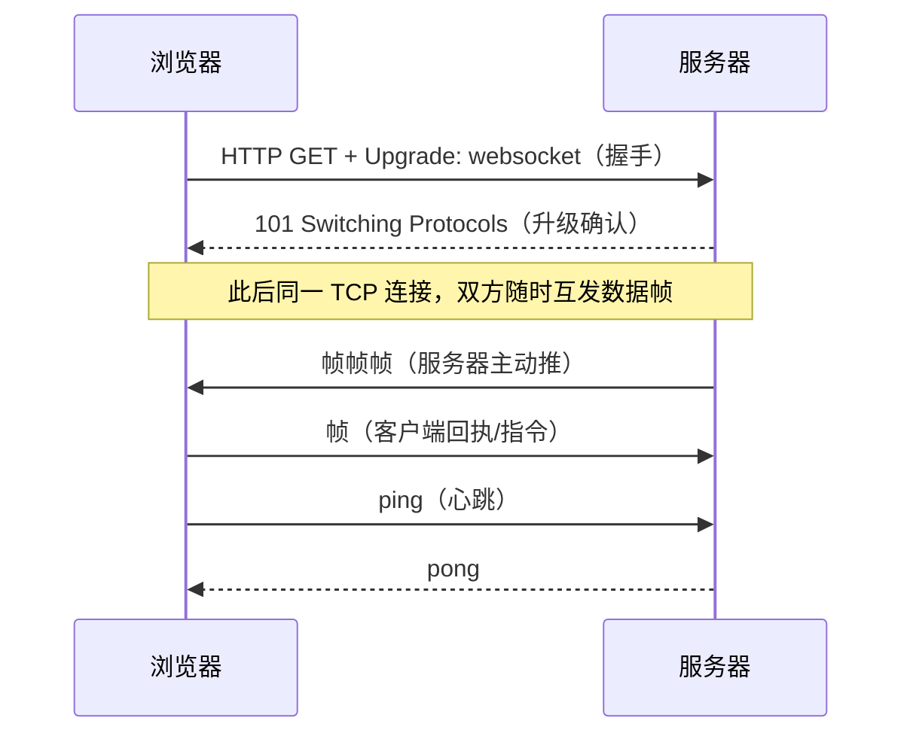

## 先想清楚：HTTP 推不动消息

HTTP 的生命周期由 Request 界定：**一个 Request 对应一个 Response，
且 Response 永远是被动的**。服务器想"主动"给浏览器推消息，只能靠
客户端不断去问：

| 方案 | 原理 | 代价 |
|---|---|---|
| 短轮询 | 每隔 N 秒发一次请求问"有了吗" | 大部分请求空手而归，浪费带宽与连接 |
| 长轮询（long poll） | 请求挂住，服务器有消息才响应，客户端收到后立刻再发 | 每条消息仍是一次完整 HTTP 往返；挂连接占用服务端资源 |
| SSE | 服务器单向持续推流 | **只能下行**，且是文本流 |
| **WebSocket** | 一次握手后建立**全双工**持久连接 | 需要服务端/代理支持；有状态连接对运维要求高 |

2008 年诞生、2011 年成为国际标准（RFC 6455）的 WebSocket 干脆绕开
了"请求-响应"模型：握手之后双方随时互发，是真正的双向平等对话。

## 握手：借 HTTP 的壳，走自己的路

WebSocket 是独立协议（`ws://` 明文、`wss://` 加密），只在**握手阶段
借用 HTTP**——这让它能穿过现有浏览器与代理设施：

```text
① 客户端发起（一个"长得像 HTTP"的请求）
GET /chat HTTP/1.1
Host: server.example.com
Upgrade: websocket              ← 核心：请求协议升级
Connection: Upgrade
Sec-WebSocket-Key: x3JJHMbDL1EzLkh9GBhXDw==   ← 随机 Base64，防老服务器误应答
Sec-WebSocket-Version: 13

② 服务端应答
HTTP/1.1 101 Switching Protocols   ← 101：协议切换成功
Upgrade: websocket
Connection: Upgrade
Sec-WebSocket-Accept: HSmrc0sMlYUkAGmm5OPpG2HaGWk=
        ← Key + 固定 GUID 的 SHA-1 摘要，证明"我认识 WebSocket"
```

`101 Switching Protocols` 之后，HTTP 的工作就结束了——这条 TCP
连接上跑的从此全是 WebSocket 帧。



## 帧与心跳

握手后的数据以**帧（frame）**为单位，格式轻量（头部最小 2 字节）：

- **Opcode 区分帧类型**：0x1 文本（UTF-8）、0x2 二进制、0x8 连接关闭、
  **0x9 ping / 0xA pong**；
- **分片**：大消息可拆成多个帧（fin 标志收尾）；
- **心跳**：靠 ping/pong 保活并探活——穿过 nginx 等代理时，空闲连接
  会被中间层掐掉，`proxy_read_timeout` 与心跳间隔要对齐；
- 掩码：客户端→服务端的帧必须带 4 字节掩码（防缓存投毒攻击）。

浏览器 API 极简：

```js
const ws = new WebSocket('wss://example.com/chat');
ws.onopen = () => ws.send('hello');
ws.onmessage = e => console.log(e.data);   // 文本或 Blob/ArrayBuffer
ws.onclose = () => { /* 记得指数退避重连 */ };
```

## 什么场景该用它

**适合**：聊天/IM、协同编辑、实时行情与监控推送、多人游戏——
"低延迟 + 双向 + 高频"的服务器主动推送。

**不必上**：只需服务器单向推（通知、日志尾随）→ SSE 更简单；
低频数据刷新 → 轮询/普通请求足矣；要考虑 HTTP 缓存、 CDN、无状态
水平扩展的普通业务接口 → 老老实实 HTTP。

一句话：**WebSocket 用"有状态长连接"换"全双工低延迟"**——接得住
这份状态管理成本（重连、心跳、连接数上限、网关配置）才用它。

## 小结

- HTTP 是"一问一答"的半双工；WebSocket 握手借 HTTP（Upgrade +
  101）升级出全双工持久连接。
- 帧协议自带文本/二进制/关闭/ping-pong 类型，心跳对齐代理超时是
  部署必查项。
- 轮询→长轮询→SSE→WebSocket 是"推的能力"递进；选型先问方向
  （单向下行用 SSE）与频率，别为了双向两个字节上长连接。

## 延伸阅读

- [看完让你彻底理解 WebSocket 原理（CSDN）](https://blog.csdn.net/asd051377305/article/details/108066378)——本篇母本，含聊天室前后端实战
- [RFC 6455 · The WebSocket Protocol](https://www.rfc-editor.org/rfc/rfc6455)（帧格式与握手规范）
- [MDN · WebSocket API](https://developer.mozilla.org/zh-CN/docs/Web/API/WebSocket)
