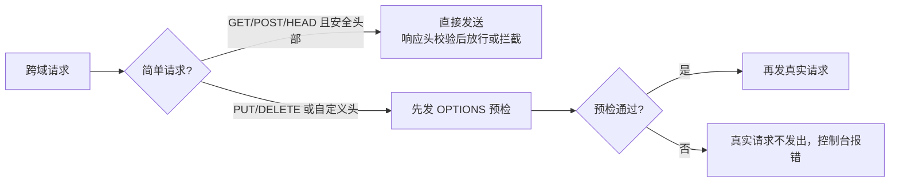

## 先想清楚：跨域到底"跨"的是什么

**同源策略**是浏览器最核心的安全功能：协议、域名、端口三者**完全相同**
才算同源——两个不同域名即使指向同一个 IP，也非同源。它限制三样东西：

- **存储**：Cookie、LocalStorage、IndexedDB 无法跨域读写；
- **DOM**：拿不到另一个源页面的节点；
- **AJAX**：请求发送后，**响应被浏览器拦截**。

有三个标签天生豁免，允许跨域加载资源：

```html

<link href="https://cdn.com/style.css">
<script src="https://cdn.com/lib.js"></script>
```

一个高频误解先澄清：**跨域请求其实发出去了**。服务端能收到请求并
正常执行、返回结果，只是结果被浏览器拦下不给 JS。所以表单能发起
跨域请求（提交后页面跳转，不"读取"响应内容），AJAX 却不行——同源
策略防的是**读取**，不是发送。这也说明它防不住 CSRF：请求毕竟是
发出去了。

另外两点：协议或端口不同造成的跨域，前端无法自救；浏览器只看
URL 首部（协议+域名+端口），不解析 IP 是否相同。

## 九种方案总览

| # | 方案 | 类型 | 一句话原理 |
|---|---|---|---|
| 1 | CORS | 服务端配合 | 响应头声明"允许谁来读我"，浏览器放行 |
| 2 | 代理（nginx / Node） | 架构规避 | 同源策略只是浏览器行为，服务器之间没有跨域 |
| 3 | JSONP | 历史方案 | 借 `<script>` 豁免漏洞，回调函数回传数据 |
| 4 | postMessage | 窗口通信 | HTML5 标准化的跨窗口消息 API |
| 5 | WebSocket | 长连接 | 协议本身不受同源限制 |
| 6 | document.domain | iframe | 主域相同的子域，双方改写 domain 即同源 |
| 7 | window.name + iframe | iframe | window.name 跨页面（含跨源）持久 |
| 8 | location.hash + iframe | iframe | 把数据塞进 hash，通过 hashchange 通知 |
| 9 | 服务端无关降级 | — | 低频场景直接表单/图片打点绕过"读取"限制 |

实战里的主流选择只有前两个；3-9 是特定历史或特定场景的补丁。

## CORS：现代标准答案

CORS（Cross-Origin Resource Sharing）需要浏览器和后端同时支持
（IE8/9 得用 XDomainRequest）。关键动作全在服务端——设置响应头：

```text
Access-Control-Allow-Origin: https://front.com   ← 允许的源（* 或具体域名）
Access-Control-Allow-Credentials: true           ← 允许带 Cookie
Access-Control-Allow-Methods: GET, POST, PUT
Access-Control-Allow-Headers: Content-Type, token
```

浏览器把请求分成两类：



- **简单请求**：方法为 GET/POST/HEAD，头部限于 Accept/Content-Type
  （仅 text/plain、multipart/form-data、
  application/x-www-form-urlencoded）等安全集合——直接发，浏览器
  收到响应后校验 `Access-Control-Allow-Origin` 决定是否交给 JS；
- **预检请求（preflight）**：不满足上述条件（如带 `token` 自定义头、
  PUT/DELETE、JSON 的 `application/json`）时，浏览器**先**发一个
  `OPTIONS` 询问服务器"这些头/方法行不行"，通过后才发真实请求。

注意 `*` 通配符与 `credentials: true` 不能同时使用——带 Cookie 的
跨域必须回显具体域名。服务端还要处理预检结果的可缓存
（`Access-Control-Max-Age`），避免每次都多一跳 OPTIONS。

## 代理：让浏览器根本没跨域

同源策略是**浏览器**的安全行为，服务器之间通信完全不受限。于是把
请求转个弯：

```text
浏览器 ──(同源)──> nginx/Node ──(服务器间，无跨域)──> 目标 API
```

nginx 反向代理示例：

```nginx
server {
    listen 80;
    location /api/ {
        proxy_pass http://backend.example.com/;   # 浏览器只见过自己这台 nginx
    }
}
```

开发环境用 webpack/vite 的 `devServer.proxy`、生产用 nginx 或网关，
是前后端分离项目的标配做法——对前端完全透明，对后端零改造。

## JSONP：上古方案，但面试还问

利用 `<script>` 豁免：请求回来的不是数据，是**一次函数调用**。

```js
function jsonp({ url, params, callback }) {
  return new Promise((resolve) => {
    const script = document.createElement('script');
    window[callback] = (data) => {          // ① 先声明全局回调
      resolve(data);
      document.body.removeChild(script);
    };
    params = { ...params, callback };
    script.src = `${url}?${Object.entries(params)
      .map(([k, v]) => `${k}=${v}`).join('&')}`;  // ② script src 指向接口
    document.body.appendChild(script);      // ③ 服务器回 "callback(data)" 即执行
  });
}
```

服务端返回的是 JS 代码：`show('我不爱你')`，加载即执行，数据就
到手了。**仅支持 GET、需服务端配合、有 XSS 风险**——CORS 时代只剩
"理解原理"的价值。

## iframe 家族与 postMessage

跨域不只发生在 AJAX，还有**窗口之间**（iframe 嵌入、window.open）：

- **postMessage**（HTML5 标准做法）：

```js
// 父窗口 → iframe
iframeWin.postMessage('hello', 'https://child.com');
// 子窗口接收
window.addEventListener('message', (e) => {
  if (e.origin === 'https://parent.com') console.log(e.data);
});
```

- **document.domain**：`a.example.com` 与 `b.example.com` 双方都写
  `document.domain = 'example.com'` 即视为同源（仅限主域相同，且
  该方案已被现代浏览器标记为废弃）；
- **window.name + iframe**：iframe 加载跨域页后，其 `window.name`
  在跳回同域页面时依然保留，可作数据摆渡；
- **location.hash + iframe**：数据放 URL hash 中传递，父窗口监听
  `hashchange`，容量小且暴露在 URL 上。

这四类如今基本只剩 postMessage 在生产使用（微前端、第三方嵌入组件）。

## 选型决策

```text
接口跨域
├─ 能改服务端 → CORS（生产标准）；带 Cookie 记得具体域名 + credentials
├─ 改不了服务端 → 代理（开发 vite proxy / 生产 nginx）
└─ 古董浏览器兼容 → JSONP（只 GET）
窗口/iframe 通信 → postMessage
实时双向 → WebSocket（不受同源限制）
```

一句话：**CORS 解决"允许读"，代理解决"不让浏览器知道"，其余是
历史补丁**——理解"跨域是浏览器拦截响应"这一本质，所有方案都只是
绕开它的不同姿势。

## 小结

- 同源 = 协议+域名+端口全同；请求发得出、服务端处理得了，被拦的是
  响应读取。
- CORS 是标准答案：简单请求直发校验响应头，复杂请求先 OPTIONS
  预检；`*` 与 credentials 互斥。
- 代理利用"同源策略只约束浏览器"的事实，是服务端不可改时的唯一
  正解。
- JSONP 借 script 豁免回传函数调用；iframe 系方案已被 postMessage
  全面取代。

## 延伸阅读

- [九种跨域方式实现原理（完整版）——浪里行舟，掘金](https://juejin.cn/post/6844903769408257038)——本篇母本，九种方案全部附代码
- [MDN · HTTP 访问控制（CORS）](https://developer.mozilla.org/zh-CN/docs/Web/HTTP/CORS)——预检/简单请求判定与响应头权威说明
- [MDN · Window.postMessage](https://developer.mozilla.org/zh-CN/docs/Web/API/Window/postMessage)
