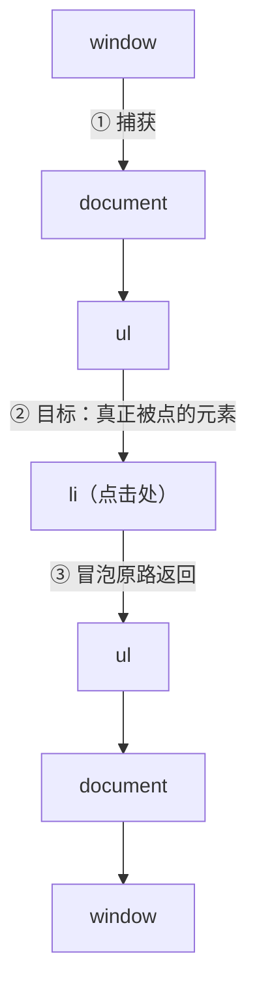

## 事件流：一次点击经过的三段路

DOM 事件不是"点到谁就谁的"——完整事件流分三段：**捕获（window 沿
DOM 树向下）→ 目标（事件源）→ 冒泡（从目标向上回 window）**：



`addEventListener` 的第三个参数（`useCapture`，或 options 对象的
`capture` 字段）决定监听器挂在**捕获段还是冒泡段**——默认 false，
即冒泡段。绝大多数逻辑在冒泡段做；捕获段的典型用途是**在事件到达
目标前拦截**（埋点、全局权限校验）。

## 事件委托：冒泡的工程化

**把子元素的监听统一挂到父元素上，靠 `event.target` 分辨真实来源**
——子元素再多也只挂一个监听：

```js
document.getElementById("list").addEventListener("click", (e) => {
  const item = e.target.closest("li.item");   // closest 向上找，兼容子层嵌套
  if (!item) return;                          // 点在列表空白处，忽略
  console.log("点了", item.dataset.id);
});
```

三个收益对应三个真实问题：

| 收益 | 解决的问题 |
|---|---|
| 监听数从 N 降到 1 | 长列表/表格的内存与初始化耗时 |
| 动态子元素免重挂 | 增删节点不用 addEventListener（对应作用域篇的泄漏源头之一） |
| 统一出口 | 埋点、权限、上报类横切逻辑一处收敛 |

**委托的边界**：没有冒泡的事件委托不了——`focus/blur`、`scroll`
（元素级）、`load` 等；`mouseover/mouseout` 冒泡但会在子元素间反复
进出，需要委托时改用 `mouseenter/mouseout` 的非冒泡语义或
`pointerenter`。委托层太深时 `closest` 的查找成本也要心里有数。

## stopPropagation 与 preventDefault 的分工

两个 API 名字容易混，管的事完全不同：

```js
link.addEventListener("click", (e) => {
  e.preventDefault();      // 取消默认行为：不跳转、不提交、不勾选
  e.stopPropagation();     // 阻止事件继续冒泡：父层监听器收不到
});
```

- **preventDefault**：管"浏览器对这件事的默认动作"，不影响事件传播；
- **stopPropagation**：管"事件还传不传给别人"，不影响默认行为；
- `stopImmediatePropagation`：更进一步——连**同一元素**上后注册的
  监听器也不执行；
- 反向需求 `composedPath()`：拿完整传播路径，做全局兜底时有用。

典型组合场景：弹窗内点击 `preventDefault` + 弹窗外点击关闭（委托
document 判断 `!root.contains(e.target)`）。

## 自定义事件与解耦

DOM 事件机制不止服务原生交互——**CustomEvent 是浏览器内置的发布/
订阅**，跨组件通信不引库就能做（观察者模式与 Spring 事件篇同构，
只是搬到 DOM）：

```js
// 发：detail 携带数据，bubbles 让它能被上层委托
document.dispatchEvent(new CustomEvent("cart:changed", {
  detail: { count: 3 },
  bubbles: true,
}));

// 收
document.addEventListener("cart:changed", (e) => {
  badge.update(e.detail.count);
});
```

适用边界：页面内松耦合通知；一旦涉及状态共享与可追踪性，交给框架
的状态管理，别把事件总线变成"谁改的都查不清"。

## 性能细节：passive 与 once

```js
// passive：承诺不调 preventDefault，浏览器可立即滚动不等监听器
window.addEventListener("scroll", onScroll, { passive: true });
window.addEventListener("wheel", onWheel, { passive: true });

// once：执行一次自动解绑（初始化、一次性动画收尾）
el.addEventListener("transitionend", handler, { once: true });
```

**passive 的背景**：滚动类监听器里若可能调用 `preventDefault`，浏览
器必须等监听器执行完才能滚动——主线程一忙，滚动就掉帧。标记
passive 等于放弃 preventDefault 换流畅滚动；Chrome 对
`touchstart/wheel` 已默认 passive，显式声明是为了跨浏览器一致。

## 小结

- 三段事件流：捕获拦横切、冒泡做业务；`capture` 选项定挂靠段。
- 委托 = 冒泡 + `closest`：省监听、免重挂、统一出口；无冒泡事件
  委托不了。
- preventDefault 管默认行为，stopPropagation 管传播，两者正交。
- CustomEvent 是浏览器内置观察者；滚动监听记得 passive。

## 延伸阅读

- [MDN 事件介绍](https://developer.mozilla.org/zh-CN/docs/Learn/JavaScript/Building_blocks/Events)
- [MDN addEventListener](https://developer.mozilla.org/zh-CN/docs/Web/API/EventTarget/addEventListener)
