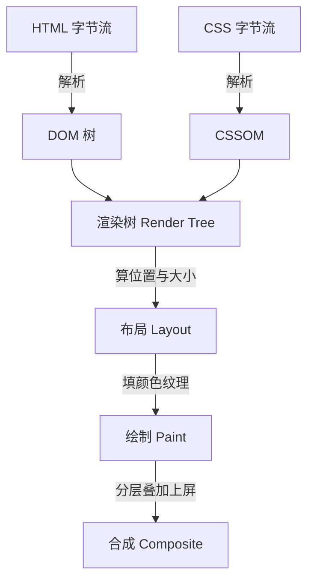
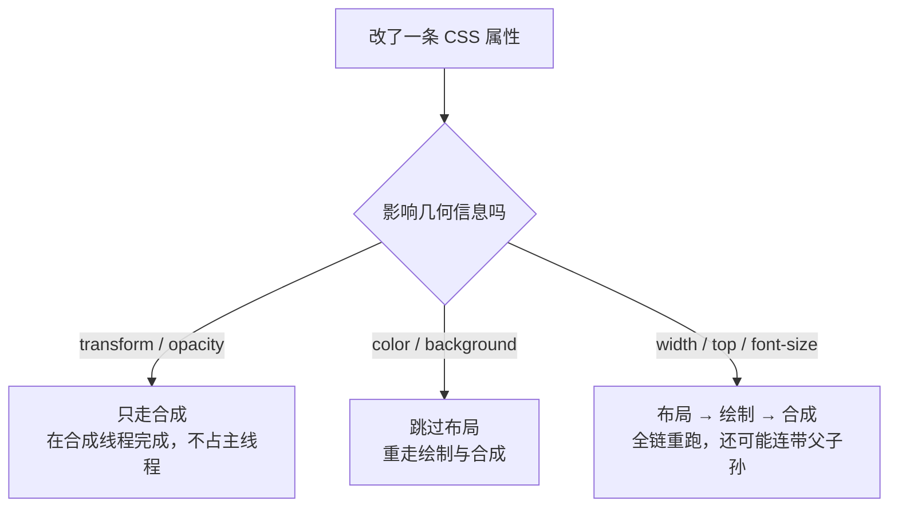

「浏览器输入 URL 之后发生了什么」问到最后一层，就是渲染管线：DOM 怎么变成像素、
为什么改 `width` 卡而改 `transform` 顺滑、`display: none` 和 `visibility: hidden`
在渲染上差在哪。这篇把管线拆开讲，重绘回流是这条管线上最高频的追问。

## 从字节到像素：渲染管线五步

浏览器拿到 HTML 字节流后，走一条固定的流水线，面试里叫**关键渲染路径**
（Critical Rendering Path）：



五步各管一件事，逐层收窄：

- **解析生成 DOM / CSSOM**：HTML 字节流按编码解码成字符，再按 token 流构建
  DOM 树；CSS 同理构建 CSSOM。两者是相互独立的树。
- **渲染树**：把 DOM 和 CSSOM 合并——遍历每个**可见**节点，从 CSSOM 摘出对应
  样式。`display: none` 的节点、`<head>` 里的内容不进渲染树。
- **布局（回流）**：自上而下计算每个节点在视口里的精确位置和大小，产出一棵
  带几何信息的盒子树。
- **绘制**：把每个盒子画成像素指令——颜色、文字、阴影、边框，先记录成绘制
  列表，真正 rasterize 可以延后。
- **合成**：把页面按层拆开，各层独立光栅化后由（通常是 GPU 的）合成线程叠加
  成最终画面。

关键在最后一步：**浏览器把页面分层，层与层之间由合成线程叠加**。这正是后面
「transform 为什么快」的伏笔——有些操作可以只走第五步。

## CSS 和 JS 为什么会阻塞渲染

两个经典追问：CSS 为什么放 `head`？JS 为什么会卡住页面？

**CSS 阻塞的是渲染，不是解析。** 浏览器规定：CSSOM 没构建完，就不渲染任何
内容（白屏），但 DOM 照常解析。这是故意的——否则页面会先按无样式渲染、CSS
加载完再整体重排一次，闪烁比短暂白屏更糟。CSS 放 `head` 让它尽早开始下载，
和 DOM 解析并行。

**JS 阻塞的是 DOM 解析本身。** 脚本可以 `document.write`、可以读元素几何
信息、可以改 DOM 和 CSSOM——浏览器不知道你要干什么，只能停下来：等它下载
并执行完才继续解析 HTML。而脚本执行前还要求它前面的 CSSOM 已就绪（脚本可能
要读样式）。所以「CSS 里挂个慢脚本」会串成最长的阻塞链。

`defer` 和 `async` 都是给外链脚本的「免阻塞许可证」，差别在执行时机：

| 属性 | 下载 | 执行时机 | 顺序保证 | 适用 |
| --- | --- | --- | --- | --- |
| 无 | 阻塞解析 | 立即 | 保序 | 依赖 DOM 的传统脚本 |
| `async` | 并行 | 下完就执行 | **不保序** | 独立统计脚本 |
| `defer` | 并行 | DOM 解析完、`DOMContentLoaded` 前 | **保序** | 需要完整 DOM 的应用脚本 |

记忆口诀：`async` 是「下载完随时插队」，`defer` 是「排队等 DOM 完工」。
`defer` 内联写无效，两个属性同时存在时现代浏览器按 `defer` 处理。

## 回流、重绘、合成：三档开销

渲染管线的价值在于**改动可以局部失效**，不必五步全跑。改一条 CSS 属性，浏览器
按影响范围走三档：

| 档位 | 几何变了？ | 重跑步骤 | 常见属性 | 开销 |
| --- | --- | --- | --- | --- |
| 回流（重排） | 是 | 布局 → 绘制 → 合成 | `width`、`top`、`font-size` | 最大 |
| 重绘 | 否（外观变） | 绘制 → 合成 | `color`、`background`、`visibility` | 中 |
| 合成 | 否 | 仅合成 | `transform`、`opacity` | 最小 |



面试标准答案是这两条：

- **`transform` 不触发回流**：位移缩放不改变盒子在文档流里的几何位置，只改
  合成层的绘制结果；动画可以完全在合成线程跑，主线程卡住动画照样流畅——这也是
  「滚动加载动画用 `transform` 而不是 `top`」的原理。
- **回流的破坏半径不止一个元素**：改 `body` 宽度会让整棵树重新布局；改一个
  内部元素，只重排它所在的子树。所以「把频繁动画的元素提为独立层」（transform
  动画自动提升、或 `will-change: transform` 显式提示）能把破坏半径锁在一层里。

`will-change` 不是免费的：每个提升的层都要额外内存，滥用反而掉帧，用完即弃。

## 强制同步布局与布局抖动

回流不是每次改动立即执行——浏览器会把写操作攒到下一帧统一处理。但**读几何
信息**是例外：`offsetHeight`、`getBoundingClientRect()` 这类 API 必须返回
当前真实值，于是强制清空写队列、立刻重算布局。读写交错，就把「攒一批」变成了
「写一次算一次」：

```js
// 反例：一帧内读写交错，N 个元素触发 N 次布局
boxes.forEach((box) => {
  const h = box.offsetHeight; // 读：强制同步布局
  box.style.height = h * 2 + 'px'; // 写：布局立即失效
});
```

这个模式叫**布局抖动**（Layout Thrashing），循环里读写交错一次，就强制布局
一次，N 个元素就是 N 次全量布局。修复思路是**先批量读，再批量写**：

```js
// 先把所有读攒完，再统一写：布局只重算一次
const heights = boxes.map((box) => box.offsetHeight);
boxes.forEach((box, i) => {
  box.style.height = heights[i] * 2 + 'px';
});
```

两个配套手段：

- **`requestAnimationFrame`**：把写操作排到浏览器下一次渲染前执行，天然对齐
  帧边界；下一帧读、这一帧写，读写分帧。
- **微数据缓存**：需要多次读同一几何信息时读一次存变量，而不是循环里反复问
  浏览器。

## 高频追问：display 三兄弟的渲染差异

`display: none`、`visibility: hidden`、`opacity: 0` 都能让元素「看不见」，
渲染层的差别是必考题：

| | `display: none` | `visibility: hidden` | `opacity: 0` |
| --- | --- | --- | --- |
| 是否占位 | 不占 | 占 | 占 |
| 渲染树 | **不进** | 进，绘制时跳过 | 进 |
| 回流 | 触发 | 不触发（继承给子树） | 不触发 |
| 事件 | 不响应 | 不响应 | **响应** |
| 过渡动画 | 无法过渡 | 可过渡（离散） | 可过渡（连续） |

记忆锚点：`display: none` 是「从渲染树里除名」，所以动它必回流、子元素也没法
单独显示；`visibility: hidden` 是「占位但跳过绘制」，且子元素可以用
`visibility: visible` 单独捞回来（它是继承属性）；`opacity: 0` 是「老老实实
画出来、只是全透明」，所以能接事件、能做连续过渡动画。

## 小结

- 渲染管线五步：DOM/CSSOM → 渲染树 → 布局 → 绘制 → 合成；改动按影响范围
  局部失效，不用全跑。
- CSS 阻塞渲染不阻塞解析，JS 阻塞解析；`defer` 保序等 DOM，`async` 下完
  插队不保序。
- 回流 > 重绘 > 合成；`transform`/`opacity` 只走合成线程，是动画首选。
- 读写交错造成布局抖动；修复 = 先批量读、再批量写，配合 rAF 分帧。
- `display: none` 除名不占位，`visibility: hidden` 占位不绘制，`opacity: 0`
  占位全透明仍接事件。

## 延伸阅读

- [MDN 渲染页面：浏览器的工作原理](https://developer.mozilla.org/zh-CN/docs/Web/Performance/How_browsers_work)
- [Google：渲染树构建、布局及绘制](https://web.dev/articles/critical-rendering-path-render-tree-construction)
- [MDN：requestAnimationFrame](https://developer.mozilla.org/zh-CN/docs/Web/API/Window/requestAnimationFrame)
