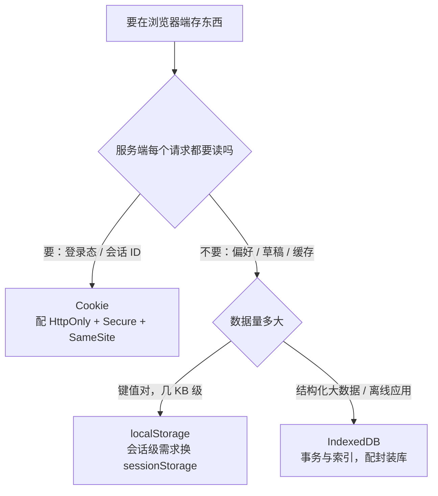

HTTP 是无状态的，「记住用户」靠浏览器端存储。面试常把 Cookie、localStorage、
sessionStorage、IndexedDB 拉一张桌子比，真正的考点是**各自的诞生动机**——
它们不是四个竞争方案，而是四代需求。

## 四种存储横向对比

| | Cookie | localStorage | sessionStorage | IndexedDB |
| --- | --- | --- | --- | --- |
| 容量 | 4 KB | 5–10 MB | 5–10 MB | 数百 MB 起 |
| 生命周期 | 可设过期 | 永久，手动清 | 当前标签页 | 永久，手动清 |
| 随请求发送 | **每次自动携带** | 否 | 否 | 否 |
| API 形态 | 字符串 | 同步字符串 | 同步字符串 | 异步事务 |
| 诞生动机 | 状态随请求走 | 本地持久键值 | 会话级键值 | 大量结构化数据 |

一行定位：**Cookie 是「跟着请求走的」，其余三个是「留在浏览器里的」**。
Cookie 4 KB 且每个请求都带上，天生只适合放少量凭证；Web Storage 解决「想
在浏览器存点东西又不想拖累请求」；IndexedDB 解决「存的不是键值是数据库」。

## Cookie：服务器种下的凭证

Cookie 由服务器通过 `Set-Cookie` 响应头种下，之后**每个同源请求自动携带**
——这是它独有的能力，也是它的原罪：

```http
Set-Cookie: sid=abc123; Max-Age=86400; HttpOnly; Secure; SameSite=Lax
```

四个高频属性各管一件事：

- **`Expires` / `Max-Age`**：不设就是会话 Cookie，关浏览器即失效；
  `Max-Age` 优先级更高。
- **`HttpOnly`**：JS 读不到—— XSS 偷不走 Cookie，这是 token 安全的第一道墙。
- **`Secure`**：只在 HTTPS 下发送。
- **`SameSite`**：跨站请求带不带。`Lax`（默认）放行顶级导航 GET，
  `Strict` 全拒，`None` 全放但必须配 `Secure`——CSRF 防线的 Cookie 侧
  （请求侧的攻击面与防御见 [CSRF：伪造请求](/security/basic/core/02-csrf/)）。

因为自动携带，Cookie 每次都在消耗带宽，也正因为自动携带，登录态才能在
服务端渲染时天然可用。**凭证放 Cookie 的代价是 CSRF 风险，放 Web Storage
的代价是 XSS 风险**——这个权衡是本文最高频的追问，展开见下文选型一节。

## Web Storage：同源键值对

`localStorage` 和 `sessionStorage` 共用同一套 API（`getItem/setItem/
removeItem/clear`），差别只有生命周期和可见范围：

- **localStorage**：同源共享、永久有效——用户偏好、主题设置、草稿。
- **sessionStorage**：**当前标签页私有**，关页即清。注意「标签页」粒度：
  新标签页打开同源页面，sessionStorage 是**空的**（复制粘贴 URL 或
  `target=_blank` 也不带过去，浏览器仅在新开标签的瞬间可选地复制）。

两个细节常被追问：

- **只存字符串**：存对象要 `JSON.stringify`，读出来 `JSON.parse`；存
  `undefined` 或函数会被转成字符串 `"undefined"`，是经典 bug 源。
- **storage 事件**：同源的其他标签页在 storage 变化时收到 `storage`
  事件（触发变化的页面自己收不到）——这是零依赖的**跨标签页通信**通道，
  登出时广播其他标签页同步退登录就靠它。

```js
// 标签页 A：登出时广播
localStorage.setItem('logout', String(Date.now()));

// 标签页 B/C：同步清理登录态
window.addEventListener('storage', (e) => {
  if (e.key === 'logout') clearLocalSession();
});
```

同步 API 是 Web Storage 的另一面：主线程阻塞、无索引、无事务——数据量
一大就到顶，这是 IndexedDB 存在的理由。

## IndexedDB：浏览器里的数据库

IndexedDB 是**事务型、异步、索引化**的对象数据库：按 key 存任意结构化
克隆值，建索引加速查询，读写都走事务，API 全异步不堵主线程。适用场景
其实很窄：

- 离线优先应用的数据缓存（配合 Service Worker，见延伸阅读）；
- 大量结构化数据的本地暂存（邮件草稿列表、录音、图片 blob）；
- 日志/埋点先落本地再批量上报。

存在感低的真实原因：原生 API 以事件回调为主、事务模型啰嗦，日常开发
几乎都通过封装库（Dexie.js 等）使用。面试记住三个关键词即可——
**异步、事务、同源**，以及它和 Cache API 的分工：IndexedDB 存**数据**，
Cache API 存**请求响应**（网络资源）。

## 选型决策：凭证与数据各回各家



最高频追问：**token 放 localStorage 还是 Cookie？** 答案是权衡题：

- 放 `localStorage`：JS 可读，XSS 一旦得手直接偷走 token——但要偷 localStorage
  本身就得先有 XSS，配合 CSP 和输入净化后风险可控；不自动携带则**天然免疫 CSRF**。
- 放 `HttpOnly` Cookie：XSS 读不到，但自动携带带来 CSRF 面，需要 `SameSite`
  + CSRF token 兜底；且跨域前后端分离场景要处理 Cookie 的 SameSite/跨站限制。

现代主流是 **HttpOnly Cookie 优先**（XSS 更难防于 CSRF），把「为什么」讲
清两层攻击面比背结论更得分。深化阅读：
[Session 与 Cookie 攻击面](/security/basic/core/01-session-attack/)。

## 小结

- Cookie 跟请求走（4 KB、自动携带、凭证专属），Web Storage 留在浏览器
  （5–10 MB、键值），IndexedDB 是异步事务数据库（大数据、离线）。
- Cookie 四属性：Max-Age 定寿，HttpOnly 挡 XSS 读，Secure 限 HTTPS，
  SameSite 管 CSRF。
- sessionStorage 隔离到标签页；storage 事件是免费的跨标签页广播。
- Web Storage 只存字符串；IndexedDB 存数据、Cache API 存响应，分工不同。
- token 存储是 XSS vs CSRF 的权衡，主流选择 HttpOnly Cookie。

## 延伸阅读

- [MDN：Web Storage API](https://developer.mozilla.org/zh-CN/docs/Web/API/Web_Storage_API)
- [MDN：HTTP Cookie](https://developer.mozilla.org/zh-CN/docs/Web/HTTP/Cookies)
- [MDN：IndexedDB API](https://developer.mozilla.org/zh-CN/docs/Web/API/IndexedDB_API)
