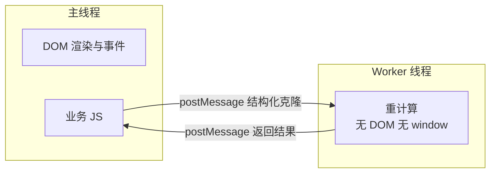

JS 是单线程的——[事件循环](/js/basic/core/05-event-loop/)解释了它怎么排队，
但没解释一件事：**一个 200ms 的同步计算把队列全堵死怎么办**。渲染管线那篇
说过主线程卡住掉帧，这一篇讲唯一的正规逃生门：Web Worker。

## 单线程的边界：长任务冻结一切

主线程同时背着三件事：跑 JS、处理事件、配合渲染。一个 50ms 以上的同步
长任务（大数组排序、JSON.parse 十几 MB、复杂加密），会让这期间的所有
事件排队、动画掉帧、点击无响应——用户感知就是「页面卡死了」。

把计算拆成小片用 `setTimeout` 喂给事件循环是权宜之计（能保住响应但拖长
总耗时），根治方案是把整块计算搬出主线程——这就是 Worker：**浏览器提供的
真·并行线程**，和主线程并行跑、互不阻塞，靠消息通信。



主线程独占 DOM，Worker 拿不到——这是边界也是安全模型：没有 DOM 就没有
竞态，两个线程永远只通过消息交换数据。

## 基本用法：三段式

```js
// main.js：创建、发消息、收结果
const worker = new Worker('/workers/hash.js');
worker.postMessage({ text: 'long input' });
worker.onmessage = (e) => renderResult(e.data);
worker.onerror = (e) => console.error(e.message);
```

```js
// workers/hash.js：Worker 自己的全局是 self
self.onmessage = (e) => {
  const result = heavyHash(e.data.text); // 同步跑多久都行
  self.postMessage(result);
};
```

三段式：主线程 `new Worker(url)` → 双向 `postMessage` → 各自
`onmessage` 接收。两个高频细节：

- **Worker 脚本必须同源**，且开发时从 `file://` 打开页面会直接报错，
  需要本地服务器。
- **`onerror` 只在主线程侧能挂**，Worker 内部抛错不会静默，但兜底要
  自己写。

## 传的是什么：结构化克隆

`postMessage` 不是传引用，是**结构化克隆**（Structured Clone）：数据在
发送侧复制一份到接收侧，两线程不共享任何可变对象。克隆算法比
`JSON.stringify/parse` 强——`Date`、`Map`、`Set`、`ArrayBuffer`、
Blob 都能原样过，只有函数、DOM 节点、`Error` 全量字段这类传不了。

```js
worker.postMessage(
  { buf: bigArrayBuffer, meta: { at: new Date() } },
  [bigArrayBuffer], // 第二参数：转移所有权，零拷贝
);
```

第二个参数是**Transferable 转移列表**：`ArrayBuffer` 可以不复制、直接把
所有权移交过去——几十 MB 的二进制从「复制一秒」变成「移交微秒」，但移交后
主线程侧立即变为不可用。复制保两头可用，转移保性能，按需选。

## 能力边界清单

Worker 里 `this` 是 `self`（DedicatedWorkerGlobalScope），没有 `window`、
`document`，因此：

| | 主线程 | Worker |
| --- | --- | --- |
| DOM 操作 / `document` | ✅ | ❌ |
| `fetch` / `XMLHttpRequest` | ✅ | ✅ |
| `WebSocket` / `IndexedDB` | ✅ | ✅ |
| `setTimeout` / `setInterval` | ✅ | ✅ |
| `localStorage` / `sessionStorage` | ✅ | ❌（同步阻塞设计不进线程） |
| `alert` / `confirm` | ✅ | ❌ |

记忆口径：**Worker 是「没有 UI 的网络+计算+存储(IndexedDB)后台线程」**。
页面卸载时 Worker 不会自动死，要主动 `worker.terminate()` 或在 Worker 内
`self.close()`，长驻 Worker 注意自己回收。

## 什么时候真的该上 Worker

Worker 不是「显得高级」的装饰，它有两笔成本：数据靠克隆传输（大对象
复制有开销）、代码要多一个文件和一套消息协议。判据一句话：

- **该用**：单次同步计算超过 ~50ms 且可独立——大 JSON 解析、图片/音频
  处理、前端加密解密、复杂排序过滤、Diff 计算。
- **不该用**：算完就要立刻改 DOM 的轻任务（来回消息的开销超过计算本身）；
  需要频繁读 DOM 的逻辑（Worker 读不到 DOM，协议会复杂到失控）。

另外两个亲戚一句话定位：**SharedWorker** 允许多个标签页共享同一个 Worker
（跨页复用连接池/长连接），**Service Worker** 是浏览器与网络之间的代理线程，
PWA 离线缓存的主角，场景不同不与本篇混淆。

## 小结

- 长任务冻结主线程的根治方案是 Worker：真并行线程，消息通信，DOM 独占
  主线程所以 Worker 碰不到 DOM。
- `postMessage` 走结构化克隆（Date/Map/ArrayBuffer 可过，函数不行）；
  `ArrayBuffer` 走 Transferable 零拷贝转移。
- Worker 能用 fetch/WebSocket/IndexedDB/定时器，不能用 DOM 和 Web Storage。
- 判据：50ms 以上可独立计算才值得上 Worker，轻任务的消息开销得不偿失。

## 延伸阅读

- [MDN：Web Workers API](https://developer.mozilla.org/zh-CN/docs/Web/API/Web_Workers_API)
- [MDN：结构化克隆算法](https://developer.mozilla.org/zh-CN/docs/Web/API/Web_Workers_API/Structured_clone_algorithm)
- [MDN：Transferable 对象](https://developer.mozilla.org/zh-CN/docs/Web/API/Web_Workers_API/Transferable_objects)
