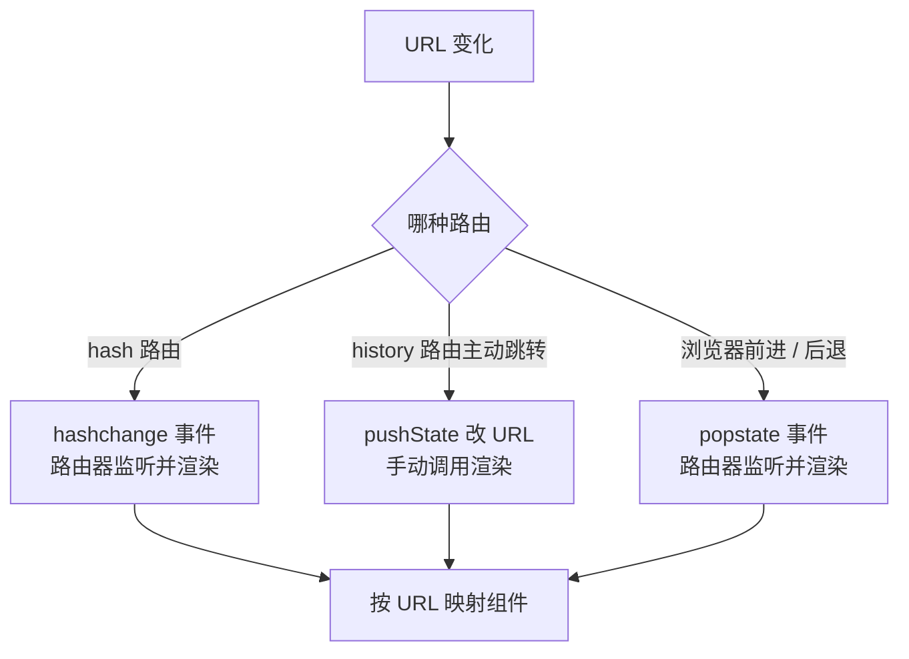

多页应用时代「换页面 = 发请求」，SPA 把页面搬进 JS 之后，URL 变化却不能
刷新——这个矛盾靠前端路由解决。面试常问：hash 路由和 history 路由差在哪、
为什么 history 路由刷新会 404、`popstate` 到底什么时候触发。这一篇讲清
两套方案的同一条链路。

## 后端路由与前端路由的分野

传统路由由服务器裁决：URL 变 → 浏览器发请求 → 服务器返回新 HTML → 整页
重绘。SPA 的资源就一个 `index.html` + JS bundle，页面切换只是**组件树的
切换**——前端路由的职责就是：监听 URL 变化 → 不发请求 → 映射到组件并只
重渲染必要部分。

于是问题只剩一个技术内核：**怎么在不刷新页面的前提下改 URL**。浏览器只
给了两条路，就是 hash 和 History API。

## hash 路由：借锚点的壳

URL 里 `#` 后面的部分叫 fragment，原生语义是页内锚点。它有两个对路由
至关重要的特性：

- **改 hash 不发请求、不刷新页面**——浏览器只做一次页内定位；
- **hash 变化会触发 `hashchange` 事件**——天然的变更通知。

```js
function render() {
  const route = location.hash.slice(1) || '/';
  view.innerHTML = routes[route] ? routes[route]() : notFound();
}

window.addEventListener('hashchange', render);
render();
```

一个极简 hash 路由只要十几行：监听 `hashchange`，把 `location.hash`
映射成组件。所有跳转就是 `location.hash = '/list'`，浏览器自动发事件。

代价也在这个 `#` 上：URL 永远带着不优雅的 `#`；SEO 弱（早期爬虫不执行
JS，fragment 内容抓不到）；fragment 本意是锚点，语义被路由占用后页内
定位反而没法用。但它**服务器零配置**——fragment 根本不会发给服务器，
随便什么静态托管都能跑。

## history 路由：正牌的 URL 操作能力

HTML5 的 History API 提供了正统方案：

| 方法 | 行为 |
| --- | --- |
| `pushState(state, title, url)` | 压入新历史记录并改 URL，**不发请求不刷新** |
| `replaceState(state, title, url)` | 替换当前记录（跳转不留在历史里） |
| `back()` / `forward()` / `go(n)` | 历史导航，触发 `popstate` |

```js
function navigate(path) {
  history.pushState({ path }, '', path);
  render(path); // pushState 不会触发 popstate，必须手动渲染
}

window.addEventListener('popstate', (e) => {
  render(location.pathname); // 只在浏览器前进/后退/go 时触发
});
```

最容易踩的两个坑，也是高频追问：

- **`pushState` 不触发 `popstate`**。事件只服务于浏览器的前进/后退/
  `go()`。所以主动跳转要「改 URL + 手动渲染」两条腿，封装层把两者合成
  一个 `navigate`。
- **刷新必 404，除非服务器配合**。`/list` 这个路径是 JS 压进历史栈的，
  服务器上并不存在这个资源——用户在 `/list` 按 F5，请求真发到了服务器，
  返回 404。解法是 fallback：所有路径都回 `index.html`（Nginx
  `try_files $uri /index.html;`），再由前端路由接管。



一张图记住事件分工：**hashchange 全自动，pushState 半自动（手动渲染），
popstate 只管历史导航**。

## 对比与选型

| | hash 路由 | history 路由 |
| --- | --- | --- |
| URL 形态 | `/#/list` | `/list` |
| 刷新 404 | 不会（fragment 不上服务器） | 会，需服务器 fallback |
| SEO | 弱 | 好（配合 SSR 更佳） |
| 服务器配置 | 零 | 必须 fallback 到 index.html |
| 锚点定位 | 被占用 | `#` 仍可用于锚点 |

现代项目默认 **history 路由**：URL 干净、SEO 可做、锚点不冲突，404 代价
只是一行 Nginx 配置。hash 路由仍是合理选择的场景：纯静态托管没法配
fallback（如部分内网环境）、要求「打开即用」的演示页、以及老项目惯性。

## 框架路由封装了什么

React Router、Vue Router 的底层就是这两套机制，没有第三种。它们在
路由器内核外补的是工程化外设：**嵌套路由与布局复用**（Outlet/children）、
**路由守卫**（登录态拦截、权限校验在跳转链路上挂钩子）、**懒加载**
（路由级代码分割，配合 `import()`）、**滚动恢复与过渡**。面试答「hash 和
history 的区别」时落到「封装层解决的是配置问题，机制层只有这两条路」，
能把话题从背表带向理解。

## 小结

- 前端路由的技术内核只有一个：不改请求地变 URL——浏览器只给了 hash 与
  History API 两条路。
- hash 路由借锚点壳：`hashchange` 全自动、服务器零配置，代价是 URL 带
  `#` 与 SEO 弱。
- history 路由是正牌：`pushState` 不触发 `popstate`，主动跳转要手动
  渲染；`popstate` 只管前进/后退。
- history 路由刷新 404 的根因是「路径只存在于历史栈」，解法是服务器
  fallback 到 `index.html`。
- 框架路由 = 这两套内核 + 守卫/懒加载/嵌套布局等工程化外设。

## 延伸阅读

- [MDN：History API](https://developer.mozilla.org/zh-CN/docs/Web/API/History_API)
- [MDN：hashchange 事件](https://developer.mozilla.org/zh-CN/docs/Web/API/Window/hashchange_event)
- [Vue Router：不同历史模式](https://router.vuejs.org/zh/guide/essentials/history-mode.html)
