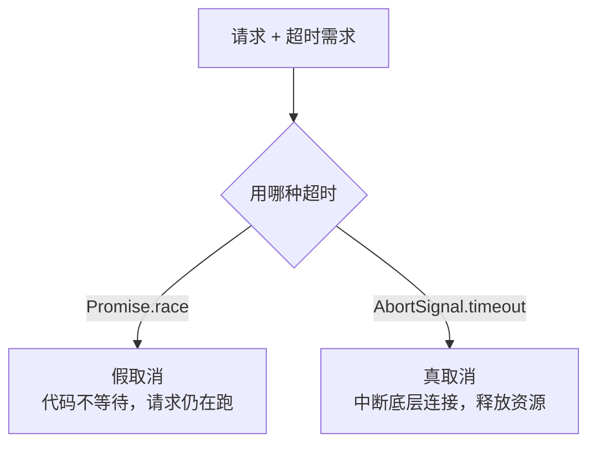

[Promise 组合器](/js/basic/core/11-promise-combinators/)篇留了一句
「race 超时只是不等了，请求还在跑」。这篇把「真取消」讲完：
AbortController——前端请求管理的最后一块拼图，也是搜索联想、组件卸载
这些场景的必考实现。

## 假取消 vs 真取消

用 `Promise.race([fetch, timeout])` 做超时，超时后只是**你的代码不再等
结果**，底层 HTTP 请求照样发出、服务器照样算、带宽照样占。真取消要让
浏览器**中断底层请求**——连接关闭、服务端感知断开（nginx 日志里能看到
upstream aborted），这才是 AbortController 的能力：



## AbortController 三件套

```js
const controller = new AbortController();
const { signal } = controller;

fetch('/api/list', { signal })
  .catch((e) => {
    if (e.name === 'AbortError') return; // 主动取消，不是错误
    console.error(e);
  });

// 任意时机取消：
controller.abort();
```

三个角色：`controller` 是遥控器（唯一能发起取消的对象）、`signal` 是
传给请求的「取消凭证」、`abort()` 按下开关。signal 上有 `aborted`
属性（是否已取消）和 `abort` 事件（监听取消时机）。取消后 fetch 以
`AbortError` 拒绝——**catch 里必须按 `e.name === 'AbortError'` 分流**，
否则主动取消会被当成错误上报，这是最常见的误报来源。

XMLHttpRequest 时代对应的是 `xhr.abort()` + `onabort` 回调；axios 的
CancelToken 已废弃，统一迁移到 signal——新代码一律 AbortController。

## 超时的标准写法

现代浏览器直接给了一个组合件：

```js
// AbortSignal.timeout(ms)：到点自动 abort，无需手动管理
const res = await fetch('/api/slow', {
  signal: AbortSignal.timeout(5000),
});
```

它就是「setTimeout + abort」的官方封装，且**超时属于真取消**。需要
「外部可手动取消 + 也有超时」时，用静态方法把两个 signal 合并：

```js
const controller = new AbortController();
const merged = AbortSignal.any([
  controller.signal,
  AbortSignal.timeout(5000),
]);
fetch('/api/list', { signal: merged }); // 手动取消或超时，任一生效
```

## 实战模式一：搜索联想防重复提交

输入框高频触发联想请求，响应乱序回来会把旧结果覆盖新结果——经典
竞态。标准解法：**发起新请求前 abort 上一个**：

```js
let controller = null;

input.addEventListener('input', async (e) => {
  controller?.abort(); // 旧的还没回来？掐掉
  controller = new AbortController();
  try {
    const res = await fetch(`/suggest?q=${e.target.value}`, {
      signal: controller.signal,
    });
    render(await res.json());
  } catch (err) {
    if (err.name !== 'AbortError') throw err; // 取消静默，错误上抛
  }
});
```

只有「最后一次发出的请求」能活到渲染，天然保证结果与输入一致——比
序号比对、时间戳过滤都干净。防抖管「少发」，abort 管「发了的作废」，
两者互补不替代。

## 实战模式二：组件卸载 / 页面隐藏时收尾

```js
const controller = new AbortController();
window.addEventListener('resize', onResize, { signal });
fetch('/api/init', { signal });

// 组件卸载：一行取消所有挂在该 signal 上的监听与请求
controller.abort();
```

`addEventListener` 的选项也支持 `signal`——一个 controller 可以同时
管理 N 个请求和 N 个事件监听，卸载逻辑收敛成一行 `abort()`，不再逐个
removeEventListener。React 的 StrictMode 双挂载效应、Vue 的
onUnmounted 清理，用的都是这个模式。

## 小结

- race 超时是假取消（不等待但请求仍在跑），AbortController 才中断
  底层连接。
- 三件套：controller 遥控、signal 凭证、abort() 开关；取消以
  `AbortError` 拒绝，catch 必须按 `e.name` 分流，否则误报。
- 超时标准件是 `AbortSignal.timeout`，多源取消用 `AbortSignal.any`
  合并；axios CancelToken 已废弃统一到 signal。
- 搜索联想「新请求 abort 旧请求」是防重复提交的标杆实现；signal
  同时管理请求与事件监听，卸载一行收尾。

## 延伸阅读

- [MDN：AbortController](https://developer.mozilla.org/zh-CN/docs/Web/API/AbortController)
- [MDN：AbortSignal.timeout](https://developer.mozilla.org/zh-CN/docs/Web/API/AbortSignal/timeout_static)
- [MDN：AbortSignal.any](https://developer.mozilla.org/zh-CN/docs/Web/API/AbortSignal/any_static)
