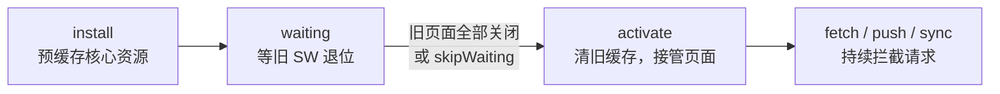

[Web Worker](/js/intermediate/web/06-worker/)篇的亲戚清单里点过名：
Service Worker 是「浏览器与网络之间的代理线程」。它让 Web 应用获得
离线能力，是 PWA 的地基——面试考三件事：生命周期为什么这么绕、缓存
策略怎么选、和 HTTP 缓存什么关系。

## 定位：装在浏览器里的网络代理

Service Worker 是一段**运行在浏览器后台、独立于页面**的脚本，核心能力
是**代理这个源下所有页面的网络请求**：页面发起 fetch，SW 可以先拦下来
——读缓存直接返回、转发网络、或两者混合。正因为它能全权代理请求，
「离线可用」才成为可能：断网时代理直接从缓存返回响应。

与 Web Worker 的关键差异：SW **没有页面、不能碰 DOM**，生命周期不由
页面持有——页面关了它还能在后台收 push 事件。这份「独立于页面的持久
性」换来一个强约束：**必须 HTTPS**（或 localhost）——一个能代理全部
流量的中间人，裸 HTTP 下就是劫持利器。

## 三阶段生命周期：为什么更新这么绕



三个阶段各干一件事，绕的根源是**旧版本可能还开着**：

- **install**：新 SW 首次注册后进入，一般在这里预缓存核心资源
  （`cache.addAll`）；
- **waiting**：旧的 SW 还在控制页面时，新 SW 只能排队——浏览器保证
  「同一时刻一个 SW 服务一个页面」，避免新旧脚本同时跑；
- **activate**：旧 SW 控制的页面全部关闭（或新 SW 调 `skipWaiting()`
  强制接班）后激活，通常在这里清理旧版缓存（`caches.delete`）。

由此推出高频追问「**SW 更新了用户怎么才能用到**」：默认要等用户关掉
所有旧页面、下次打开才生效。生产方案是「检测到新 SW 时提示用户刷新」
或 `skipWaiting + clients.claim()` 立即接管——代价是新代码可能在旧
页面上半途生效，要自己保证兼容。

## fetch 拦截与三种缓存策略

SW 激活后，源下页面的请求都会触发 SW 的 `fetch` 事件，策略自己写——
这是它与 HTTP 缓存最大的不同：**HTTP 缓存策略由响应头声明，SW 策略由
代码实现**：

```js
self.addEventListener('fetch', (event) => {
  event.respondWith(
    caches.match(event.request).then(
      (cached) =>
        cached ||
        fetch(event.request).then((res) => {
          const copy = res.clone(); // 响应流只能读一次，先留底
          caches.open('v1').then((c) => c.put(event.request, copy));
          return res;
        }),
    ),
  );
});
```

三个经典策略，按数据性质选：

| 策略 | 逻辑 | 适用 |
| --- | --- | --- |
| **Cache First** | 有缓存直接回，没有才请求 | 版本化静态资源（带 hash 的 JS/CSS） |
| **Network First** | 先网络，失败才落缓存 | 时效数据（新闻列表、天气） |
| **Stale-While-Revalidate** | 先回缓存，后台刷新 | 允许短暂陈旧的列表页 |

一个必踩的坑藏在代码里：**Response 的 body 流只能读一次**，要同时
「回给页面 + 存进缓存」必须 `res.clone()`——漏掉 clone，缓存里存的
是已被消费的空流。

## 与 HTTP 缓存的分层关系

[HTTP 缓存](/network/basic/http/06-http-cache/)管「这一条请求要不要
重新拿」，SW 管「整个应用的离线与资源编排」，两层**叠加生效**：SW 的
`fetch` 拦截先于 HTTP 缓存发生——SW 直接用缓存回话，HTTP 缓存根本
没机会参与。所以 SW 的缓存策略代码里如果再做 `cache.match` 之外的事
（如 `fetch(url, { cache: 'no-cache' })`），要清楚自己在操作哪一层。

## PWA 的定位

PWA（Progressive Web App）= 一组 Web 能力的组合拳，SW 是地基：
**SW 提供离线与代理 + Web App Manifest 提供安装元信息 + HTTPS 提供
安全前提**。三者齐了，Web 应用可以「安装到桌面、断网可用、推送可达」
——面试答 PWA 时按这个组合答，比单说「离线缓存」完整一个档次。

## 小结

- SW 是独立于页面的代理线程：能拦全部请求才有离线能力，也因此必须
  HTTPS。
- 生命周期绕的根源是「同一时刻一个 SW 服务一个页面」：install 预缓存
  → waiting 等退位 → activate 清旧接管；skipWaiting 可强制接班。
- 三策略按数据性质选：静态资源 Cache First、时效数据 Network First、
  折中 Stale-While-Revalidate；Response 流只能读一次，先 clone 再缓存。
- SW 拦截先于 HTTP 缓存，两层叠加各管一段；PWA = SW + Manifest +
  HTTPS 的组合。

## 延伸阅读

- [MDN：Service Worker API](https://developer.mozilla.org/zh-CN/docs/Web/API/Service_Worker_API)
- [Google：Service Worker 生命周期](https://web.dev/articles/service-worker-lifecycle)
- [Workbox：策略实现库](https://developer.chrome.com/docs/workbox)
