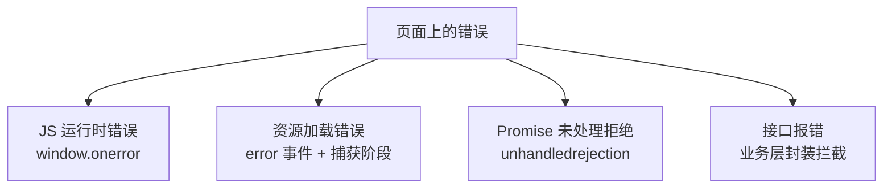

[错误处理](/js/basic/core/08-error-handling/)篇讲的是**语言机制**
（try/catch 怎么用、Error 家族怎么分），这一篇讲**生产视角**：用户
浏览器里每天发生的上千种报错，怎么一个不漏地抓到、看懂、报上来——
这是「监控平台」这类中间件的前端侧原理，面试常以「说说你们的错误
监控方案」出现。

## 四类错误来源，四个捕获入口

第一性：**不同来源的错误走不同的全局入口**，没有一网打尽的单点：

| 来源 | 捕获入口 | 关键细节 |
| --- | --- | --- |
| 同步 JS 错误 | `window.onerror` | 拿到 msg/source/lineno/error 完整五参 |
| 资源加载错误 | `addEventListener('error', fn, true)` | **不冒泡**，必须在捕获阶段监听 window |
| Promise 拒绝 | `unhandledrejection` | 只抓没人 catch 的，catch 过的进不来 |
| 接口错误 | 业务封装（axios 拦截器） | 4xx/5xx 不触发上面任何入口 |

最经典的坑是第二行：``、`<script>` 加载失败的 error 事件**不冒泡**
——挂在 window 上的冒泡监听永远收不到，必须开**捕获阶段**
（`capture: true`）。而 `window.onerror` 也收不到资源错误——两个入口
各自漏一类，所以要并存。

## Script error.：跨域脚本的刻意打码

接了监控平台的人都会见过一堆 `Script error.`、无行号无堆栈的报错。
这不是 bug，是**浏览器的安全策略**：页面加载了 CDN 上的第三方脚本，
脚本抛错时，如果脚本域与页面不同源，错误细节被刻意抹掉——否则恶意
页面可以靠报错信息探测跨域脚本的内部内容。

解锁方式两步，缺一不可：

1. 脚本标签加 `crossorigin="anonymous"`（声明愿以 CORS 方式获取）；
2. CDN 响应头回 `Access-Control-Allow-Origin`（同意）。

两者齐了，跨域脚本的完整错误信息才会在 onerror 里展开。面试答
「为什么你们的监控全是 Script error」能说到 CORS 这层，就过了深水区。

## sourcemap：把压缩代码报错翻译回源码

生产代码经过压缩混淆，「a.b is not a function」发生在 `app.8f2c.js`
第 1 行第 88 万列——没法看。sourcemap 是压缩器生成的「行列映射表」，
监控平台拿到 sourcemap 就能把错误位置**反向还原到源码的文件、行号、
甚至原始变量名**。

工程要点：sourcemap 只上传监控平台、**不部署到线上**（否则等于发布
源码）；构建时按版本归档，报错按版本号匹配对应 map。React 生产报错
只给错误码（Minified React error #185）也是同一套逻辑——完整信息在
官方的解码页里。

## 上报策略：别让监控自己把页面拖垮

监控代码跑在用户的页面上，它自己必须轻：

- **聚合去重**：同一个错误（按 stack 哈希）上报一次 + 计数，1000 个
  用户撞同一个 bug 就传 1000 份是流量事故；
- **采样率**：性能类、高频类可采样（如 10%），错误类通常全量；
- **上报通道**：走 `sendBeacon` / `fetch keepalive`——页面崩了或用户
  立刻关闭，报错照样送达（呼应[性能采集](/js/intermediate/web/10-web-vitals/)篇）；
- **自我保护**：监控代码外层再包 try/catch，别让监控本身成为新错误源。

## 小结

- 四类来源四个入口：onerror 抓 JS 错误、捕获阶段 error 事件抓资源
  错误（不冒泡）、unhandledrejection 抓漏网 Promise、接口错误靠业务
  拦截器。
- Script error. 是跨域脚本的刻意打码，`crossorigin` + CORS 头两件套
  解锁完整信息。
- sourcemap 让压缩报错还原到源码，map 只进监控平台不上线。
- 上报三板斧：聚合去重、采样率、sendBeacon 通道，监控不能拖垮页面。

## 延伸阅读

- [MDN：window.onerror](https://developer.mozilla.org/zh-CN/docs/Web/API/Window/error_event)
- [MDN：unhandledrejection](https://developer.mozilla.org/zh-CN/docs/Web/API/Window/unhandledrejection_event)
- [web.dev：解释 Script error](https://web.dev/articles/cors-made-easy)
