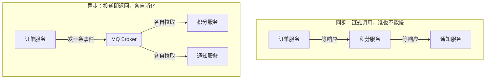

面试聊 MQ，开口第一句不该是"Kafka 怎么用"，而是**"为什么需要它"**——
三问框架：是什么、为什么、代价是什么。这三问答好了，后面 Kafka/RocketMQ/RabbitMQ
的具体机制才有挂靠的地方。

## 一问：MQ 是什么

一条**异步中转的缓冲管道**：生产者把消息投给 Broker 就返回，消费者按自己的节奏
拉取处理。对比同步调用一句话看清差别：

- 同步：下单接口的耗时 = 所有下游耗时之和，**任何一家慢或挂，下单跟着遭殃**。
- 异步：订单服务发一条"订单已创建"事件即返回，下游谁需要谁订阅——
  订单服务**根本不知道**有多少个下游。

## 二问：为什么用（三大价值）

- **解耦**：新加一个"风控服务"消费订单事件，订单服务**一行代码不改**。
  生产者只面向"事件"，不面向"谁在消费"。
- **削峰**：秒杀瞬时 1 万 QPS，下游只扛得住 1 千——请求先进队列排队，
  消费端按自己的能力匀速消化。队列是**抗住洪水的堤坝**，不是加速器。
- **异步**：非核心链路（发短信、记积分、发通知）后置执行，核心接口
  响应时间从"所有下游之和"降到"主流程耗时"。

## 三问：代价是什么（面试加分项）

能说出代价，才证明真用过：

- **复杂度转移**：丢消息、重复消费、消息顺序、积压——同步调用里不存在
  的问题全冒出来了（Kafka 可靠性篇、幂等消费篇逐个拆解）。
- **最终一致**：异步意味着下游晚一点才生效，订单"已下单"但积分"还没到"——
  业务必须接受窗口期，强一致场景别用 MQ。
- **多一个组件**：Broker 本身要部署、扩容、监控、调优，它挂了比下游挂了更糟。

**什么时候不该用 MQ**：调用链路简单且强一致（转账扣款同事务）、
QPS 本来就不高、下游就一个且不会增长——硬上 MQ 是给自己找运维负担。

## 高频追问速答

- **解耦/削峰/异步哪个最核心？** 看业务：交易系统多是削峰，平台系统多是解耦；
  能按场景说比背三条更有说服力。
- **MQ 选型看什么？** 吞吐（Kafka 十万级 > RabbitMQ 万级）、延迟语义、
  事务/顺序能力、运维成本——本站 Kafka/RocketMQ/RabbitMQ 方向各有深入篇。
- **用了 MQ 数据就不一致了怎么办？** 接受最终一致 + 对账兜底；
  需要强一致的部分留在同步链路（见分布式事务篇）。

## 小结

- MQ = 异步中转的缓冲管道；价值是解耦、削峰、异步，代价是复杂度、最终一致、多组件。
- 三问框架是所有 MQ 面试题的入口，后续每一篇机制笔记都在回答其中某一问的深化。
