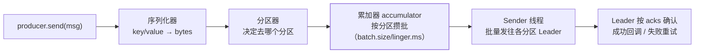

import AlgorithmVizIsland from '../../../../../components/viz/AlgorithmVizIsland.astro';

消费侧有 offset 篇打底，broker 侧有 ISR 篇讲 acks 语义，但**消息从 `send()`
到落盘的客户端路径**没有专篇——"消息发出去就不管了？"背后的分区选择、
批量发送、重试乱序是生产端排障的日常，也是高频面试题。

## send() 的完整旅程



要点：

- `send()` **异步**：消息进累加器就返回 Future，真正的网络发送由 Sender
  线程批量做（批量与 linger.ms 的权衡在高吞吐篇深挖过）。
- **分区选择三规则**（按序判断）：①消息指定了 partition 用之；②有 key 按
  `hash(key) % 分区数`（同 key 恒同分区——有序性的根基）；③都没有走
  **粘性分区**：一批时间内钉住一个随机分区，攒满换下一个（3.x 行为），
  目的是让批量更满。

这条双线程路径按帧放一遍，「send() 返回」与「消息落盘」之间发生了什么一目了然：

<AlgorithmVizIsland demo="kafka-producer" />

## 重试与乱序：一对陷阱

网络抖动时生产者会重试（`retries`，默认整型最大值）。问题在：
**重试 + 在途请求 > 1 = 乱序**——第一批失败重试时，第二批已经成功写入，
最终分区里第二批排在第一批前面。

```
max.in.flight.requests.per.connection > 1 且无幂等 → 重试可能乱序
开了幂等生产者 → Broker 按 sequence number 重排，分区内仍有序
```

面试标准答法：**顺序性要求高的场景必须开幂等生产者**
（`enable.idempotence=true`），它同时解决两个问题：

1. **重复**：每个（生产者，分区）有独立序列号，Broker 见到重发的同序列号
   消息直接去重——重试不再造成写入重复；
2. **乱序**：Broker 按序列号重排，`max.in.flight ≤ 5` 时保证分区内有序。

## acks 的生产者视角

ISR 篇从 broker 角度讲过 acks，生产者侧补一张速查：

| acks | 含义 | 代价 |
| --- | --- | --- |
| `0` | 发出去就算成功 | 可能丢，最快 |
| `1` | Leader 落盘即成功 | Leader 挂且未同步时丢 |
| `all/-1` | ISR 全部落盘 | 最慢，配合 `min.insync.replicas` 不丢 |

配合关系：**acks=all + 幂等 + `min.insync.replicas≥2`** 是"不丢消息"的生产
标准三件套（可靠性篇的三环节视角互补）。

## 高频追问速答

- **send() 返回成功就代表落盘了吗？** 不——只代表进了累加器；要确认
  结果用 `get()` 拿 Future 或注册回调，生产代码里"发完就忘"是丢消息的高发姿势。
- **粘性分区为什么存在？** 逐条随机选分区会把一批消息摊薄到多个 batch，
  批量收益归零；钉住一个分区攒满再换，吞吐显著更高。
- **幂等生产者能跨会话去重吗？** 不能——序列号随 producer 会话（PID）
  重启即换；跨会话幂等要用 Kafka 事务（transactional.id）或业务侧去重。

## 小结

- send 异步五步：序列化 → 分区 → 攒批 → Sender 批量发 → acks 确认；
  分区三规则里 key 哈希是顺序性的根。
- 重试与乱序互锁，**幂等生产者**用序列号一并解决重复与乱序（max.in.flight≤5）。
- 不丢消息的生产标准：acks=all + 幂等 + min.insync.replicas≥2。
