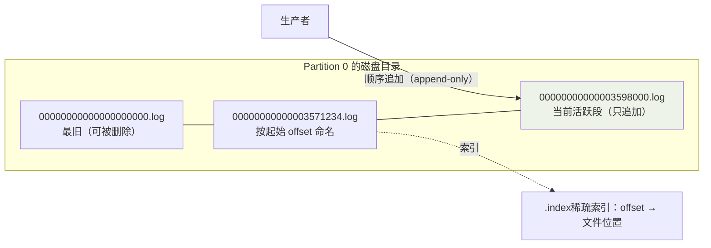
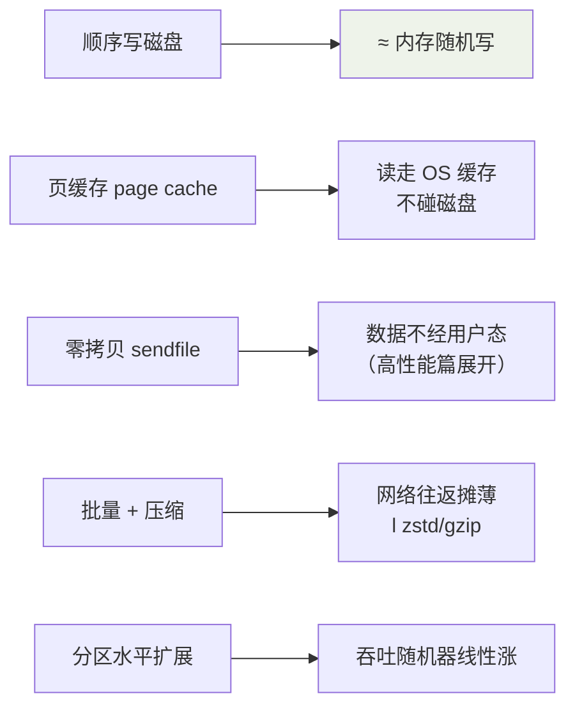

## 三层模型

```mermaid
flowchart TB
    subgraph TOPIC["Topic: order-events（逻辑主题）"]
        P0["Partition 0"]
        P1["Partition 1"]
        P2["Partition 2"]
    end
    subgraph BROKERS["Broker 集群（每分区多副本分布在不同机器）"]
        B1["Broker 1<br/>P0L + P1F"]
        B2["Broker 2<br/>P0F + P1L"]
        B3["Broker 3<br/>P2L"]
    end
    subgroup CG["Consumer Group: inventory-service"]
        C1["Consumer 1<br/>← P0"]
        C2["Consumer 2<br/>← P1 + P2"]
    end
    P0 -.leader 副本.-> B1
    P1 -.leader 副本.-> B2
    C1 --> B1
    C2 --> B2

    style TOPIC fill:#f5f0e6
```

三个概念一句话：

- **Topic**：逻辑分类（订单事件、支付事件……）。
- **Partition**：Topic 的物理分片——**扩展与并行的最小单位**（与哈希
  槽思想同源，见一致性哈希篇）。
- **Consumer Group**：消费组内**一个分区只给一个消费者**（组内互斥），
  组与组之间互不影响（广播语义的来源：两个组各自消费全量）。

```
分区数 = 组内并行度的上限（消费者数 > 分区数 → 多余的闲着）
吞吐不够 → 加分区；但加分区会触发 Rebalance 且破坏 key 顺序
```

**key 的路由作用**：`hash(key) % 分区数` 决定消息去哪个分区——同一
订单 id 的事件永远同分区，这是"分区有序"的根基（顺序性篇展开）。

## 存储模型：顺序写 + 分段日志

每个分区在磁盘上是**一串只追加的日志文件**（segment）：



- **只在文件尾追加**：磁盘顺序写 ≈ 内存随机写的速度（几百 MB/s），
  这是 Kafka 吞吐的物理根基。
- **分段 + 按时间/大小滚动**：旧段整文件删除（过期清理是"删文件"
  而不是"删消息"，O(1)）。
- **offset 即地位**：每条消息在分区内单调递增的编号，消费进度就是
  一个数字——极简的进度模型。

## 消费：拉模式 + offset 提交

```java
// 消费者主动拉取批量消息，处理完提交 offset（进度游标）
while (true) {
    ConsumerRecords<String, String> records = consumer.poll(Duration.ofMillis(500));
    for (ConsumerRecord<String, String> r : records) {
        process(r);                       // 先处理……
    }
    consumer.commitSync();                // ……后提交（手动提交，防丢的关键）
}
```

- offset 存在内部主题 `__consumer_offsets` 里（不是 ZooKeeper，0.9+）。
- **自动提交**（`enable.auto.commit=true`，默认 5s）的问题是"先提交后
  处理"——崩溃时消息丢/重（不丢消息篇展开）。

## Rebalance：消费组的重新洗牌

消费者加入/退出（部署发布！）、分区数变化都会触发**重平衡**：分区
重新分配给组内消费者。

代价：**重平衡期间全组停止消费**（默认协议下），频繁发生就是消费
抖动的元凶。治理手段：

| 手段 | 作用 |
|---|---|
| 静态成员（`group.instance.id`） | 滚动发布不触发 Rebalance（替代：优雅关闭） |
| 合理心跳与会话超时 | 避免误判死亡 |
| CooperativeStickyAssignor | 增量重平衡（只挪必要分区，不再全停） |
| 分区数提前规划 | 避免中途扩分区 |

## Kafka 为什么快（总结清单）



## 小结

- 三层模型：Topic 逻辑分类、分区并行单位（key 定路由）、消费组组内
  互斥 + 组间广播。
- 存储三件套：顺序追加、分段删除、offset 进度——极简设计换来极限
  吞吐。
- Rebalance 全组停摆是最大的坑：静态成员 + 增量分配协议是生产标配。
