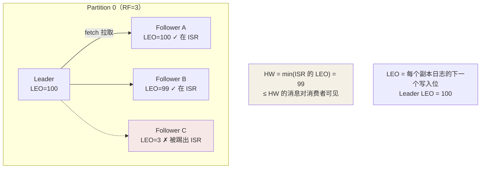

## 副本：可用性的来源

每个分区有 N 个副本（replication factor），分布在不同 Broker：

- **Leader 副本**：分区的唯一读写入口——生产消费都只找 Leader。
- **Follower 副本**：只做一件事——**不断从 Leader 拉取数据对齐**
  （注意是 pull，不是 Leader push，与注册中心的"通讯录"哲学相反：
  Kafka 让落后者自己追）。

## ISR：动态"及格名单"

**In-Sync Replicas（ISR）= Leader + 跟得上的 Follower**。"跟不上"
由参数定义：落后超过 `replica.lag.time.max.ms`（默认 30s）就被踢出。



两个进度指标：

| | 含义 | 作用 |
|---|---|---|
| **LEO**（Log End Offset） | 下一条要写入的位置 | 副本各自的"写到了哪" |
| **HW**（High Watermark） | ISR 中最小的 LEO | **消费者只能看到 < HW 的消息**——保证消费者永远只读到"已多副本持久化"的数据 |

Follower 拉取分两步：先拉数据（LEO 前进），再拉 HW 更新自己的可见水位
——所以 Follower 恢复速度 = 拉数据 + 等下一轮 HW 同步。

## Leader 选举：ISR 优先

Leader 宕机 → Controller（或 KRaft 元数据管理）从 **ISR 里挑一个**新
Leader。为什么必须是 ISR：**ISR 里的副本拥有全部已提交消息**，切换
零丢失。

### Unclean 选举：A 与 C 的选择

```
极端场景：ISR 全灭（Leader + 所有同步副本同时宕机），只剩落后的 C
```

```yaml
unclean.leader.election.enable: false   # 默认：不选，分区不可用（CP 倾向）
unclean.leader.election.enable: true    # 选 C：恢复服务但丢 C 缺的那段数据（AP 倾向）
```

这是 CAP 的又一现场（见 CAP 篇）：日志场景通常选 false（丢日志不如停
服）；交易场景有人选 true 换可用性——**没有免费午餐，只有明确取舍**。

## acks：生产者侧的复制确认

```yaml
acks: 0     # 发出去就算成功（可能丢，吞吐最高）
acks: 1     # Leader 落盘即成功（Leader 宕机未同步 → 丢）
acks: all   # ISR 全部确认（配合 min.insync.replicas ≥ 2 才有意义）
```

**acks=all 单独用没用**——ISR 可能收缩到只剩 Leader 自己（"全部"退化
成"一个"）。配套必须加：

```yaml
min.insync.replicas: 2    # ISR 至少 2 个副本才接受写入
# 组合语义：RF=3 + min.insync.replicas=2 + acks=all
# 容忍 1 台宕机不丢消息；2 台同时宕机时写入报错（宁可不可用）
```

## KRaft：告别 ZooKeeper

3.x 起 Kafka 用内置 **KRaft（Kafka Raft）** 协议自管元数据，4.0 正式
移除 ZooKeeper 依赖：

| | 旧架构（ZK） | KRaft |
|---|---|---|
| 元数据 | 存 ZooKeeper，双系统同步 | 内置 Raft 日志（`__cluster_metadata`） |
| Controller 故障切换 | 依赖 ZK 会话，秒级 | Raft 选主，**毫秒级** |
| 扩容 | 元数据变更经 ZK 竞争写 | Raft 日志统一分发 |
| 组件数 | Kafka + ZK 两套 | 一套 |

元数据本身也是共识问题——所以答案是 Raft（共识篇的又一个落地现场：
**元数据 = 状态机，Raft 保证各 Broker 看到同一份**）。

## 小结

- 副本模型：Leader 独挑读写、Follower pull 追赶；ISR 是动态及格线。
- LEO 是个人进度、HW 是集体可见水位；消费只见到 < HW 的消息。
- RF=3 + min.insync.replicas=2 + acks=all 是"容忍一台宕机不丢"的标准
  答案；unclean 选举是显式的 CAP 抉择；元数据共识交给 KRaft（Raft）。
