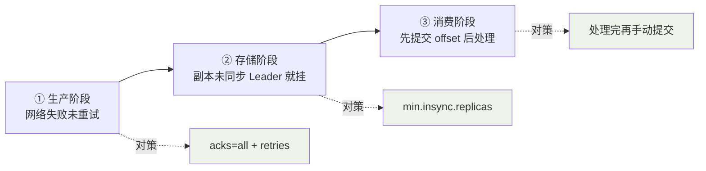
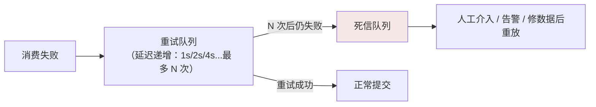

## 丢消息只可能发生在三个环节



### ① 生产端

```yaml
acks: all
retries: 2147483647         # 重试到天荒地老（配合 delivery.timeout）
enable.idempotence: true    # 幂等生产者（下文）
```

一个隐蔽陷阱：**异步 send 不看回调**。`producer.send(msg)` 不阻塞，
网络失败默默吞掉——必须带回调：

```java
producer.send(new ProducerRecord<>("order-events", key, value),
    (metadata, exception) -> {
        if (exception != null) {
            // 记日志 / 本地落盘兜底 / 告警，而不是 void 掉
            log.error("send failed", exception);
        }
    });
```

**幂等生产者**（enable.idempotence）：broker 按 `<PID, 分区, 序列号>`
去重，网络重试不再产生重复——但 **PID 每次重启都变，只保护单会话单
分区**，跨会话仍需业务级去重。

### ② 存储端

`acks=all` + `min.insync.replicas=2`（ISR 篇的结论）。刷盘参数顺带
一提：`log.flush.interval.messages` 默认交给 OS 页缓存异步刷——**Kafka
的持久性依赖副本而非单机 fsync**，副本数就是安全边界。

### ③ 消费端（最常见的丢法）

```java
// ❌ 自动提交（默认）：poll 后 5s 内提交 offset，处理还没做完
//    → 崩溃后新消费者从已提交 offset 继续 → 没处理完的消息"被跳过" = 丢

// ✅ 关闭自动提交，处理完成后再手动提交
props.put("enable.auto.commit", "false");
ConsumerRecords<String, String> records = consumer.poll(Duration.ofSeconds(1));
for (ConsumerRecord<String, String> r : records) {
    process(r);
}
consumer.commitSync();   // 语义：offset 之前的一定处理完了（At Least Once）
```

手动提交的代价：崩溃后 **offset 之前的重处理** → 重复消费 → 需要幂等。
这正是"不丢"与"不重"的交换：**重试天然存在，幂等才是真正的防线**。

## 幂等消费三件套

```java
// ① 唯一键去重表：业务唯一号 + 处理状态
@Transactional
public void handle(OrderEvent event) {
    if (dedupMapper.exists(event.getEventId())) return;  // 处理过，直接吞
    dedupMapper.insert(event.getEventId());               // 占坑
    orderMapper.insert(toOrder(event));                    // 同一本地事务
}

// ② 状态机：只允许合法迁移，重复消息撞在状态上自然失效
update orders set status='PAID' where id=? and status='UNPAID';
// 返回 0 行 = 已处理过（或状态不对），天然幂等

// ③ Redis SETNX：高频场景的前置快速过滤（TTL 兜底防膨胀）
Boolean first = redis.setIfAbsent("mq:dedup:" + event.getEventId(), "1", 24, HOURS);
if (Boolean.FALSE.equals(first)) return;
```

选型：**低频要准用去重表（本地事务保原子）；高并发用 Redis 前置过滤 +
表兜底；状态迁移天然幂等的业务（更新余额为绝对值）什么都不用做**。

## 重复消费的必然性

把整条链路串起来看，重复**注定**发生：

```
生产者重试（网络抖动）+ Broker 收到了但 ack 丢了 → 重复写入
消费者处理完、提交 offset 前崩溃 → 重启后重复消费
Rebalance 触发 → 未提交部分被重新分配重消费
```

所以设计期的第一问不是"怎么不重复"，而是"**重复发生了，业务会不会坏**"
——幂等不是优化项，是 MQ 业务的**准入证**。

## 死信与重试：处理不了的怎么办

消费失败（抛异常/超时）不能无限重试阻塞队列，标准姿势是**重试队列 +
死信队列（DLQ）**：



RocketMQ 自带（`%RETRY%`/`%DLQ%`）；Kafka 需自建 topic 或交给
Spring Kafka 的 `DeadLetterPublishingRecoverer`。**死信队列必须有
监控**——积压在死信里的每一条都是真实业务损失。

## 小结

- 三段检查表：生产（acks=all + 回调必看）、存储（min.insync.replicas=2）、
  消费（处理后再手动提交）。
- 重复不可避免（重试/Rebalance 的天性），幂等三件套：去重表、状态机、
  Redis SETNX。
- 处理不了的消息进重试/死信队列——DLQ 有监控、有人管，才算闭环。
