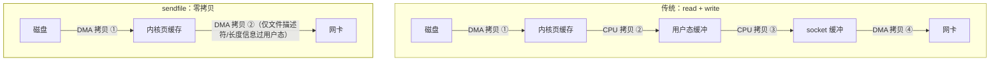

"Kafka 为什么快"几乎是必考题。正确答案不是某个单一技巧，而是**六个机制的乘积**——
每个都砍掉一条传统消息中间件的耗时路径。架构篇给过总结清单，本篇逐个拆开讲原理和参数。

## 六个机制的总览

一句话版本：**写进来快（顺序写+页缓存）、存下去快（不进 JVM 堆）、发出去快（零拷贝）、
攒着发快（批量+压缩）、横向堆快（分区并行）**。

## 顺序写：磁盘并不慢，随机才慢

机械硬盘随机写约 100 IOPS 量级，而**顺序写可达上百 MB/s**——差距来自寻道：
随机写每次都要磁头寻道+旋转等待，顺序写磁头只管往前推。Kafka 每个分区就是一串
只追加的日志段（存储模型篇展开），**永远不修改已写数据**，把磁盘用成了磁带。

- 对 SSD 道理依然成立：随机写在 SSD 上虽快，但顺序写仍有**写入放大更低、
  GC 压缩回收更友好**的优势。
- 面试表达：顺序写把"慢介质的短板路径"绕开了，这不是 Kafka 独有——Redis AOF、
  MySQL redo log、LSM-Tree 全是同一个思想（见存储引擎篇）。

## 页缓存：Kafka 不自己管内存

Kafka **不建自己的缓存层**，直接用操作系统的 PageCache：

- **写**：`producer` 的消息落到 PageCache 即返回（配合 acks 语义），OS 异步刷盘，
  崩溃风险由多副本兜底而不是 fsync——这是 Kafka 敢不刷盘的底气（ISR 篇的 acks=-1）。
- **读**：消费者追尾读（读最新 offset）时，数据**还在 PageCache 里**，等于内存级读取；
  只有积压很深、读冷数据时才真正落盘。
- 为什么不放 JVM 堆？三个理由：①堆内对象有 GC，几十 GB 缓存一次 Full GC 全抖；
  ②堆内缓存在进程重启后清零，**OS 页缓存在 broker 重启后依然热**；
  ③省去堆内→socket 的一次多余拷贝。面试常问，答这三条。

## 零拷贝：省掉两次拷贝两次切换

消费者拉消息，传统路径要 **4 次拷贝 + 4 次用户/内核态切换**：

- 省掉的：②③两次 CPU 拷贝（数据不再进用户态）和对应的两次上下文切换。
  CPU 不碰数据，只搬运描述符，Broker 进程纯当"调度员"。
- Kafka 用 `java.nio.FileChannel.transferTo`（底层 sendfile）实现，索引文件的
  mmap（内存映射）是另一处零拷贝：索引直接映射进地址空间，免 read 系统调用。
- **高频追问：零拷贝什么时候失效？** ①开启 SSL/TLS——加密必须在用户态改写字节，
  sendfile 链路断掉，退化回多份拷贝（所以"Kafka 开加密后吞吐明显下降"是正常现象）；
  ②需要对消息做转换/校验的消费者路径。追问这一层才算真懂。

## 批量与压缩：用延迟换吞吐

生产端两条消息之间如果逐条发网络请求，大部分开销花在**每条消息一次的 RPC 与
协议头上**。Kafka 的做法是攒批：

| 参数 | 作用 | 调大的代价 |
| --- | --- | --- |
| `batch.size` | 单分区攒批的字节上限 | 内存占用上升 |
| `linger.ms` | 宁可等多少毫秒凑一批 | 端到端延迟上升 |
| `compression.type` | 批级别压缩（lz4/zstd/snappy） | Broker/消费者 CPU 上升 |

三个要点：

- **压缩是批级别的**——一批里消息越相似压缩率越高，这也是攒批的隐藏收益。
- `linger.ms=0` 不是不攒批：一批满了照样发，linger 只是"没满再多等一会"。
- 吞吐敏感的日志类 Topic 用大 batch + zstd，延迟敏感的交易类用小 batch + lz4，
  这是"吞吐换延迟"的典型权衡（见网络篇可靠传输的同类权衡）。

## 分区并行：横向扩展的总开关

前四个机制决定"单分区多快"，分区数决定"一共多少条道"：

- 生产端：多分区可并行追加（不同分区的日志文件互不竞争）。
- 消费端：分区数 = 消费组内并行度上限（架构篇的三层模型）。
- 副本：每个分区独立选主，故障恢复互不影响。

代价也在架构篇说过：加分区触发 Rebalance、破坏 key 路由的有序性、
更多文件句柄与副本迁移成本。**分区不是越多越好**，经验值是单分区吞吐×分区数
略高于目标吞吐即可。

## 网络模型：Reactor 多路复用（一句话版）

Broker 侧是 Reactor 模式：Acceptor 接连接，Processor 线程用 epoll 批量监听
IO 就绪事件，请求丢进队列由工作线程处理——单机撑海量连接靠的不是线程多，
是**不为一个连接泡一个线程**（与 Netty/Redis 单线程事件循环同源，见 IO 模型篇）。
面试能点到"多路复用+请求队列"即可，重点仍在上面五个机制。

## 高频追问速答

- **Kafka 比 RabbitMQ 快在哪？** 批量+零拷贝+页缓存是 Kafka 激进利用 OS 的三板斧；
  RabbitMQ 消息语义更重（单条确认/复杂路由），设计目标不同，不是单纯"优化差距"。
- **顺序写为什么对 SSD 也重要？** 写入放大与垃圾回收压力更低，且 Kafka 的
  索引稀疏设计依赖追加模型的 offset 单调性。
- **消息太老读冷数据，页缓存没命中怎么办？** 真落盘读，这是 Kafka 读取慢的场景——
  所以监控要看消费者 lag，追尾读才吃得到页缓存红利。
- **零拷贝和 SSL 不可兼得怎么办？** 要么牺牲吞吐开加密，要么内网明文+外层统一加密，
  按安全边界划，不是二选一的技术问题而是架构决策。

## 小结

- 快 = 顺序写（绕开随机 IO）+ 页缓存（不进堆、重启仍热）+ 零拷贝（CPU 不碰数据）
  + 批量压缩（摊薄协议开销）+ 分区并行（横向加道）+ Reactor（不泡线程）。
- 每个机制都有代价与失效场景：零拷贝怕 SSL、攒批加延迟、加分区破坏有序性——
  面试说出代价比背出机制更能证明理解。
