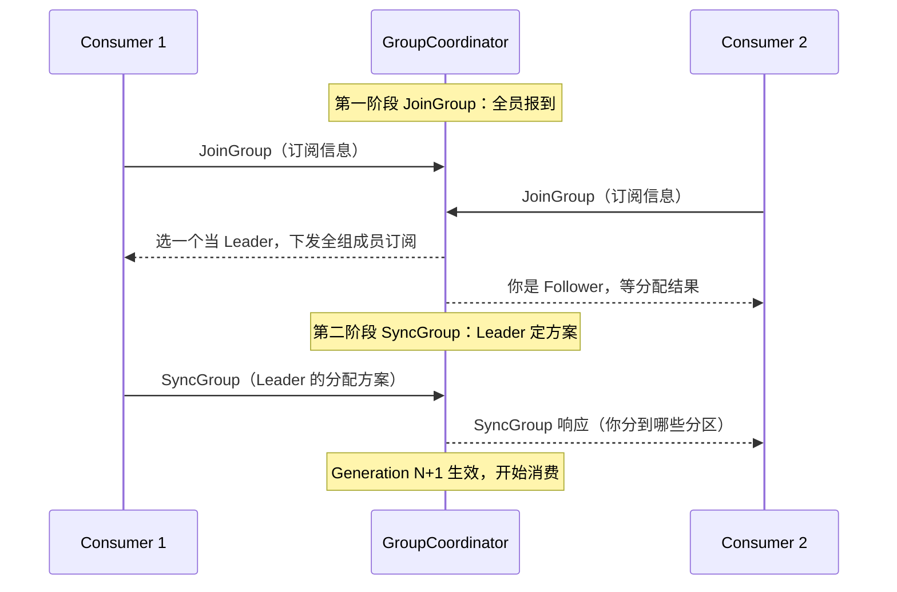

import AlgorithmVizIsland from '../../../../../components/viz/AlgorithmVizIsland.astro';

架构篇的 Rebalance 小节给了"是什么 + 治理表格"，本篇深挖面试官追问的三层：
**协议怎么走、为什么代价是全组停摆、参数到底怎么调**。"线上消费突然抖了一下"
的事故里，Rebalance 是出镜率最高的嫌疑人。

## 什么时候触发

三个来源，面试要答全：

- **成员变化**：新消费者加入、旧消费者退出（**主动关闭、崩溃、处理太慢被踢**——
  部署发布是最常见场景）、心跳超时被判定死亡。
- **订阅变化**：组内消费者订阅的 Topic 列表变了（含正则订阅命中新 Topic）。
- **分区变化**：Topic 扩分区（这也是"分区提前规划"的原因）。

## 协议：两阶段洗牌

每个消费组的 Broker 端有一个 **GroupCoordinator**（选分区所在的 Broker 担任），
重平衡走 JoinGroup / SyncGroup 两阶段：

要点：

- **分配方案由消费者组的 Leader 算**（不是 Coordinator）——Coordinator 只负责
  收集与下发。分配策略就是 `partition.assignment.strategy`（Range / RoundRobin /
  Sticky / CooperativeSticky）。
- 每次重平衡 **Generation 代数 +1**：旧代提交的 offset 会被拒绝，防止新旧
  成员同时写——这是"僵尸消费者"的防线。

两阶段洗牌按帧放一遍（注意方案是谁算的、Generation 什么时候变）：

<AlgorithmVizIsland demo="kafka-rebalance" />

## 为什么代价是全组停止消费

默认（Eager）协议下，JoinGroup 一开始**所有成员要放弃手头全部分区**再进组——
哪怕这次只是"一个新消费者加入"。于是大组重平衡 = 所有消费者停摆数秒到数十秒，
期间消息积压。这就是治理表格里所有手段的靶子：

- **静态成员**（`group.instance.id`）：重启后身份不变，Coordinator 认为"只是
  暂离"，**滚动发布不再触发重平衡**——K8s 环境优先配置。
- **增量协作重平衡**（CooperativeStickyAssignor）：两阶段变成"只挪必要的分区"，
  被挪走的短暂停一下，其余消费者**全程不停**——大组必开。

## 三个超时参数：高频陷阱题

| 参数 | 谁负责 | 含义 |
| --- | --- | --- |
| `heartbeat.interval.ms` | 心跳线程 | 心跳间隔，建议为会话超时的 1/3 |
| `session.timeout.ms` | 心跳线程 | 多久没心跳判死亡（**与处理快慢无关**） |
| `max.poll.interval.ms` | 业务线程 | 两次 poll 的最大间隔，**处理慢被踢看它** |

陷阱在区分后两个：消费者"活着但被踢出组"，大概率是 `max.poll.interval.ms`
内没来得及下一次 poll（单批处理太慢）——解法是调小 `max.poll.records` 或调大
该参数，**调 session.timeout.ms 是无效的**。这条辨析是面试和排障的共同分水岭。

## 高频追问速答

- **重平衡期间已消费但没提交的 offset 会怎样？** 分区转给别人后可能重复消费
  ——重平衡也是重复消费的常见来源（与幂等消费篇互为因果）。
- **怎么发现线上在频繁 Rebalance？** 看消费组 `generation` 是否持续增长、
  消费 TPS 周期性归零；日志里找 `Attempt to heartbeat failed` / 
  `rebalance failed`。
- **Coordinator 怎么选？** `__consumer_offsets` 分区的 Leader 所在 Broker
  （组名哈希到 50 号分区），能答到"分区 Leader 担任"即可。

## 小结

- 触发三来源：成员、订阅、分区；协议两阶段：JoinGroup 全员报到 + SyncGroup
  Leader 分配，Generation 防僵尸。
- Eager 协议全组停摆是原罪，静态成员治发布抖动、增量协作治大组停摆。
- 两个超时管两件事：心跳超时管"死没死"，poll 间隔管"处理慢"，混为一谈是
  排障与面试的双重踩坑点。
