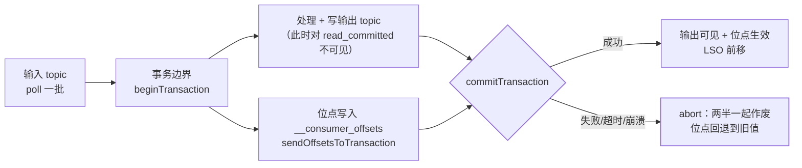

## 先把三个词分开：幂等、事务、Exactly-Once

[不丢消息与幂等消费](/kafka/intermediate/core/03-reliability-idempotent/)
讲的是**幂等生产者**：broker 按 `<PID, 分区, 序列号>` 去重，解决"同一次
重试发出两份"。它的射程很短——单会话、单分区。

事务解决的是另外两件事。`KafkaProducer` 的 Javadoc 把定位写得很清楚：
从 0.11 起多两种模式，幂等生产者把投递语义从 at-least-once 抬到
exactly-once delivery，而**事务生产者让应用可以原子地往多个分区（甚至
多个 topic）发消息**。两个约束要记住：设了 `transactional.id`，
idempotence 会被自动打开；事务 API 全部是阻塞式的，失败即抛异常。

| 层次 | 解决的问题 | 身份来源 |
|---|---|---|
| 幂等生产者 | 重试不产生重复 | PID（进程重启就换） |
| 事务 | 一批写入 + 一批 offset 要么都算数要么都不算数 | `transactional.id`（跨重启稳定） |
| EOS | 读—算—写的端到端一次 | 上面两者 + 消费端 `read_committed` |

**本篇的主线是一句话**：Kafka 的 Exactly-Once 是"**从 Kafka 读、往 Kafka
写**"这个闭环内的一次。官方 design 文档的表述是——当消费者从 Kafka topic
消费、生产到另一个 topic 时，可以借助事务实现 exactly-once；因为消费者的
position 本身就是**作为一条消息写进内部 topic 的**，所以它能和输出数据
放进同一个事务。这句话同时给出了能力来源和失效边界。

## 事务到底原子化了什么：offset 也是一条消息

理解这一点，后面所有结论都能自己推出来。传统"处理完再 `commitSync()`"
的做法里，写输出和提交位点是**两次独立动作**，中间崩就出现"输出写了两遍
但位点没走"。事务把这两半焊成一次提交：



标准骨架（照 Javadoc 的示例结构，异常分诊是重点）：

```java
props.put(ProducerConfig.TRANSACTIONAL_ID_CONFIG, "order-eos-0");
producer.initTransactions();          // 向 coordinator 注册身份并清理旧事务
try {
    producer.beginTransaction();
    producer.send(outputRecords);
    producer.sendOffsetsToTransaction(  // 位点进同一个事务
        offsets, consumer.groupMetadata());
    producer.commitTransaction();
} catch (ProducerFencedException | OutOfOrderSequenceException
         | AuthorizationException e) {
    producer.close();   // 身份已失效，只能重建，不能重试
} catch (KafkaException e) {
    producer.abortTransaction();      // 本批作废，下一批继续
}
```

**官方对崩溃语义有一句容易漏的补充**：事务被中止时，消费者存的 position
会回到旧值，但**消费者不会自动回退，必须自己重新拉取已提交的 offset**。
所以位点回滚不是"免费重放"，消费端逻辑要能接受重来一遍。

## transactional.id 是身份，不是前缀

`transactional.id` 的价值全在**跨进程存活**：新实例 `initTransactions()`
时，coordinator 会为该 ID 抬高 producer epoch、把上一个会话没结束的事务
中止掉，旧实例（僵尸生产者）再写就会撞上 `ProducerFencedException`。
这才是"重启之后也不会重复"的机制来源——幂等的 PID 做不到，因为它随进程
消失。

三条硬约束：

1. **必须与任务分区一一对应**。多个实例共用同一个 `transactional.id`，
   后果是彼此 fence：A 还活着，B 一 `initTransactions` 就把 A 打成僵尸，
   A 的 `commitTransaction` 抛 `ProducerFencedException`；
2. **不能随机生成**。每次重启换新 ID = 放弃 fencing = 僵尸生产者还能写；
3. Kafka Streams 的做法是模板：用 `application.id` + 任务编号派生，
   天然一一对应（等价地：**只有"读—处理—写"的流式应用才需要
   `transactional.id`**，纯生产者用无 ID 事务也能拿到原子性，只是没有
   跨会话保护）。

错误处理上有一条版本变化值得单独记：Kafka 4.0 起（KIP-890）多了
`TransactionAbortableException`，官方要求应用把 **`TimeoutException`
和它都当作"该 abort"的信号**，理由写得很直白——超时之后盲目重试操作
有引入重复、从而**破坏 exactly-once 语义**的风险。`commitTransaction()`
超时不等于失败：它可能已经提交，重试提交或重发数据都是错的姿势，
正确动作是 abort 当前事务并由下游幂等兜住重复。

## read_committed 是另一半，LSO 是它的代价

事务写完，broker 会追加一条**控制记录**（commit/abort marker）。数据本身
早就落进 log 了，"不可见"是**客户端读的时候过滤**出来的：

```bash
# 消费端不开这个，前面所有事务努力都白搭
isolation.level = read_committed   # 默认 read_uncommitted
```

官方定义：`read_committed` 只返回已提交事务的消息，以及**不属于任何事务
的消息**；默认级别下所有消息都可见，包括最终被中止的那批。

代价藏在 LSO（last stable offset，最早一个未决事务的起始 offset）里。
`read_committed` 消费者的 position、lag 计算都以 LSO 为界而不是 HW——
Kafka 客户端源码 `SubscriptionState` 里 `partitionLag` / `partitionEndOffset`
对两种隔离级别就是分叉的。两个直接后果：

- **中止的消息照样被拉过来再丢弃**：过滤发生在客户端，网络与磁盘传输
  一分没省。大量 abort（比如反复重试的批）会白烧带宽；
- **一个悬而未决的事务会卡住整个分区的可见性**。生产者挂了没提交，
  LSO 就停在那，下游 read_committed 消费者看起来"停住"，直到该事务超时
  被 abort。

所以 `transaction.timeout.ms` 是个双向权衡。Kafka Streams 文档的说法：
开 EOS 时它默认被设为 **10000（10 秒）**，这是 broker 中止事务并 fence
生产者的上限；处理时间更长要调大（`StreamsConfig.producerPrefix(...)`），
但**必须 ≥ `commit.interval.ms`**（否则应用启动失败）、**不得超过 broker
的 `transaction.max.timeout.ms`**，而且要清楚代价——文档原文：更高的事务
超时会**推迟僵尸生产者的 fence**，并**延长 `read_committed` 消费者在未提交
数据上被阻塞的时间**。（两个配置是"客户端请求值 vs 服务端允许上限"的关系，
别把 10 秒当成集群统一的默认值。）

真出了"事务悬着不动"的事故，运维侧有正解：Admin API 的 `fenceProducers`
会对指定 `transactional.id` 发一次不带 PID/epoch 的 `InitProducerId`，
**由 coordinator 抬高 epoch，把旧的生产者实例全部 fence 掉**——源码注释
明确写着这才是处理 `INVALID_PRODUCER_EPOCH` 的正确做法，而不是去删
`__transaction_state` 里的记录。

## 到哪儿就失效：四个必须承认的边界

### 一、源头不在 Kafka

`design` 文档给的成立条件是"消费 Kafka topic 并生产到另一个 topic"。
数据从 MySQL binlog、HTTP 抓取、设备上报进来时，**这段没有事务身份**，
重放与否由采集端决定。Kafka 侧再严格，端到端仍是 at-least-once。

### 二、落点不在 Kafka

同一份文档写得很克制：**对其他目标系统的 exactly-once 投递，通常需要与
那个系统协作，Kafka 提供的是原语（primitives）**。Sink Connector 写
Elasticsearch、写 S3、写数据库，事务帮不上——这就是为什么
[分布式事务五种方案](/distributed/intermediate/transaction/01-distributed-transaction/)
里"本地消息表 + 消费端幂等"仍然是业务链路的主流解。

一条值得知道的演进：新版 `KafkaProducer` 增加了**两阶段提交的挂载点**
——`prepareTransaction()` 会 flush 全部待发数据并把生产者切到"只能
commit/abort/complete"的状态，返回一个 `PreparedTxnState`，中间那一步
留给外部系统改动，最后用 `completeTransaction(PreparedTxnState)` 收尾。
它给的是**接入点**，不是免费的跨系统 EOS：外部系统仍要有自己的 prepare/
commit，否则中间崩了照样不一致。

### 三、副本因子不够

这条是官方少见的重话：**复制因子低于 3 会让 EOS 实际上失效**，推荐
RF=3 配 `min.in.sync.replicas=2`，并且明确"这个建议适用于所有 topic"
——包括 `__transaction_state`、`__consumer_offsets`、Streams 内部 topic
和用户 topic。默认配置下开 EOS 就要求集群至少三个 broker；开发环境想
少几个，得自己调 broker 侧的 `transaction.state.log.replication.factor`
与 `transaction.state.log.min.isr`。道理很直白：事务状态本身丢了，
"到底提交没有"就无从谈起（与 [副本与 ISR](/kafka/intermediate/core/02-replica-isr/)
是同一个论证）。

### 四、消费端不配合

`isolation.level` 是**消费者**的配置。生产者事务写得再标准，下游用默认
级别消费就照样看得见被中止的数据。跨团队落地时这一步最容易被漏，
而且**它不会报错**——只会让"重复且脏"的数据安静地流进下游。

MirrorMaker 的官方配置正好把这条摆成对照：想让目标集群具备
exactly-once，需要目标侧 `us-east.exactly.once.source.support = enabled`，
**同时**读源集群的消费者配 `us-west.consumer.isolation.level = read_committed`
——两侧成对出现才成立。

## 要不要开：先算三笔账

| 账 | 开 EOS 的代价 |
|---|---|
| 延迟 | 开 EOS 后 Streams 把 `commit.interval.ms` 默认改成 **100ms**，可见性还受 LSO 约束；跨区/长尾更明显 |
| 吞吐 | 每批数据多一条控制记录 + 过滤成本；abort 多发时白烧带宽 |
| 运维 | transactional.id 与分区必须一一对应；coordinator 与 `__transaction_state` 要监控；RF 必须 3 |

选择上不需要犹豫太久的判据：**下游还是 Kafka，且重放的代价是"状态算错"
（聚合、对账、账务、物化视图）→ 开 EOS；下游是数据库或第三方接口 →
EOS 只能保护 Kafka 内的那一段，真正的正确性还得回到消费端幂等三件套。**

## 高频追问速答

- **"Kafka 能做到 exactly-once 吗？"**
  在"消费 Kafka topic → 处理 → 生产到 Kafka topic"这个闭环内可以，
  机制是消费者的 position 本身作为一条消息进事务；出了这个闭环需要
  与目标系统协作，Kafka 只给原语。
- **"开了事务下游就看不到重复了吗？"**
  还要下游 `isolation.level=read_committed`；默认级别下中止事务的消息
  照样可见，而且这个错不会抛异常。
- **"`transactional.id` 和 `group.id` 什么关系？"**
  前者是**生产者身份**（跨会话、用于 fencing 与事务状态），后者是消费组
  标识；`sendOffsetsToTransaction` 通过 `ConsumerGroupMetadata` 把两者
  在同一个事务里连起来。
- **"事务能保证不丢吗？"**
  不保证。可靠性仍靠 `acks=all` + `min.insync.replicas` + ISR；
  事务管的是"原子"和"可见性"，两件事别混。

## 小结

- Kafka 的 EOS 是**闭环内**的：消费者的 position 作为一条消息写进
  `__consumer_offsets`，才能和输出数据共用一个提交点。
- `transactional.id` 提供跨重启的身份与 fencing；它必须和任务分区一一对
  应，共用会互相 fence，随机生成等于放弃保护。超时与
  `TransactionAbortableException` 都应当 abort，不能重试提交。
- `read_committed` 是事务的另一半：默认级别看不见 marker，可见性以 LSO
  为界，中止的消息仍要传输后在客户端丢弃；悬置事务会卡住整分区可见性，
  于是 `transaction.timeout.ms` 成为"僵尸 fence 快慢"与"下游阻塞长短"
  的权衡。
- 四处必然失效：源不在 Kafka、落点不在 Kafka、RF 小于 3、消费端不配
  `read_committed`。**下游是数据库时，别指望事务替你解决重复。**

## 延伸阅读

- [Kafka 官方设计文档 · Message Delivery Semantics](https://github.com/apache/kafka/blob/trunk/docs/design/design.md)（"position 作为一条消息进事务"、"其他目标系统需协作，Kafka 提供原语"的原文出处）
- [`KafkaProducer` 源码与 Javadoc](https://github.com/apache/kafka/blob/trunk/clients/src/main/java/org/apache/kafka/clients/producer/KafkaProducer.java)（0.11+ 两种模式、标准异常分诊示例、`prepareTransaction` 三段式协议）
- [Kafka Streams 配置文档 · processing.guarantee](https://github.com/apache/kafka/blob/trunk/docs/streams/developer-guide/config-streams.md)（`exactly_once_v2` 与 broker 版本、EOS 下 10s 超时与 100ms 提交间隔、RF<3 失效的官方建议）
- [Kafka Streams 核心概念 · Processing Guarantees](https://github.com/apache/kafka/blob/trunk/docs/streams/core-concepts.md)
- [Kafka 4.0 升级说明](https://github.com/apache/kafka/blob/trunk/docs/getting-started/upgrade.md) 与 [KIP-890](https://cwiki.apache.org/confluence/x/B40ODg)（`TransactionAbortableException`、"超时后重试会破坏 EOS"）
- 站内配套：[不丢消息与幂等消费](/kafka/intermediate/core/03-reliability-idempotent/)、[副本与 ISR 机制](/kafka/intermediate/core/02-replica-isr/)、[消费组 Rebalance 全解](/kafka/intermediate/core/05-rebalance/)、[分布式事务五种方案](/distributed/intermediate/transaction/01-distributed-transaction/)
