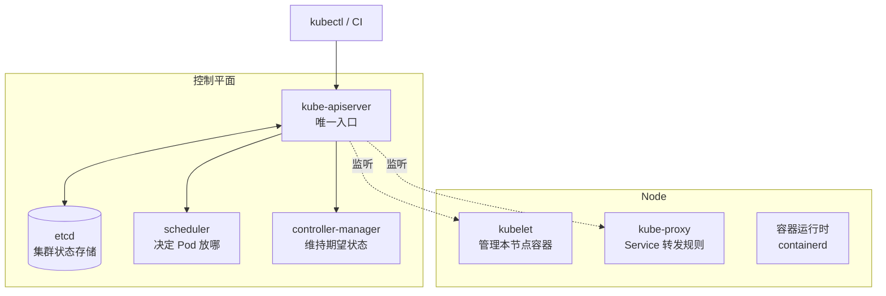

## 一个大脑 + 一群工人

Kubernetes 集群分两层：**控制平面（Control Plane）做决策**，
**工作节点（Node）干活**。

各组件一句话分工：

| 组件               | 职责                                       |
| ---------------- | ---------------------------------------- |
| kube-apiserver   | 唯一读写入口，鉴权/校验/存取 etcd，其他组件全靠监听它 |
| etcd             | 集群唯一事实来源，存所有对象的期望状态              |
| scheduler        | 看新 Pod 该放哪个节点（资源、亲和性、污点）           |
| controller-manager | 几十种控制器，各自盯着一种对象的现状与期望差异        |
| kubelet          | 节点代理：按 apiserver 的指令拉起并看护容器         |
| kube-proxy       | 在节点上落地 Service 的转发规则                |

## 根基：声明式 API 与调谐循环

命令式是「帮我启动 3 个 nginx 实例」；声明式是提交一份 YAML：
「**期望状态**是 nginx 副本数为 3」，然后控制循环（reconcile loop）
持续工作：

> **观测现状 → 与期望对比 → 执行动作消除差异 → 循环**

这是理解 Kubernetes 一切行为的钥匙：

- 你不告诉它「怎么做」，只声明「要什么」
- **控制器各管一种对象**：Deployment 控制器发现副本数不够就补，
  Node 控制器发现节点失联就打污点驱逐
- 执行动作后不「确认完成」而是继续循环——Pod 挂了会被再次拉起，
  因为差异永远会被尝试消除
- kubectl apply 之后立刻返回，不等部署完成——你只是改了 etcd 里的
  期望状态

## 为什么这样设计

- **自愈免费获得**：崩溃、误删、节点宕机，调谐循环都会把现状拉回期望
- **收敛式架构**：组件之间不互相调用，都监听 apiserver——任何组件
  重启都不丢状态（状态在 etcd），这是控制平面高可用的基础
- **可扩展**：自定义 CRD + 自定义控制器就能扩展出新的「对象类型」，
  Operator 模式由此而来

## 要点备忘

- apiserver 是唯一入口：组件间零直连，全靠监听（watch）API
- etcd 存期望状态，调谐循环负责让现状逼近期望——「申报式」而非「命令式」
- scheduler 决定「放哪」，kubelet 负责「怎么跑」
- 排障第一问：这个对象对应的控制器在哪个循环里、期望状态是什么

## 延伸阅读

- [Kubernetes 官方文档 · Kubernetes 架构](https://kubernetes.io/zh-cn/docs/concepts/architecture/)
