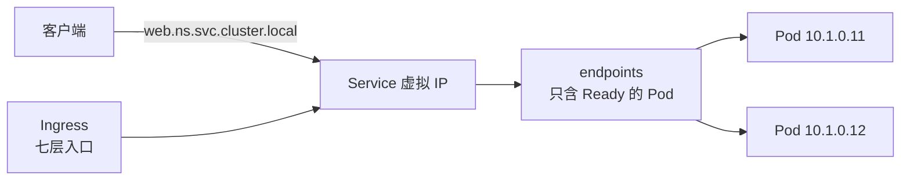

## 问题：为什么不能直接连 Pod

Pod 会随发布、调度、扩缩容随时生灭，IP 跟着重写。**Service 给一组
Pod 一个稳定的虚拟 IP + DNS 名**，后端成员靠 selector 动态发现：



要点：**endpoints 只收 Ready 的 Pod**——readiness 探针失败即摘除，
这是流量熔断与发布摘流的落点。

## kube-proxy：转发规则怎么落地

ClusterIP 是**不存在的 IP**，只存在于转发规则里。kube-proxy 三种
模式：

| 模式      | 机制                   | 特点                    |
| ------- | -------------------- | --------------------- |
| iptables | 逐条规则随机匹配 NAT         | 规则多时线性匹配变慢            |
| IPVS    | 内核哈希表 + 真实负载均衡算法     | 大规模集群首选，支持连接复用         |
| ebpf    | 绕过内核协议栈直达 socket（Cilium 等） | 性能最优，依赖内核版本 |

DNS 侧：每个 Service 自动注册 `svc.ns.svc.cluster.local` 域名，
Pod 内直接用服务名互访——这就是集群内「服务发现」的开箱实现。

## 四种 Service 类型

- **ClusterIP**（默认）：集群内互访
- **NodePort**：每个节点开一个端口（30000-32767）对外——端口难管，
  适合演示与底层兜底
- **LoadBalancer**：云厂商给 Service 挂一个外部负载均衡器——每个
  一个 LB，成本高
- **ExternalName**：CNAME 到外部域名，无代理

## Ingress：七层路由的统一大门

NodePort/LB 只解决「四层可达」，路径与域名路由需要七层。Ingress
声明路由规则（哪个域名/路径 → 哪个 Service），**实际执行靠
Ingress Controller**（NGINX、Traefik 等）——只写 Ingress 资源不装
Controller 是没有流量的，这是新手最常踩的空门。

```yaml
spec:
  rules:
    - host: api.example.com
      http:
        paths:
          - path: /order
            backend: { service: { name: order-svc, port: { number: 80 } } }
```

## 要点备忘

- Service = 稳定虚拟 IP + DNS + 动态 endpoints，selector 决定后端
- ClusterIP 只活在转发规则里；规模大了上 IPVS
- endpoints 只收 Ready Pod：readiness 与流量直达挂钩
- 四层入口用 Service 类型，七层路由用 Ingress + Controller 成对出现

## 延伸阅读

- [Kubernetes 官方文档 · Service](https://kubernetes.io/zh-cn/docs/concepts/services-networking/service/)
