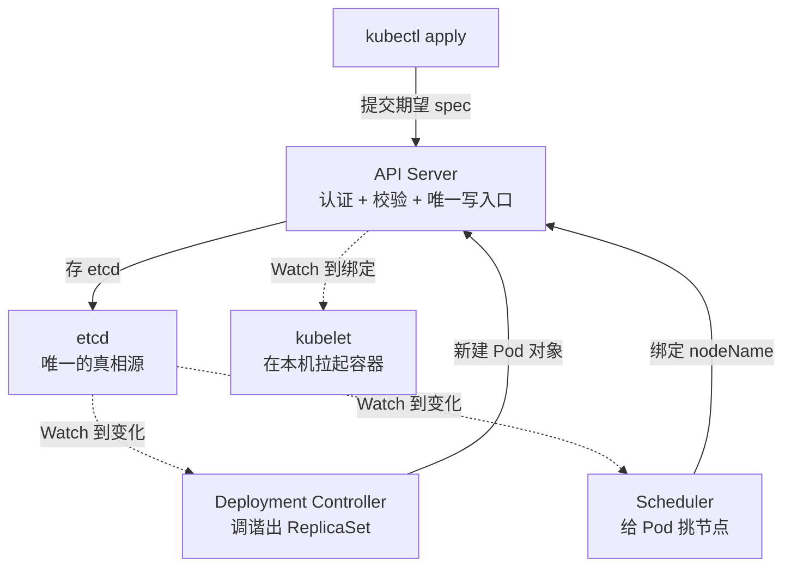

[架构篇](/kubernetes/basic/core/01-architecture/)讲过「声明式 API 与
调谐循环」的思想，这篇往下挖一层：调谐循环**靠什么感知变化**——答案是
List-Watch 和 Informer 机制。「kubectl apply 之后集群里发生了什么」是
K8s 面试最经典的深挖题，答案全部落在这套机制上。

## kubectl apply 的完整旅程

四个关键认知：

- **只有 API Server 能写 etcd**——所有组件（controller、scheduler、
  kubelet）互相不通信，全部围绕 API Server 的对象读写协作，这是解耦
  的根基。
- **kubectl apply 提交的是「期望状态」**，返回时 Pod 还没创建——创建
  是后续多个控制器接力调谐的结果。
- **每个控制器只 Watch 自己关心的对象**：Deployment 控制器盯着
  Deployment，发现 spec 与实际不符就调出 ReplicaSet；Scheduler 盯着
  未绑定的 Pod。全靠事件驱动，没有轮询。
- 链条是异步的：apply → etcd → 控制器 → 新对象 → 下一级控制器 →
  …→ kubelet 拉容器。

## List-Watch：先全量，再增量

控制器感知变化靠的是对 API Server 的两个动作：

- **List**：首次连接时拉全量资源列表 + 一个 `resourceVersion`（集群
  的全局版本号，可理解为 etcd 的 revision）；
- **Watch**：从该版本号开始挂长连接，只收后续的**增量事件**
  （ADDED / MODIFIED / DELETED）。

为什么这么设计？全量保证「断线重连后有完整现状」，增量保证「日常流量
与集群规模无关」。Watch 断线后，控制器带着**最后收到的
resourceVersion** 重连，API Server 把这之后的变更补发——不丢事件。
若版本已被 etcd 压缩（compaction）掉，客户端只能重新 List 重建本地
缓存，这是极端情况而非日常。

## Informer：给开发者的 Watch 工具包

直接写 Watch 太糙——要自己处理重连、缓存、并发。client-go 把这套
模式封装成 **Informer**，三件套各管一段：

| 组件 | 职责 |
| --- | --- |
| Reflector | 负责 List-Watch，把事件塞进队列 |
| DeltaFIFO | 事件缓冲区，记录「谁发生了什么变化」 |
| Indexer / 本地缓存 | 全量对象存内存，读操作不再打 API Server |

控制器的标准姿势：Informer 收到事件 → 把对象的 key 丢进 **workqueue**
→ 调谐函数从 workqueue 取 key，**先查本地缓存拿完整对象**再对账。

两个设计点面试常问：

- **边缘触发（level trigger 的反面）**：事件只告诉你「这个对象变了」，
  不告诉你为什么变、中间态是什么；调谐函数永远以「当前期望状态 vs
  当前实际状态」对账，而不是「响应某个具体事件」。
- **水平触发 + 幂等**：同一个对象反复触发调谐是常态（重发、更新、
  resync 周期性全量重推），所以调谐逻辑必须幂等——跑一遍和跑十遍结果
  相同。这就是 K8s 控制器「自愈能力」的实现基础：不是恢复到某个备份，
  而是持续把现实往期望拉。

## 高频追问

**etcd 挂了集群还能跑吗？** 能跑不能改——所有组件读的是 Informer 的
本地缓存，存量 Pod 照常运行；但任何写操作（新 Pod、调度决策）都要过
API Server → etcd 这条路，写路径全断。这也解释了 etcd 为什么是集群
第一优先级的守护对象（quorum 相关见 [etcd 篇](/etcd/intermediate/ops/02-leader-failover/)）。

**为什么各组件不直接互调，非要围着 API Server 转？** 解耦 + 审计 +
并发控制：组件版本可以各自独立升级；所有变更过统一鉴权与准入控制；
etcd 的乐观锁（resourceVersion 做并发前提）避免覆盖写。组件直连的
网状通信在千节点规模下不可运维。

**Informer 为什么必须有本地缓存？** 调谐函数每秒可能被触发几十次，
每次都 List 会打爆 API Server——K8s 集群最大的性能敌人就是客户端
狂刷 List。本地缓存让「读」彻底本地化，API Server 只承受增量的
Watch 连接。

## 小结

- kubectl apply 只提交期望状态；API Server 是唯一写入口，控制器、
  调度器、kubelet 全靠 Watch 对象变化接力工作。
- List 全量 + Watch 增量，resourceVersion 续传不丢事件，压缩了才重
  List。
- Informer = Reflector + DeltaFIFO + 本地缓存，读走缓存、写走队列，
  保护 API Server。
- 边缘触发 + 水平调和 + 幂等调谐，是声明式系统「自愈」的实现地基。

## 延伸阅读

- [Kubernetes 官方：API 概念与调谐循环](https://kubernetes.io/zh-cn/docs/concepts/architecture/controller/)
- [client-go：Informer 机制与工作队列](https://pkg.go.dev/k8s.io/client-go/informers)
- [Kubernetes 官方：API Server 与 etcd](https://kubernetes.io/zh-cn/docs/concepts/architecture/)
