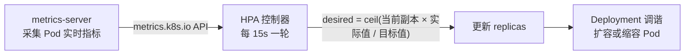

[Deployment 滚动发布](/kubernetes/basic/core/03-deployment-rollout/)篇管
「怎么发」，这篇管「发多少」：流量有波峰波谷，手调副本数永远慢一拍——
**HPA（Horizontal Pod Autoscaler）** 让副本数跟着负载自动伸缩。它是
K8s 弹性伸缩的面试主角，核心考两点：目标值怎么算、为什么配置了却不生效。

## HPA 在控制什么

HPA 是一个控制器：每隔一段时间（默认 15s）读取 Pod 的实际负载指标，
和目标值比较，**按比例算出期望副本数**，再改 Deployment 的
`spec.replicas`——复用现成的调谐循环，HPA 本身只做「算几个」这一步。



```yaml
apiVersion: autoscaling/v2
kind: HorizontalPodAutoscaler
metadata:
  name: web-hpa
spec:
  scaleTargetRef:
    apiVersion: apps/v1
    kind: Deployment
    name: web
  minReplicas: 2
  maxReplicas: 10
  metrics:
    - type: Resource
      resource:
        name: cpu
        target:
          type: Utilization
          averageUtilization: 60   # CPU 目标利用率 60%
```

## 目标值算法：一道必考的算术题

HPA 的伸缩公式只有一行：

```text
期望副本数 = ceil(当前指标值 / 目标指标值 × 当前副本数)
```

例：4 个副本、CPU 实际利用率 90%、目标 60%——期望 =
ceil(90/60 × 4) = 6。多个指标同时存在时取**各指标算出的最大值**（哪个
更紧听哪个）。这个公式天然保证「指标值会收敛到目标附近」，面试能当场
推导就赢过背概念的选手。

## 高频坑：CPU 利用率按 requests 算

「配了 HPA 但指标一直 5% 不扩容」的根因几乎都是一个：**Utilization
的分母是 Pod 的资源 requests，不是节点容量**。容器没写
`resources.requests` 时，CPU 利用率算不出来，HPA 直接不工作（事件里
会报 missing request）。所以 HPA 生效的前提链是：

```text
写 requests → metrics-server 装了且健康 → 指标能查到 → HPA 才有输入
```

指标管道本身也是考点：`kubectl top` 和 HPA 的数据都来自
**metrics-server**（集群级组件），不是 kubelet 直接喂给 HPA；自定义
指标（QPS、队列长度）则要装 Prometheus Adapter 等适配器暴露成
custom.metrics.k8s.io。

## 防抖：缩容为什么不敢立即缩

负载瞬时抖动很常见——按 15s 的窗口直接缩容，会陷入「缩了又扩、扩了又
缩」的震荡。HPA 两道防抖：

- **缩容稳定窗口**（`stabilizationWindowSeconds`，默认 300s）：缩容
  决策看过去 5 分钟的**最大**指标值——只要 5 分钟内出现过高峰，就按
  高峰算，宁可多留副本。
- **behavior 步长限制**：可配置每分钟最多扩/缩多少个 Pod 或百分比，
  扩容默认激进（快速扛流量），缩容默认保守（慢慢回落）。

扩容缩容的不对称是设计出来的：**扩慢了真丢流量，缩快了只是多花钱**
——和微服务里的「快速失败、缓慢恢复」同一个权衡哲学。

## 三兄弟分工：HPA / VPA / Cluster Autoscaler

| | 调什么 | 维度 | 典型场景 |
| --- | --- | --- | --- |
| **HPA** | 改副本数 | 水平 | 流量波动型无状态服务 |
| **VPA** | 改 requests/limits | 垂直 | 用量长期估不准的服务 |
| **Cluster Autoscaler** | 改节点数 | 集群 | Pod 因资源不足 Pending 时加节点 |

三者是不同层的补位：HPA 加 Pod 但节点满了加不动（Pending），Cluster
Autoscaler 看到 Pending Pod 就加节点；VPA 调单副本规格（和 HPA 同时
用要错开指标，否则互相打架）。事件驱动型任务（MQ 消费者）社区常用
KEDA 把队列长度映射成 HPA 指标——本质还是 HPA。

## 小结

- HPA = 比例算法 + 调谐复用：期望副本 = ceil(实际/目标 × 当前数)，
  多指标取最大。
- 生效前提链：requests 必填 → metrics-server 健康 → 指标可查；
  Utilization 分母是 requests 不是节点容量。
- 缩容稳定窗口默认 5 分钟看峰值，扩容激进缩容保守的不对称是设计。
- HPA 调副本、VPA 调规格、CA 调节点，各管一层互相补位。

## 延伸阅读

- [Kubernetes 官方：Pod 水平自动扩缩](https://kubernetes.io/zh-cn/docs/tasks/run-application/horizontal-pod-autoscale/)
- [metrics-server GitHub](https://github.com/kubernetes-sigs/metrics-server)
- [Kubernetes 官方：Cluster Autoscaler](https://github.com/kubernetes/autoscaler)
