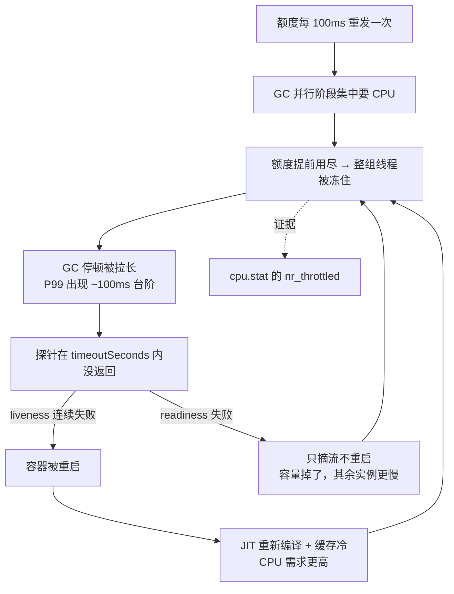

## 三条线各自有文档，事故出在缝里

站内这三块都已经分开写过了：[探针与生命周期](/kubernetes/intermediate/ops/01-probes-lifecycle/)
讲三种探针的分工，[JVM 调优](/java/advanced/jvm/07-tuning/)讲容器里的内存
参数，[容器生死](/docker/basic/fundamentals/03-lifecycle/)讲 PID 1 与信号。
本篇不重复它们，只算它们**交叉处**的账。

一句话主线：**K8s 给的 CPU 是"每 100 毫秒结算一次的配额"，而 JVM 的 GC、
JIT、线程池默认值全都按"我有多少核"来算。** 这两套假设一旦错位，探针超时、
GC 停顿变长、发布期间掉流量**是同一件事的三个症状**，分开治永远治不好。

## 一、`limits.cpu` 不是核数，是配额

官方口径很直接：kubelet **默认用 CFS quota 来强制 Pod 的 CPU limit**。
落到内核是两个文件（cgroup v1）：

| 文件 | 含义 | 默认 |
|---|---|---|
| `cpu.cfs_period_us` | 一个结算周期的长度（微秒） | 100 毫秒 |
| `cpu.cfs_quota_us` | 一个周期内可运行的总时长（微秒）；`-1` 为不限 | 不限 |

cgroup v2 把两者合成一行 `cpu.max`：`--cpus=1.5` 就是 `"150000 100000"`
（换算法见[容器的底层隔离](/docker/advanced/orchestration/02-principles/)），
`limits.cpu: 2` 写作 `"200000 100000"`。

配额制的关键推论，全在"按周期刷新"这句话里。内核文档原文：
*"A group's unused runtime is globally tracked, being refreshed with quota
units above at each period boundary."* —— **额度每个周期边界重发一次**，
不是一天总账。于是：

- 周期内额度用尽，这个 cgroup 里的线程就不再被调度，**最坏要等接近一个
  周期（100ms 量级）**才能继续；
- 所以 Java 服务会出现**平均 CPU 利用率不高、但 P99 上有一道 ~100ms 台阶**
  的怪现象：突发把额度吃光了，均值却很好看；
- GC 并行阶段、JIT 编译、业务线程池、Netty/Lettuce 事件循环**共用同一份
  额度**——按总和结算，不区分谁在用。

取证不用猜，cgroup 自带计数器：

```bash
# cgroup v2：额度与统计
cat /sys/fs/cgroup/cpu.max
grep -E 'nr_periods|nr_throttled|throttled' /sys/fs/cgroup/cpu.stat
# cgroup v1：cpu.cfs_quota_us / cpu.cfs_period_us / cpu.stat
#   v1 的 cpu.stat 明确暴露 nr_periods / nr_throttled / throttled_time(纳秒)
#   v2 的字段命名不同（偏 *_usec 风格）——先 cat 出来看有哪些字段，
#   别照抄脚本里的名字，这是现场排查最容易白跑一步的地方
```

判据是**比例与相位**：`nr_throttled / nr_periods` 持续非零，且被限流的时刻
与延迟尖刺同相位 —— 确诊。反过来，"平均 CPU 才 60%"完全不构成排除理由。

## 二、同一个 `requests`，K8s 和 JVM 读出来的意思正好相反

- **K8s 侧**：`requests.cpu` 落成 `cpu.shares`，是**相对权重**，只在争抢时
  决定配比；HPA 更直接拿它当分母——CPU 利用率是"相对 requests 的百分比"，
  没写 requests 时 HPA 连指标都算不出来（见
  [弹性伸缩与 HPA](/kubernetes/intermediate/ops/04-autoscaling-hpa/)）。
- **JVM 侧**：历史上曾**用 `cpu.shares` 推算可用核数的上限**。这是语义倒置
  ——shares 是相对权重/下限，JVM 当上限用，结果是资源用不满。这个行为已经
  被移除（JDK-8283356）：现在的实现忽略 CPU shares，把调度决定权交回内核。

两条事实拼起来的推论，值得每个人自己验算一遍：

> 只设 `requests` 不设 `limits` → cgroup 里没有配额（`-1` 即不限）→
> JVM 无从得知"几核"→ 于是**按节点核数**配置自己的线程与 GC。

64 核节点上一个 `requests: 2` 且没写 limit 的 Java Pod 就是这么翻车的：
所有按核数取默认值的池子都按 64 核算。显式收口只有两条路：

```bash
-XX:ActiveProcessorCount=4    # 直接钉死 JVM 认为的核数
# 另有 -XX:+UseContainerCpuShares 可把"按 shares 推算"的旧行为请回来，
# 生产上不要依赖它
```

内存是**另一本账**：`UseContainerSupport` 认的是内存限额，
`MaxRAMPercentage` 默认只敢用限额的 25%（[JVM 调优](/java/advanced/jvm/07-tuning/)
已展开）。**CPU 与内存读的是不同 cgroup 文件——只调内存参数不管核数，或者
反过来，都只补了一半。**

要到"独占物理核"这一层，就是节点级承诺了：kubelet
`--cpu-manager-policy=static`，可独占核数等于**节点核数减去
kubelet/system 预留**，而且**切换策略前必须删掉
`/var/lib/kubelet/cpu_manager_state`**，否则节点会拒绝按新策略分配。

## 三、GC 停顿把探针打死：一个自激环

先给探针的账：**判死窗口 = `periodSeconds × failureThreshold`**，再加
单次 `timeoutSeconds` 的判定。这三个参数的默认值随版本走，别背数字，
用 `kubectl explain pod.spec.containers.livenessProbe` 查你集群当前版本的
说法。也就是说：Java 侧要问的是——**我的最坏停顿落在窗口 inside 还是
outside？**



注意图里最关键的一条边：**限流会直接拉长 GC 停顿**。停顿不再只由堆大小和
分配速率决定，还由"这一刻还剩多少 CPU 额度"决定。同一个 JVM 参数在
不同 limit 的 Pod 上测出的停顿不是一回事，这也是"压测环境没问题、上线就
抖"的常见答案。

于是修的顺序必须按环来断，而不是从"把超时调大"开始：

1. **先断停顿与配额的错配**：堆给小了、`ActiveProcessorCount` 与真实额度
   不匹配、分配速率过高（回到[JVM 调优的三条纪律](/java/advanced/jvm/07-tuning/)）；
2. **再确认探针端点不会被业务拖下水**。这是本篇最实操的一条：如果
   `/actuator/health` 和业务接口共用同一套 Web 线程池，那么**业务线程被慢
   调用占满时探针也在排队**——进程活得好好的，HTTP 却超过 `timeoutSeconds`
   没返回，照样判死。Spring Boot 的正解是把管理端口独立出去
   （`management.server.port`，配置见
   [Actuator](/java/intermediate/spring-boot/05-actuator/)），并让
   liveness 与 readiness 各指自己的端点组；
3. **然后才放宽窗口**，按实测最坏停顿留倍数；
4. **最不该做的是删掉 liveness**：它管的是死锁类故障的自愈，删掉的代价是
   故障只能靠人。

分诊一句话就够：**把 GC 日志（`-Xlog:gc*`）的停顿时间戳和
`kubectl describe pod` 里 `Liveness probe failed` 的时间戳对齐**。
对得上，是停顿问题；**对不上而 `nr_throttled` 在涨，那是配额问题不是 GC
问题**——两者修法完全不同，值这一步。取证的完整手法（Arthas/JFR）见
[在线诊断工具箱](/java/advanced/jvm/10-arthas-jfr/)。

## 四、优雅停机：预算从 preStop 就开始烧了

这里有一条与直觉相反的官方定义，值得整段记住：

> *"PreStop hooks are not executed asynchronously from the signal to stop
> the Container; the hook must complete its execution before the TERM signal
> can be sent."*
> *"This grace period applies to the total time it takes for both the PreStop
> hook to execute and for the Container to stop normally."*

也就是：**preStop 跑完才发 SIGTERM，而 preStop 的时间算在
`terminationGracePeriodSeconds` 里面。** 官方给的反例算术很直白——grace 设
60 秒、hook 花 55 秒、容器收到信号后还需 10 秒正常退出，`55 + 10 > 60`，
于是**容器在正常停止之前就被杀掉**。

Java 应用的花费清单通常是四段，**要相加**再留余量：

```
gracePeriod ≥ 摘流传播(preStop sleep)
            + 注册中心下线(Dubbo offline / gracefulShutdown)
            + 在途请求收尾(Spring graceful timeout)
            + 余量
```

- 摘除与终止是**并发**的，preStop 里 sleep 几秒是为了等 EndpointSlice 与
  注册中心把流量停下来；
- 应用侧超时：Spring 是 `server.shutdown: graceful` +
  `spring.lifecycle.timeout-per-shutdown-phase`（见
  [内嵌与部署](/java/intermediate/spring-boot/04-embedded-deploy/)），
  Dubbo 还要走 QoS 的 `offline` / `gracefulShutdown`（见
  [无损上下线](/java/advanced/dubbo/03-generic-and-shutdown/)）；
- **最容易被重复计费的一处**：Spring 的 phase timeout 已经等 30 秒，
  又在 `@PreDestroy` 或 shutdown hook 里自己 sleep 30 秒——预算直接爆。
  排查时把两处都读一遍，正常只该留一处计时；
- 关停期探针姿态：**readiness 应该尽快失败**（不再接新流量），
  **liveness 不应该失败**（否则 Pod 是"被重启"而不是"退出"，滚动发布会
  卡在那里）——这正是把两组探针分开的价值；
- 前提别忘了：Java 进程得是 PID 1 才收得到 SIGTERM。镜像里别套一层吞信号
  的 shell（见[容器生死](/docker/basic/fundamentals/03-lifecycle/)，
  退出码 143/137 的分别也在那篇）。

## 五、症状对照表

| 症状 | 第一个要看的证据 | 典型根因 |
|---|---|---|
| P99 有 ~100ms 台阶，CPU 均值不高 | `cpu.stat` 的 `nr_throttled` | GC 并行峰值撞配额 |
| Pod 反复重启，事件有 `Liveness probe failed` | GC 日志与事件时间戳是否对齐 | 停顿超窗口，或探针端点和业务抢线程池 |
| 只掉流量不重启 | readiness 失败原因 + 依赖健康 | 依赖抖动（摘流是正确行为） |
| JVM 线程数远超配额 | `ActiveProcessorCount` 与实际 quota | 只设 requests 没设 limits |
| HPA 不扩或疯扩 | `kubectl describe hpa` 有无 missing request | 利用率分母是 requests |
| 发布时总丢一小截请求 | grace 与四段预算之和的差 | preStop sleep 与应用超时重复计费 |
| `Killed process`，Java 侧无异常 | `dmesg` + 内存限额 | 内存总账超 limit（非堆占大头） |

## 高频追问速答

- **"CPU limit 到底限的是什么？"**
  限的是一个周期内的可运行总时长（CFS quota），不是绑核。默认周期 100ms，
  所以被限流时最坏要等接近一个周期。
- **"为什么监控显示 CPU 没用满，应用却被限流？"**
  配额按周期结算：突发期把额度吃光，其余时间在等。看 `nr_throttled`，
  不要看平均利用率。
- **"JVM 会看 CPU request 吗？"**
  不会。历史上错误地看过（把 shares 当上限推算核数），该行为已移除。
  现在要定核数就设 limit，或直接 `-XX:ActiveProcessorCount`。
- **"preStop 和 SIGTERM 谁先？"**
  preStop 先——必须执行完才发 TERM；而且这段时间计入宽限期。这是最常被
  搞反的一条。
- **"探针超时是配太紧还是应用太慢？"**
  GC 停顿事件与探针失败时间戳对得上是后者；对不上而 `nr_throttled` 在涨，
  那是配额问题。

## 小结

- `limits.cpu` 是**每 100ms 重发一次的时长配额**，不是核数；GC 并行阶段
  最容易把额度吃光，表现就是"P99 有台阶、均值不好看"，取证看
  `cpu.stat` 的 `nr_throttled`。
- `requests` 在 K8s 侧是权重与 HPA 分母，**但 JVM 不再按它算核数**；
  只设 requests 不设 limits 时 JVM 按节点核数配线程池。CPU 与内存是两本
  账，要一起收口（limit 或 `ActiveProcessorCount`）。
- 限流、GC 停顿、探针、重启构成**自激环**：先断停顿与配额的错配，再把探针
  端点与业务线程池隔离（独立 management 端口），最后才放宽窗口；不要靠删
  liveness 解决误杀。
- 停机预算从 preStop 就开始烧：**preStop 跑完才发 SIGTERM，且它算在宽限期
  内**；摘流传播、注册中心下线、Spring graceful 超时、余量四段相加，最防
  不住的就是"重复计费"。

## 延伸阅读

- [Kubernetes 官方 · 容器生命周期钩子](https://kubernetes.io/docs/concepts/containers/container-lifecycle-hooks/)（"hook 必须执行完才能发 TERM"、宽限期覆盖 hook + 正常停止，以及 60/55/10 的反例）
- [Kubernetes 官方 · CPU 管理策略](https://kubernetes.io/docs/tasks/administer-cluster/cpu-management-policies/)（kubelet 默认用 CFS quota 强制 limit、static 策略与 `cpu_manager_state`）
- [Linux 内核 · CFS bandwidth control](https://www.kernel.org/doc/Documentation/scheduler/sched-bwc.txt)（`cfs_period_us`/`cfs_quota_us` 语义与 `nr_periods`/`nr_throttled`/`throttled_time`）
- [JDK-8283356: Do not use CPU Shares to compute active processor count](https://bugs.openjdk.org/browse/JDK-8283356)（JVM 为何不再按 shares 推核数）
- 站内配套：[探针与生命周期](/kubernetes/intermediate/ops/01-probes-lifecycle/)、[弹性伸缩与 HPA](/kubernetes/intermediate/ops/04-autoscaling-hpa/)、[JVM 调优](/java/advanced/jvm/07-tuning/)、[Actuator 与运维端点](/java/intermediate/spring-boot/05-actuator/)、[内嵌与部署](/java/intermediate/spring-boot/04-embedded-deploy/)、[Dubbo 无损上下线](/java/advanced/dubbo/03-generic-and-shutdown/)、[容器的底层隔离](/docker/advanced/orchestration/02-principles/)
