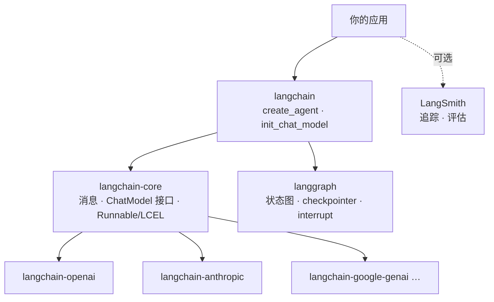

## LangChain 是什么

**LangChain 是 LLM 应用开发框架**：把「调模型、组 prompt、接工具、
管状态」这些每个 LLM 应用都要写的东西抽成可复用组件。1.0 之后定位
进一步收敛——主打 **Agent 工程**，`create_agent` 成为一等入口，底层
运行时就是 LangGraph（见[状态图三要素](/langchain/intermediate/graph/01-state-graph/)）。

它与站内概念篇的关系：[Agent Loop](/ai/basic/agent/01-agent-loop/)
讲的是「这些东西本来要手写什么」，LangChain 讲的是「框架把它们做成了什么」。

## 包分层：各管一层



分层记忆点：**core 定义抽象，伙伴包给实现，langchain 给高层封装，
langgraph 给运行时**。业务代码只 import langchain 与 langgraph，
换模型供应商不动业务代码。

## 消息模型：一切输入输出都是 Message

所有 ChatModel 的输入输出统一为消息列表，四种基本角色：

| 类型             | 角色     | 典型内容                    |
| -------------- | ------ | ----------------------- |
| SystemMessage  | 系统指令   | 人设、规则、输出要求             |
| HumanMessage   | 用户输入   | 提问、指令                   |
| AIMessage      | 模型输出   | 回答文本、tool_calls         |
| ToolMessage    | 工具结果   | 按 tool_call_id 对应的执行结果  |

一次「带工具的调用」就是四类消息按序排列：System + Human +
AI(tool_calls) + Tool(结果) + AI(最终回答)。
[工具调用](/ai/basic/agent/02-tool-use/)一节讲的执行约定，
落到 LangChain 里就是这套消息类型。

## init_chat_model：一行换模型

```python
from langchain.chat_models import init_chat_model

# 字符串格式 "provider:model"，需安装对应伙伴包
model = init_chat_model("openai:gpt-4o-mini", temperature=0)

for chunk in model.stream("用一句话解释 RAG"):
    print(chunk.text, end="")   # 流式：增量一到就打印
```

统一接口的意义：`invoke` / `stream` / `batch` 在所有模型上一致，
换供应商只改这一个字符串。生产里更常见的做法是模型实例从配置读出
后注入，而不是散落在业务代码各处 new。

## 要点备忘

- 包分层：core 抽象 → 伙伴包实现 → langchain 高层 → langgraph 运行时
- 消息四类型是全部 I/O 的通用语；工具调用的中间态就存在 AI/Tool 消息里
- `init_chat_model("provider:model")` 把「换模型」收敛成改一个字符串
- 注意时效：1.0 已收敛到 create_agent + LangGraph，老教程里的
  LLMChain / AgentExecutor 大多已淘汰，搜资料认准 1.0 文档

## 延伸阅读

- [LangChain 官方文档 · Quickstart](https://docs.langchain.com/oss/python/langchain/quickstart/)
