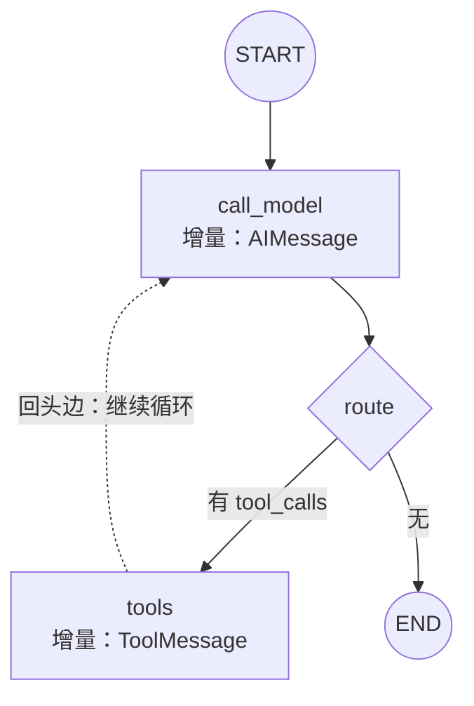

## 为什么从链到图

[LCEL 链](/langchain/basic/core/03-lcel-runnable/)是静态流水线：
数据单向流动，没有回头路。而 Agent 天然要**循环**（调完工具再来
一轮）、**分支**（按结果决定走向）、**中断**（停下来等人审批）。

LangGraph 的答案是把控制流显式化为一张**状态图**：状态怎么合并、
节点做什么、边往哪走，全部写成数据结构，而不是埋在代码缩进里。
[框架选型](/ai/advanced/agent/10-agent-frameworks/)篇说的
「LangGraph：显式状态图，适合精细编排」就是这个意思。

## 三要素

| 要素    | 是什么                        | 关键约定                    |
| ----- | -------------------------- | ----------------------- |
| State | 共享状态的 schema（TypedDict 等）  | 字段可配 reducer，决定怎么合并     |
| Node  | 普通函数：state 进，增量 dict 出     | 只写自己改的字段，不要整个覆盖         |
| Edge  | 节点间的走向                     | 固定边 / 条件边 / START·END   |

```python
from typing import Annotated, TypedDict
from langgraph.graph import StateGraph, START, END
from langgraph.graph.message import add_messages

class State(TypedDict):
    messages: Annotated[list, add_messages]   # reducer：追加合并
    retries: int                              # 无 reducer：后写覆盖

def call_model(state: State):
    return {"messages": [model.invoke(state["messages"])]}

def route(state: State) -> str:
    return "tools" if has_tool_calls(state) else END

g = StateGraph(State)
g.add_node("model", call_model)
g.add_conditional_edges("model", route)
g.add_edge(START, "model")
app = g.compile()
```

## 执行模型：超级步

图的执行按**超级步（super-step）**推进：取当前 state → 执行本步
所有节点（可并行）→ 各节点返回的增量交给字段的 reducer 合并 →
存 checkpoint → 按边决定下一步。所谓循环与分支，不过是「边把执行
带回前面的节点」。



对照 [Agent Loop](/ai/basic/agent/01-agent-loop/) 概念篇：那里的
while 循环藏在代码缩进里，这里被摊平成「条件边 + 回头边」——机制
完全同构，只是控制流从语句变成了图。

## reducer 为什么关键

- 节点返回**增量**而非全量；多个节点（含并行节点）写同一字段时，
  合并规则必须无歧义——这就是 reducer 的职责
- `add_messages` 的语义：按消息 ID 追加或更新，是消息列表的标准
  reducer；自己攒列表的累加用 `operator.add`
- 普通字段默认**后写覆盖**；并行节点写同一普通字段会直接报错——
  框架逼你在 schema 上把合并意图写清楚

## 要点备忘

- State 定合并、Node 定行为、Edge 定走向：三张表读懂任何一张图
- 节点交增量、合并归 reducer，这是并行安全的基础
- 条件边函数返回「下一个节点名」，把 if/else 从节点内部提到图上
- compile() 之后依然是一个 Runnable：invoke/stream 与链完全一致

## 延伸阅读

- [LangGraph: Thinking in LangGraph](https://docs.langchain.com/oss/python/langgraph/thinking-in-langgraph/)
