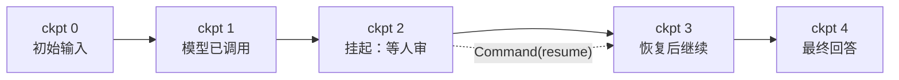

## 为什么需要持久化

Agent 流程一长就撞上四个现实：进程会崩、多轮会话要续、高危动作要
人审、出了问题要审计。四个问题的共同前提是：**每一步之后的状态都
能落盘恢复**。LangGraph 把这个能力内置为 Checkpointer——每个超级步
结束后自动存一个 checkpoint，图代码零改动。

## Checkpointer：换实现，不改图

```python
from langgraph.checkpoint.memory import InMemorySaver

app = graph.compile(checkpointer=InMemorySaver())

config = {"configurable": {"thread_id": "user-42"}}
app.invoke({"messages": [...]}, config)
```

- `InMemorySaver` 只用于测试；生产换 `SqliteSaver` / `PostgresSaver`，
  编译参数之外什么都不用改
- **thread_id 是会话标识**：同一 thread 再次 invoke，自动从最近的
  checkpoint 续跑，消息历史天然延续——不用把历史手动拼回输入
- 这是框架级「记忆」的地基：应用层的记忆策略（分层、摘要、遗忘，
  见[记忆系统](/ai/intermediate/agent/04-memory/)）都建立在
  「状态可持久化」之上

## interrupt：在图里等人

节点内调用 `interrupt(payload)`，图立刻挂起、把 payload 抛给调用方，
进程可以停任意久——状态在 checkpoint 里。人审完用
`Command(resume=...)` 恢复，resume 的值作为 interrupt 的返回值传回
节点继续执行：

```python
from langgraph.types import Command, interrupt

def human_review(state):
    decision = interrupt({
        "draft": state["response_text"],   # 抛给人看的内容
    })
    return {"response_text": decision["edited"]}

# 调用方（可以是另一个进程/服务）：
app.invoke(inputs, config)                # 停在 interrupt 处
app.invoke(Command(resume={"edited": "…"}), config)   # 审完恢复
```

前提只有一个：**必须配 checkpointer**。「暂停」的本质是状态已存档、
等一条 resume 指令，没有存档就无从恢复。



## 时间旅行：从任意 checkpoint 重放

`app.get_state_history(config)` 返回该 thread 的全部历史状态（倒序）。
取任意历史 checkpoint 的 config，`invoke(None, config)` 就从那个时刻
重放——已完成节点不重算，只跑之后的路。调试「如果上一步走另一条
边会怎样」时非常好用。

## 要点备忘

- checkpointer + thread_id = 会话持久化；换 Saver 实现不动图代码
- interrupt 不是抛异常退出，是「存档挂起」；恢复靠 Command(resume)
- 高危动作（支付、发消息、删数据）都值得在图里插一个审核节点
- 时间旅行的代价是 checkpoint 全量历史：注意 Saver 的存储增长

## 延伸阅读

- [LangGraph: Human-in-the-loop](https://docs.langchain.com/oss/python/langgraph/interrupts/)
- [LangGraph: Time travel](https://docs.langchain.com/oss/python/langgraph/use-time-travel/)
