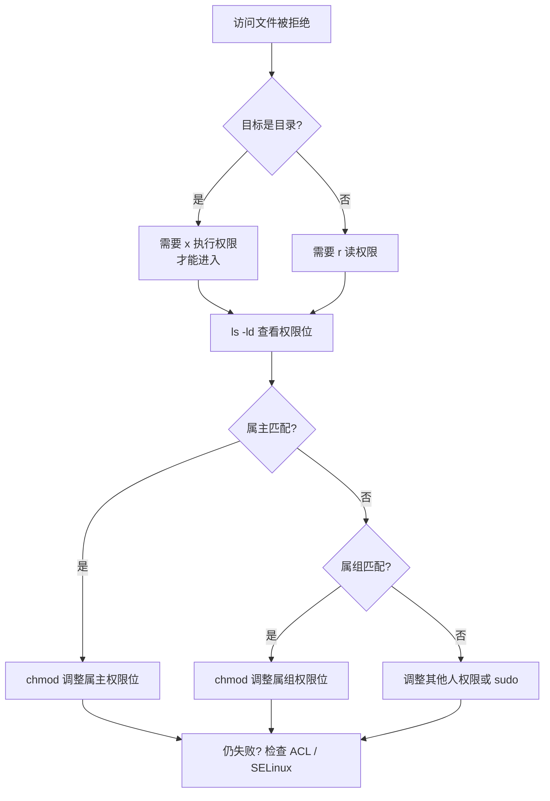
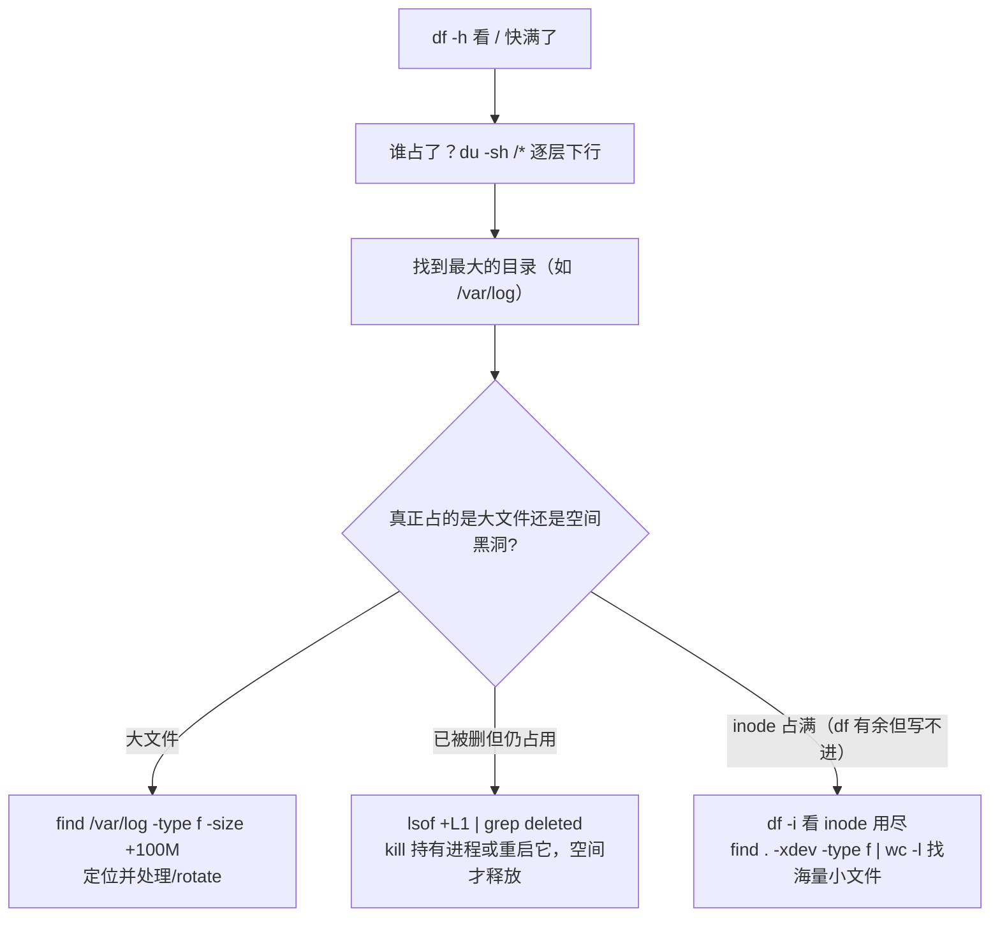

## 先建立心智：inode 与目录项

Linux 里"文件名"和"文件数据"是**两回事**，被两个结构分开管理：

| 结构 | 存什么 | 类比 |
|---|---|---|
| **inode** | 文件元数据：大小、权限、时间戳、数据块位置 | 文件的"身份证卡片" |
| **dentry**（目录项） | 文件名 ↔ inode 的映射 | 目录里一行"名字→卡片" |

```text
ls -li file            # -i 打印 inode 号
# 2029454 -rw-r--r-- 1 alice users 20 Sep  5 10:00 file
```
（第一列 `2029454` 就是 inode 号。）

**这解释了两件高频现象：**

1. **`mv` 一个文件为什么几乎瞬间完成**：pickup 只改 dentry 里"名字→inode"
   的指向，不改数据。跨文件系统 `mv` 才会真拷（因为目标盘没有这个 inode）。
2. **硬链接 = 两个 dentry 指向同一个 inode**；硬链接数就记在 inode 里（`ls -l`
   第二列）。删除文件本质是 **inode 引用计数 -1**，归零才真正释放数据——
   所以被 `rm` 的文件若仍被某进程打开（`lsof | grep deleted`），磁盘空间
   **不会释放**，重启进程才还回来。这是"文件删了磁盘却没空"的一大经典原因。

### 文件系统层级（FHS）

| 路径 | 用途 |
|---|---|
| `/bin /sbin` | 基础命令（多数已软链到 `/usr/bin`） |
| `/etc` | 系统/应用配置 |
| `/home` | 用户主目录 |
| `/var` | 变化数据：日志 `/var/log`、缓存 `/var/cache`、运行时 `/var/run` |
| `/tmp` | 临时文件，重启可清 |
| `/dev /proc /sys` | 设备、进程/内核信息的**伪文件系统**（虚拟，不占磁盘） |
| `/opt` | 第三方软件安装目录 |

`/proc` 是一个绝佳的排查入口：**进程的一切运行时状态都以"文件"暴露**。
例如看某进程的资源占用：`ls -l /proc/<pid>/fd | wc -l`（打开多少 fd）、
`cat /proc/meminfo`（内存概览）。

## 常用命令速查

| 命令 | 作用 | 常用示例 |
|---|---|---|
| `ls` | 列出目录 | `ls -lah`（含隐藏、人类可读大小） |
| `cd` | 切换目录 | `cd -`（返回上次目录） |
| `cp` | 复制 | `cp -r src/ dst/`（递归）、`cp -p`（保时间权限） |
| `mv` | 移动/重命名 | `mv old new` |
| `rm` | 删除 | `rm -rf dir/`（谨慎使用） |
| `mkdir` | 建目录 | `mkdir -p a/b/c`（递归） |
| `ln` | 链接 | `ln -s target link`（软链接） |
| `find` | 查找 | `find . -name "*.log" -mtime +7` |
| `du` / `df` | 磁盘占用 / 磁盘空间 | `du -sh dir`、`df -h` |
| `file` | 判断文件真实类型 | `file script.sh`（比扩展名可靠） |

## find 表达式系统：不只是 `-name`

`find` 的威力在于可以组合"从哪里开始 / 怎么筛 / 找到后干嘛"：

```bash
# 常用过滤器
find . -name "*.log"                 # 按文件名
find . -type f -size +100M           # 大文件
find . -type d -empty                # 空目录
find . -newer ref.txt                # 比 ref.txt 新

# -exec 对找到的东西做操作（{} 占位，\; 结尾）
find /tmp -name "*.tmp" -exec rm {} \;

# -delete 直接删（比 -exec rm 更安全，不会误触 -rf）
find /tmp -mtime +7 -type f -delete

# 逻辑组合
find . -name "*.log" -o -name "*.tmp"  # 或者
find . -name "*.log" ! -path "./node_modules/*"   # 排除目录
```

> `-delete` / `-exec` 前**务必先只跑 `find` 看一眼**命中什么，这是删数据的
> 铁律：先打印，再动手。想删"目录"要用 `-type d…… -exec rmdir {} \;` 或换
> `rmdir`，`-delete` 主要针对文件。

## 权限模型

权限位 `rwxr-xr--` 分三段：所有者 / 所属组 / 其他人。

- `r=4`，`w=2`，`x=1`，数字法如 `chmod 755 script.sh`
- 目录的 `x` 表示**能否进入**，比 `r`（能否列出）更关键

### 三种特殊位：setuid / setgid / sticky

| 特殊位 | 含义 | 典型 |
|---|---|---|
| **setuid**（所有者位变 `s`） | 执行者临时获得**文件属主**的权限 | `passwd`（普通用户改密码需写 `/etc/shadow`） |
| **setgid**（属组位变 `s`） | 目录内新建文件的属组自动继承该目录属组 | 共享协作目录 |
| **sticky**（其他人位变 `t`） | 目录内只有**属主/root**能删自己的文件 | `/tmp` |

```bash
chmod u+s file      # 设 setuid
chmod g+s dir       # 设 setgid（协作目录）
chmod +t /tmp       # 设 sticky
ls -l               # 表现为 s / S / t 出现在对应位
```

**安全提示**：`setuid` 若挂在不该挂的程序上（如 root 拥有的 shell 脚本），
就是一条提权后门——审计高危权限时重点看有哪些 `setuid` 文件：
`find / -perm -4000 -type f 2>/dev/null`。

### 权限不足排查流程



> 最后一行的 ACL / SELinux 是很多人忽略的"有权限却访问不了"来源：
> `getfacl file` 看 ACL；`ls -Z` 看 SELinux 标签，`SELinux` 本意是"即使
> 有 DAC 权限也要再查安全策略"，部署新服务时报 `Permission denied` 但
> `chmod 777` 也无效时，优先怀疑它。

## 磁盘占满排查：最实用的排查流程

`df -h` 只剩 100% 打出告警时，别慌，按层定位：



**三个经典陷阱：**

1. **`df -h` 有空间却 `No space left`** → 查 `df -i`，inode 用尽（海量小文件
   吃光 inode），删大文件没用，要清小文件。
2. **`du -sh` 显示不大，`df -h` 却满** → 被删但仍被进程打开的日志/临时文件，
   用 `lsof +L1 | grep deleted` 找出并处理持有进程。
3. **大目录在别处挂载**：`du` 默认不跨挂载点，必要时加 `--separate-dirs`/
   `-x` 限定同一文件系统，否则会被别的盘的数据误导。

## 软链接 vs 硬链接

| | 软链接 symlink | 硬链接 hardlink |
|---|---|---|
| inode | 独立 inode，存路径 | 与源文件相同 |
| 跨文件系统 | 可以 | 不可以 |
| 源删除后 | 悬空 | 数据仍在（引用计数） |
| 目录 | 可以链接 | 不允许 |

## 要点备忘

- 文件 = inode（数据）+ dentry（名字）；删文件是 inode 引用归零，被打开则
  "deleted 但占空间"直到进程退出。
- `find` 永远先打印再删；`rm -rf` 前先 `ls` 确认目标，杜绝路径打错删错目录。
- 磁盘占用排查三问：`df -h`（空间）、`df -i`（inode）、`lsof +L1 | grep
  deleted`（已删仍占用）。
- 批量改名用 `rename` 或 `for f in *.txt; do mv "$f" "${f%.txt}.md"; done`
- 大文件传输用 `rsync -avP`，支持断点续传。
- 有权限却访问不了，优先查 ACL（`getfacl`）与 SELinux。