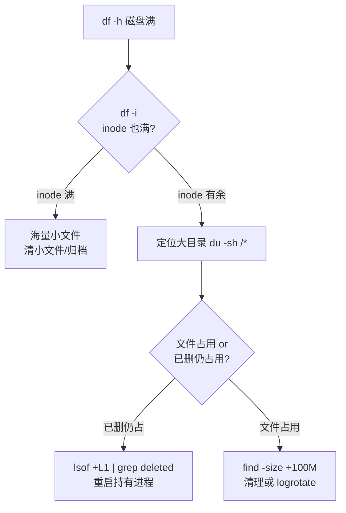

## 文件系统：数据怎么组织在磁盘上

文件系统决定"数据怎么存放在磁盘上、怎么被索引、支持多大数据量与文件名"。
Linux 支持多种文件系统，常见：

| 类型 | 特点 | 典型场景 |
|---|---|---|
| ext4 | 成熟稳定，默认选择 | 通用系统盘 |
| xfs | 大文件/高并发强，很多发行版根分区默认 | 大数据、数据库 |
| btrfs | 快照、写时复制（COW） | 需要快照/回滚 |
| tmpfs | 纯内存，重启即丢 | `/tmp`、`/dev/shm` |
| overlayfs | 分层叠加 | Docker 镜像层 |

上篇已讲 inode 与 dentry，这里补充**分区与挂载**这一层高频概念。

## 挂载（mount）：把设备接入目录树

Linux 是单一目录树（`/` 为根），所有分区/磁盘通过"挂载"接到某个目录上，
而不是像 Windows 那样出现 C 盘 D 盘。

```bash
mount /dev/sdb1 /data      # 把 sdb1 分区挂到 /data 目录
umount /data               # 卸载
df -h                      # 查看已挂载文件系统的空间与挂载点
mount | column -t          # 查看所有挂载关系
cat /etc/fstab             # 开机自动挂载配置
```

**关键概念**：
- 挂载本质是"把这个文件系统接到这个目录"，向目录写入即写入该设备。
- `df -h` 看到的一行就是一个挂载点 + 其空间占用。

## 容量排查回顾

上篇「文件与目录操作」讲过磁盘占满三问，这里作为文件系统维度再强化：



## 常用命令

| 命令 | 作用 |
|---|---|
| `lsblk` | 列块设备（磁盘/分区）树 |
| `blkid` | 查看分区 UUID 与类型 |
| `df -Th` | 带类型的空间查看 |
| `du -sh` | 目录/文件占用 |
| `fsck` | 文件系统检查修复（需卸载） |

## 小结

- Linux 单目录树，一切设备靠 mount 挂载到目录。
- ext4/xfs 是主流，tmpfs 是内存盘，overlayfs 是容器分层基础。
- 磁盘排障记住 df（空间）、df -i（inode）、lsof+deleted（已删仍占）三件套。

## 延伸阅读

- [Linux Filesystem Hierarchy Standard](https://refspecs.linuxfoundation.org/FHS_3.0/fhs/index.html)