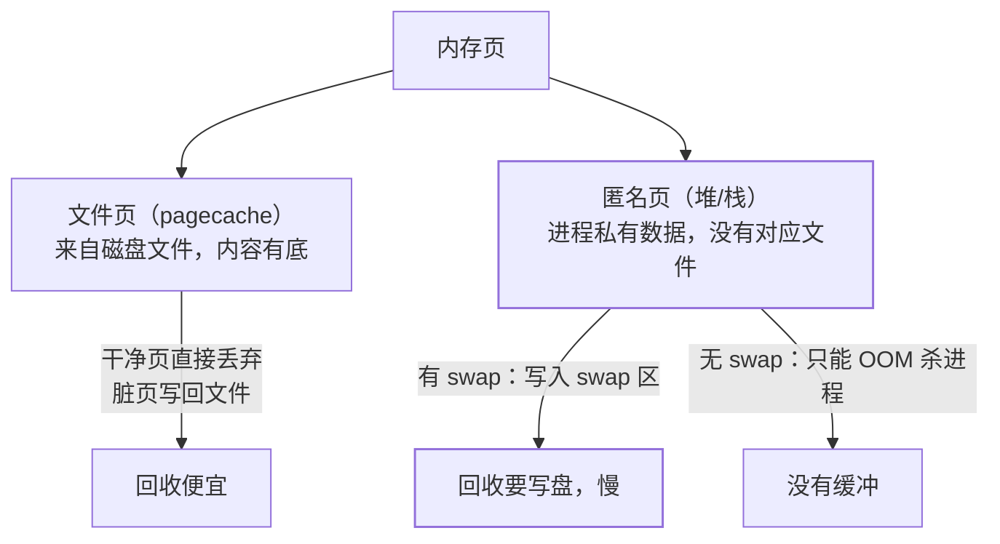

性能排查篇解读过 `free` 输出，但 swap 那两行一直没展开：**swap 是把磁盘
当内存的"溢出区"**——它既是小内存机器的救命绳，又是低延迟应用的性能毒药。
什么时候留、什么时候关、swappiness 怎么调，是 Linux 面试的常客追问。

## swap 在做什么

物理内存不够时，内核把**不活跃的内存页**换出（swap out）到磁盘，腾出
内存给更需要的进程；再访问时换回（swap in）。页分两类，回收方式不同：

- **文件页**回收便宜：内容就是磁盘文件的缓存（页缓存篇），干净页直接丢；
- **匿名页**（进程的堆、栈）没有文件对应——有 swap 时可换出到磁盘，
  没有 swap 时只能被 OOM Killer 处理。

## swappiness：一个旋钮，两种哲学

`vm.swappiness`（0~100）控制内核回收时**偏向丢 pagecache 还是换出匿名页**：

| 取值 | 行为 | 适用 |
| --- | --- | --- |
| 高（默认 60） | 较积极换出匿名页 | 通用主机、内存紧张的小机器 |
| 低（如 10） | 尽量丢 pagecache，不轻易 swap | 内存充裕、看重响应延迟 |
| 1（不是 0） | 极少 swap，仅紧急时 | 数据库、低延迟服务常见配置 |

- **swappiness=0 不是禁用 swap**（那是 `swapoff` 干的事），而是"几乎不
  主动换出"——面试最常踩的坑；
- 数据库/低延迟服务建议关 swap 或设 1：**GC 停顿或查询遇到 swap in，
  一次磁盘换页能把毫秒级操作放大到秒级**（JVM 大堆被换出是经典事故）；
- 小内存机器反而要留 swap：它是 OOM 前的最后缓冲。

## 与性能排查的衔接

- `free -h` 的 swap 行：**used swap 持续增长** = 物理内存真实吃紧
  （pagecache 已回收无可回，开始换匿名页）——比看 used 更真实的告警信号；
- `vmstat 1` 的 **si/so 列**持续非零 = 系统正在活跃换页——此时 CPU 高
  很可能是"换页风暴"而非计算；
- 排查顺序：先看 si/so 确认在换页 → `top` 找内存大户 → 区分是泄漏
  （持续增长不回落）还是配额太小。

## 高频追问速答

- **内存够用还要配 swap 吗？** 建议配少量（如 1~2GB）：给内核留 OOM 前
  的缓冲，且个别匿名页换出几乎不影响——"配了但尽量不用"是稳妥策略。
- **swap 在机械盘和 SSD 上有什么区别？** 换页是随机小 IO，SSD 上惩罚
  小得多——但依然比内存慢几个数量级，只是"能用"不等于"该依赖"。
- **怎么确认进程被 OOM 杀过？** `dmesg | grep -i "killed process"`（性能
  排查篇的 OOM 段），配合 `/var/log/messages` 或 journalctl。

## 小结

- swap = 匿名页的磁盘溢出区；文件页回收便宜、匿名页回收要写盘。
- swappiness 是偏向旋钮（=0 不是禁用）；数据库/低延迟服务关或设 1，
  小内存机器留着兜底。
- 排查信号：swap used 持续涨、vmstat si/so 非零——先确认换页，再找
  内存大户。
