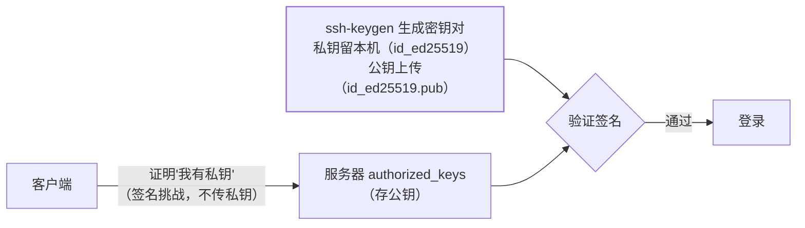

SSH 是工程师每天登录服务器的通道，也是**攻击者最爱的入口**——密码
认证的暴力破解每时每刻都在互联网上发生。密钥认证 + 服务端加固 +
堡垒机审计，是服务器访问安全的三层标配。

## 密钥认证：非对称的"锁与钥匙"



- 公钥放服务器的 `~/.ssh/authorized_keys`，私钥留本机**永不外传**；
- 认证过程传的是"签名"而非私钥——**密码认证可被暴力枚举，签名挑战
  不可离线爆破**，这就是密钥更安全的根本原因；
- **ssh-agent** 把解密后的私钥缓存在内存，一次解锁整日免密——配合
  agent 别把无密码私钥裸放。

## 服务端加固四件套

```text
# /etc/ssh/sshd_config
PasswordAuthentication no      # 关密码认证（密钥就绪后立刻关）
PermitRootLogin no             # 禁 root 直接登录（先登普通用户再提权）
Port 2222                      # 改端口（仅降噪：扫描器少打扰，非安全本身）
AllowUsers deploy ops          # 白名单用户
```

外加 **fail2ban**：多次认证失败自动封 IP——暴力破解的实时防线
（对照登录接口限流的同一思想）。

## 跳板机与堡垒机：入口收敛与审计

多台服务器不该人人直连——**访问收敛到跳板机**：

- **跳板（ProxyJump）**：`ssh -J jump target`（或 ~/.ssh/config 配置），
  流量经跳板转发；
- **堡垒机**（JumpServer类）的真正价值是**审计**：谁、什么时候、上了
  哪台、执行了什么——会话录像与命令审计是合规刚需（对账篇的"出错必
  被发现"在访问层的对应物）；
- 私钥不放跳板机（跳板被攻破 = 全网沦陷），用 agent 转发或堡垒机
  代填。

## 高频追问速答

- **known_hosts 防什么？** 首次连接记录服务器指纹，之后若指纹突变
  提示中间人攻击——别图省事关掉严格检查。
- **agent 转发的风险？** `ForwardAgent yes` 后，跳板机上的 root 可以
  向你的 agent 请求签名（借你的身份登录后续机器）——只对可信跳板
  开，跳板被攻破即身份被借。
- **私钥丢了怎么办？** 从所有服务器的 authorized_keys 里删除对应
  公钥——所以 authorized_keys 管理要集中（Ansible/堡垒机统一下发）。

## 小结

- 密钥认证 = 挑战签名不传秘密，天然抗离线爆破；密钥就绪后**立刻关
  密码认证**。
- 加固四件套：关密码、禁 root 直登、白名单用户、fail2ban；改端口
  只是降噪。
- 访问收敛到堡垒机：入口统一 + 会话审计——安全与合规一起解决。
