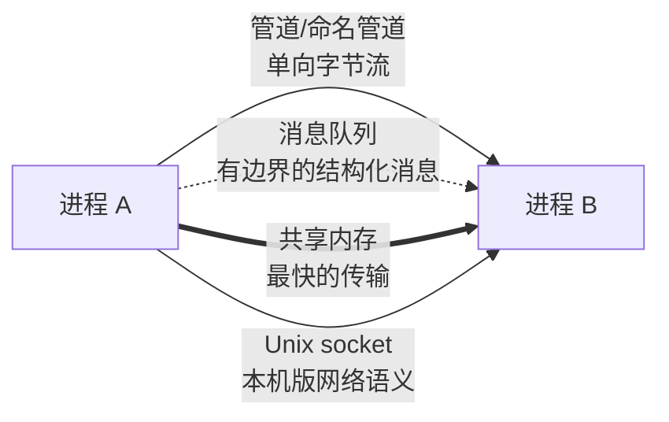

## 两个抽象，两个职责

- **进程 = 资源分配的单位**：独占一份虚拟地址空间、文件描述符表、
  信号处理表——隔离是它的关键词
- **线程 = CPU 调度的单位**：同一进程内的线程共享地址空间与 fd，
  各自只有**栈和寄存器**是私有的——共享是它的关键词，也是并发
  麻烦的来源

同一进程内线程崩溃（如段错误）整个进程陪葬；进程之间互不波及。
浏览器的多进程架构、Redis 的单进程单线程，都是在这两个抽象上做
权衡的例子。

## 上下文切换：进程比线程贵在哪

| 切换类型 | 要换的东西                         | 额外代价                 |
| ---- | ------------------------------ | -------------------- |
| 线程切换 | 栈指针、寄存器组                     | ——                  |
| 进程切换 | 上述全部 + **页表基址（CR3）**         | TLB 失效，地址翻译缓存清空，切换后一段时间访存变慢 |

这就是「同进程线程池优于多进程」的性能根源；而系统线程与协程的
差价（内核切换 vs 用户态切换）是同一逻辑的再现——
[Python 线程与 GIL](/python/intermediate/concurrency/01-threading.md)、
Go 协程的讨论都建立在这笔账上。

## 进程间通信（IPC）怎么选

- **共享内存最快**：数据零拷贝，但要配信号量/锁自己处理互斥
- 管道简单但只适合字节流父子关系；消息队列有边界、可持久
- Unix socket 复用 socket 编程模型——Docker 与宿主的通信就靠它
- 跨机器就出局了，那是网络与 RPC 的领域（语义对照见
  [RPC 原理](/distributed/intermediate/governance/01-rpc-principles/)）

## 与上层语言的呼应

- Java 线程模型、锁与可见性问题全部建立在「线程共享地址空间」
  这个事实上（见 [并发基础](/java/intermediate/concurrent/01-thread-basics/)）
- `ps`、`top` 里看到的进程/线程状态（R/S/D/Z）是观察这套调度
  抽象的窗口（排查姿势见[性能排查](/linux/intermediate/system/05-performance/)）

## 要点备忘

- 进程管隔离与资源，线程管调度与并发；共享是效率来源也是风险源
- 进程切换贵在 TLB 失效——这解释了大量「进程 vs 线程 vs 协程」选型
- IPC 选型：要快用共享内存（自管同步），要省事用 socket/消息队列
- 排障时分清线程问题（锁、切换）与进程问题（隔离、生命周期）

## 延伸阅读

- 《Linux 内核设计与实现》第 3 章（进程管理）
