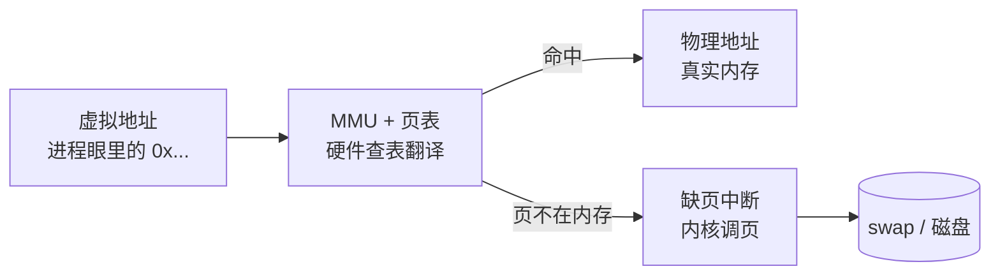

## 为什么需要虚拟内存

如果进程直接用物理地址，两件事立刻崩坏：一个进程写坏地址就能
搞死操作系统（无隔离）；内存必须连续分配，装不下就装不下（无
弹性）。虚拟内存给每个进程一个**私有且从 0 开始的地址空间假象**，
由硬件 + 内核合作翻译成物理地址：

- **隔离**：进程 A 的地址翻译不出进程 B 的物理页，互不可见
- **弹性**：地址空间可以比物理内存大，页按需调入、冷页换出
- **共享**：同一物理页可映射进多个进程（共享库、共享内存 IPC
  的底层机制）

## 页表、TLB 与缺页

- 内存按**页**（常用 4KB）切分，页表记录「虚拟页 → 物理页框」
- MMU 每次访存都要查页表，为提速用 **TLB** 缓存最近翻译——
  这也解释了[进程切换](/linux/basic/theory/01-process-thread/)换
  页表后为什么有一段变慢期（TLB 清空）
- 访问的页不在内存时触发**缺页中断**：小缺页（首次建立映射，
  页在页缓存）很快；大缺页要从磁盘读，慢几个数量级

## swap 与 swappiness

物理内存吃紧时内核把冷页换出到 swap 分区。`swappiness`（0-100）
调节倾向：越高越积极换出。**数据库/延迟敏感服务通常设小值甚至 0**
——被换出的热点页一缺页就是磁盘级延迟，抖动起来没规律。swap 的
回收细节与运维手法见 [swap 与内存回收](/linux/basic/filesystem/02-swap-memory/)，
本篇只保留机制视角。但设 0 不等于禁用，紧急时内核仍会动 swap。

## top 里的 VIRT 与 RES

| 指标   | 含义                                | 关注点        |
| ---- | --------------------------------- | ----------- |
| VIRT | 虚拟地址空间总量：含映射未使用的、mmap 的文件 | 大 ≠ 有问题    |
| RES  | 实际占用的物理内存页                    | 判断真实占水位的指标 |

Java 进程 VIRT 巨大（堆预留 + metaspace + 映射）是正常现象，
看 RES 与 GC 行为才有意义——与
[运行时内存区](/java/advanced/jvm/02-memory/)对照理解更透。

## 要点备忘

- 虚拟内存 = 隔离 + 弹性 + 共享三合一，翻译由 MMU + 页表完成
- TLB 缓存翻译结果；缺页中断分大小，大缺页是延迟毛刺的常见来源
- 延迟敏感服务压低 swappiness，宁可少用虚拟内存的超售能力
- VIRT 大不是病，RES 才是真实占用——内存告警要看对指标

## 延伸阅读

- 《深入理解计算机系统》第 9 章（虚拟内存）
