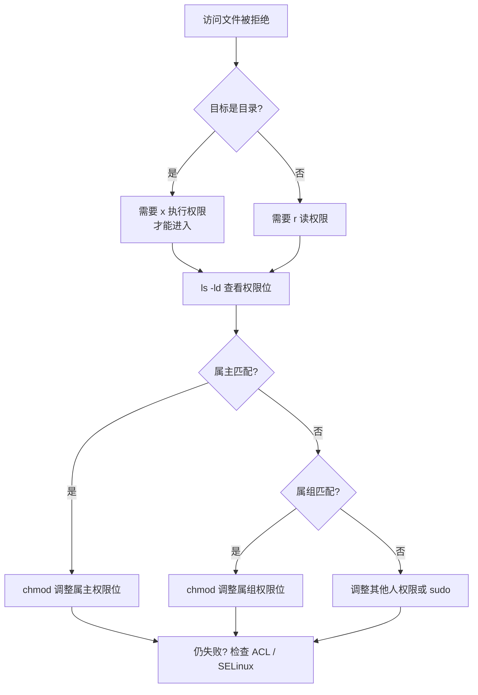

## 常用命令速查

| 命令 | 作用 | 常用示例 |
|---|---|---|
| `ls` | 列出目录 | `ls -lah`（含隐藏、人类可读大小） |
| `cd` | 切换目录 | `cd -`（返回上次目录） |
| `cp` | 复制 | `cp -r src/ dst/`（递归） |
| `mv` | 移动/重命名 | `mv old new` |
| `rm` | 删除 | `rm -rf dir/`（谨慎使用） |
| `mkdir` | 建目录 | `mkdir -p a/b/c`（递归） |
| `ln` | 链接 | `ln -s target link`（软链接） |
| `find` | 查找 | `find . -name "*.log" -mtime +7` |

## 权限模型

权限位 `rwxr-xr--` 分三段：所有者 / 所属组 / 其他人。

- `r=4`，`w=2`，`x=1`，数字法如 `chmod 755 script.sh`
- 目录的 `x` 表示**能否进入**，比 `r`（能否列出）更关键

### 权限不足排查流程

## 软链接 vs 硬链接

| | 软链接 symlink | 硬链接 hardlink |
|---|---|---|
| inode | 独立 inode，存路径 | 与源文件相同 |
| 跨文件系统 | 可以 | 不可以 |
| 源删除后 | 悬空 | 数据仍在（引用计数） |
| 目录 | 可以链接 | 不允许 |

## 要点备忘

- `rm -rf` 前先 `ls` 确认目标，杜绝路径打错删错目录
- 批量改名用 `rename` 或 `for f in *.txt; do mv "$f" "${f%.txt}.md"; done`
- 大文件传输用 `rsync -avP`，支持断点续传
