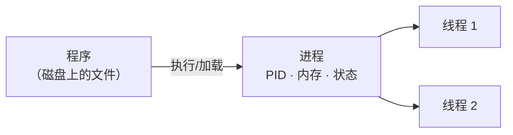

## 进程与线程

- **进程**：程序的一次运行实例，有独立 PID、内存空间。PID 1 是 init/systemd。
- **线程**：进程内的执行单元，共享进程内存，调度更轻量。



## 观察进程

| 命令 | 作用 |
|---|---|
| `ps aux` | 快照所有进程（`ps -ef` 同理） |
| `top` / `htop` | 实时动态观察 CPU/内存 |
| `pstree` | 进程树（父子关系） |
| `pgrep -f xxx` | 按名字/命令行找 PID |
| `lsof -p PID` | 该进程打开的文件/fd |

```bash
ps -eo pid,ppid,%cpu,%mem,cmd --sort=-%cpu | head  # 按 CPU 排序
top -c    # 显示完整命令行
```

## 进程状态（ps STAT）

| 状态 | 含义 |
|---|---|
| R | 运行中 |
| S | 可中断睡眠（绝大多数时间） |
| D | 不可中断睡眠（等 IO，常见卡住） |
| Z | 僵尸（zombie） |
| T | 停止/暂停 |

**僵尸进程**：子进程退出后，父进程未 `wait()` 回收，残留一个"尸体"状态。
它不占 CPU/内存（真正的资源已释放），但大量堆积说明父进程写坏了。常见对
策是让父进程正确回收，或直接重启父进程。

## 信号：控制进程的行为

信号是内核/其他进程发给进程的"通知"，常用：

| 信号 | 数字 | 作用 |
|---|---|---|
| SIGINT | 2 | 中断（Ctrl+C） |
| SIGKILL | 9 | 强杀（无法被捕获/忽略） |
| SIGTERM | 15 | 优雅终止（默认 kill） |

```bash
kill <PID>        # 发 SIGTERM，让程序自己清理后退出
kill -9 <PID>     # 强杀，最后手段
kill -STOP <PID>  # 暂停
kill -CONT <PID>  # 恢复
```

**优雅停机 vs 强杀**：优先 `kill`（SIGTERM），程序有机会释放资源、落盘数据；
`kill -9` 可能丢数据，只在卡死时才用。

## 前后台与作业控制

```bash
sleep 100 &        # 后台运行
jobs               # 列后台作业
fg %1              # 调回前台
bg %1              # 继续后台
Ctrl+Z             # 前台挂起（暂停）
nohup cmd &        # 退出终端也不停
```

## 小结

- 进程有独立内存与 PID；观察靠 ps/top/pstree，pid 1 是 systemd。
- 常见状态 S/R/D/Z，僵尸进程是父进程未回收造成的。
- 控制优先 SIGTERM（优雅），SIGKILL 是最后手段。

## 延伸阅读

- [Linux 进程与信号（man）](https://linux.die.net/man/1/kill)