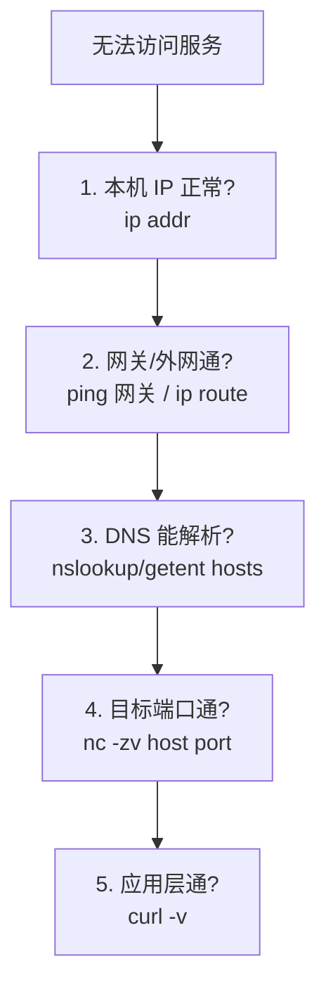

## 网络配置三要素

一台机器要能上网，需要三层信息：

| 要素 | 作用 | 查看命令 |
|---|---|---|
| IP 地址 | 机器在网络的唯一标识 | `ip addr` |
| 路由 | 数据包往哪走 | `ip route` |
| DNS | 域名 → IP 的翻译 | `cat /etc/resolv.conf` |


## 观察网络状态

| 命令 | 作用 |
|---|---|
| `ip addr` | 查看网卡与 IP |
| `ip route` | 查看路由表 |
| `ss -tlnp` | 查看监听的 TCP 端口 |
| `ss -tnp` | 查看已建立的连接 |
| `ping` | 测连通（ICMP） |
| `nc -zv host port` | 测某端口是否通 |
| `curl -v URL` | 应用层 HTTP 调试 |

## 排障四步（从下往上）



经典结论速判：

- **ping 通但端口不通** → 防火墙/服务没监听（`ss -tlnp` 看监听）。
- **能解析 IP 但连不上** → 路由或目标不可达（`ip route`、`traceroute`）。
- **域名解析失败** → DNS 配置问题（`/etc/resolv.conf`、`systemd-resolve`）。
- **本机就无 IP** → 网卡没起/没有 DHCP（`ip link set eth0 up`）。

## 端口与监听

```bash
ss -tlnp        # 监听中的 TCP 端口 + 进程
ss -ulnp        # UDP
ss -tnp state established  # 已建连
```

- `LISTEN` 状态 = 服务在等连接；只有处于监听状态的端口才能被外部访问。
- `ss` 已取代旧的 `netstat`，更快、信息更全。

## 防火墙要点

现代发行版常用 `iptables`（内核 netfilter）或 `firewalld`/`ufw` 做上层封装：

```bash
ufw allow 22/tcp     # ufw 放行端口
ufw status
firewall-cmd --list-all   # firewalld 查看
iptables -L -n -v         # 直接看规则
```

**排障时**：`nc` 连不上先 `ss -tlnp` 确认监听存在，再确认防火墙是否放行，
别只盯着应用日志。

## 小结

- 网络三要素：IP、路由、DNS，对应 ip addr / ip route / resolve.conf。
- 排障自下而上：本机 IP → 网关 → DNS → 端口 → 应用层。
- 监听用 ss -tlnp，端口连通用 nc -zv，应用层用 curl -v。

## 延伸阅读

- [Linux 网络工具（ip/ss）](https://linux.die.net/man/8/ip)