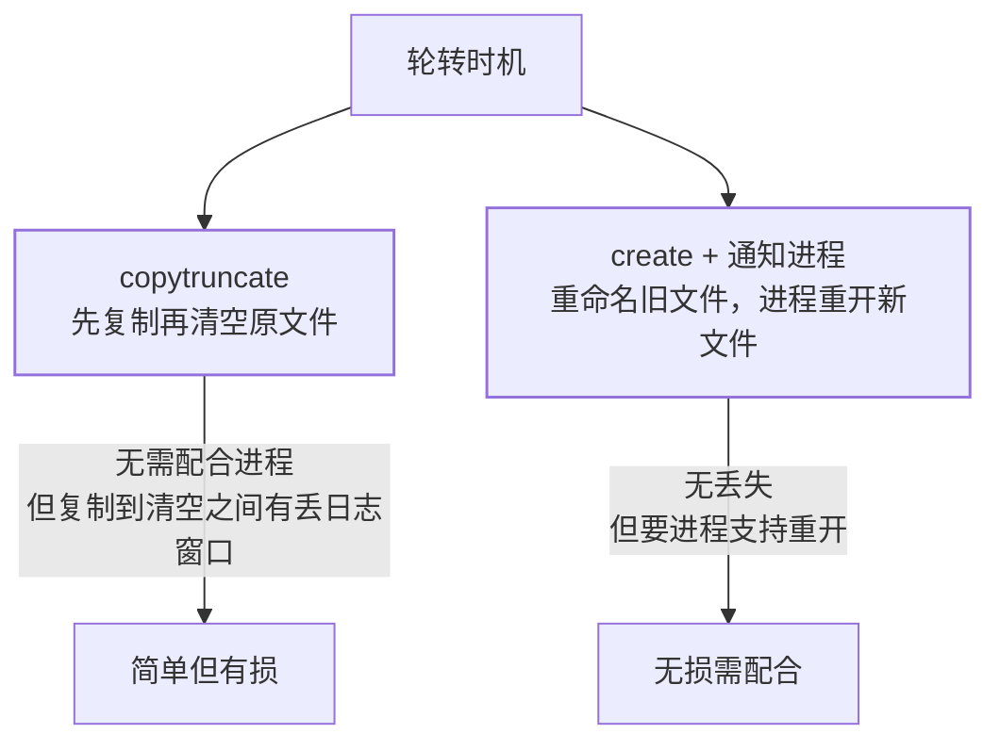

应用日志是排查问题的生命线，也是**磁盘打满的头号惯犯**。单文件无限
增长、删了却不见空间释放、轮转瞬间丢日志——日志管理的三个经典事故，
本篇一次讲清。

## 日志的两种死法

- **涨死**：单文件写到几十 GB，磁盘占满（commands 篇的磁盘排查流程
  接手）；
- **删了不释放**：`rm app.log` 后 `df` 纹丝不动——**进程还握着文件
  描述符**，inode 没释放（性能排查篇的 lsof deleted）。正确姿势：
  清空而非删除（`> app.log`），或让进程重开文件。

两种死法共同指向解药：**主动轮转**——日志按大小/时间切开、旧的压缩
或删除，`logrotate` 就是标准工具。

## logrotate：配置与两种轮转方式

```text
/var/log/app/*.log {
    daily          # 每天轮转
    rotate 14      # 保留 14 份
    compress       # 旧日志 gzip（app.log.1.gz）
    missingok      # 文件不存在不报错
    notifempty     # 空文件不轮转
    dateext        # 切出的文件带日期后缀
}
```

轮转"切开旧文件"有两种做法，取舍不同：



- **copytruncate**：不动文件本身，清空后继续写同一 inode——适合改不了
  程序的场景，代价是复制瞬间的日志可能丢；
- **create + 信号**：把旧文件改名，发信号让进程重开新文件
  （如 `postrotate kill -USR1 nginx`）——无丢失，但要进程支持重开；
- 配置错误自测：`logrotate -d /etc/logrotate.d/app`（dry-run 只打印
  不执行）。

## 应用侧 vs 系统侧：别两头都转

应用框架（logback 的 RollingFileAppender）自己就能按大小/日期滚动——
**与应用内滚动二选一**，否则出现 `app.log、app.log.2026-09-08.0.log、
app.log.1.gz` 三代同堂的混乱。

## 容器里的日志：换思路

容器内**不要自己 rotate**——容器日志走 stdout/stderr，由运行时
（docker json-file 配 max-size/max-file）或采集器（Filebeat/fluentd
→ ES/Loki）统一治理。容器里再跑 logrotate 是经典反模式：多进程写
同一文件 + 与运行时轮转打架。

## 高频追问速答

- **df 和 du 统计不一致为什么？** 大概率是被删除但仍被进程持有的文件
  （lsof | grep deleted）——du 看不见它们，df 算上了。
- **logrotate 什么时候执行？** 默认由 cron.daily / systemd timer 每天触发
  ——不是"到大小就转"，按时间策略跑；要按大小用 `size` + 更高频调度。
- **怎么防日志把盘打满的最后一道闸？** 日志分区独立挂载（打满不拖垮
  根分区）+ 监控告警（磁盘水位，性能排查篇）——轮转是日常，告警是保险。

## 小结

- 日志治理 = logrotate（或应用内滚动，二选一）+ 独立分区 + 水位告警。
- copytruncate 简单有损、create+信号无损需配合——按"能不能重开文件"
  选。
- 容器里日志走 stdout + 采集器，容器内自己 rotate 是反模式。
