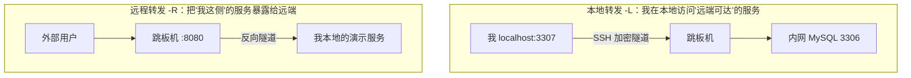

SSH 能做的事远不止登录：**端口转发（隧道）**让它成为跳板访问内网、
临时演示内网服务、调试外部 API 的万能通道。三种转发方向极易记混——
本篇用"谁访问谁"的视角一次理清。

## 三种转发：方向决定命令

- **本地转发**：`ssh -L 3307:db.internal:3306 jump`——访问**我本地的
  3307** 等于访问"跳板机眼中的 db.internal:3306"。场景：跳板机可达
  的内网数据库，我在本地用客户端连；
- **远程转发**：`ssh -R 8080:localhost:3000 jump`——把**我本地的
  服务**挂到跳板机的 8080，外部用户访问跳板机即到我（内网穿透的
  临时姿势；生产用 frp/ngrok 更稳）；
- **动态转发**：`ssh -D 1080 jump`——本地 SOCKS5 代理，流量全部经
  跳板出去（调试"只有跳板能访问的外部 API"）。

**方向记忆口诀**：`-L` 是"本地端口转发到远端目标"，`-R` 是"远端端口
反向转到本地服务"——`-L` 管我去用别人的，`-R` 管别人来用我的。

## 安全：隧道是绕过网络隔离的后门

- 隧道让"网络隔离"形同虚设——**能 SSH 上跳板 = 能碰跳板可达的一切**；
  所以 SSH 篇的加固（密钥/白名单/堡垒机）是隧道安全的前提；
- **服务端限制**：跳板机 `AllowTcpForwarding no`（不需要转发时），
  或 authorized_keys 里 `command=` 限定该密钥只能执行特定命令；
- **审计**：隧道流量经跳板，堡垒机会话审计照常覆盖（但内容是加密的
  ——合规要求高时限制隧道权限而非事后审计）；
- **保活**：NAT/防火墙掐空闲连接——`ServerAliveInterval 30` 保活，
  长期隧道用 **autossh**（断了自动重连）。

## 与 VPN 的边界

| | SSH 隧道 | VPN |
| --- | --- | --- |
| 范围 | 单端口/单应用 | 全流量/全网络 |
| 粒度控制 | 精确（只放行这个端口） | 粗（进网即在内） |
| 搭建成本 | 零（已有 SSH） | 需部署 |
| 适用 | 临时调试、点对点访问 | 团队常态化远程办公 |

临时、点对点 → SSH 隧道；团队常态化 → 正经 VPN——**临时方案永久化
就是事故**（隧道没审计、没生命周期管理）。

## 高频追问速答

- **-L 和 -R 总记混？** 看"端口开在哪"：-L 端口开在**本地**（我去访问
  远端），-R 端口开在**远端**（别人来访问我）。
- **隧道断了怎么保持？** `ServerAliveInterval` 心跳 + autossh 自动
  重连——autossh 用系统服务托管更稳。
- **远程转发外部访问不了？** 跳板机 sshd 默认 `GatewayPorts no`（只绑
  127.0.0.1）——需要外部访问时改 `GatewayPorts yes` 或走 nginx 反代
  （注意暴露风险）。

## 小结

- 三转发记方向：-L 本地口（我访问远端）、-R 远端口（别人访问我）、
  -D 动态代理（全走跳板）。
- 隧道 = 绕过网络隔离的后门：SSH 加固是前提、权限限定 + 审计 +
  autossh 保活是生产三件套。
- 临时点对点用隧道，常态化组网用 VPN——别让临时方案永久化。
