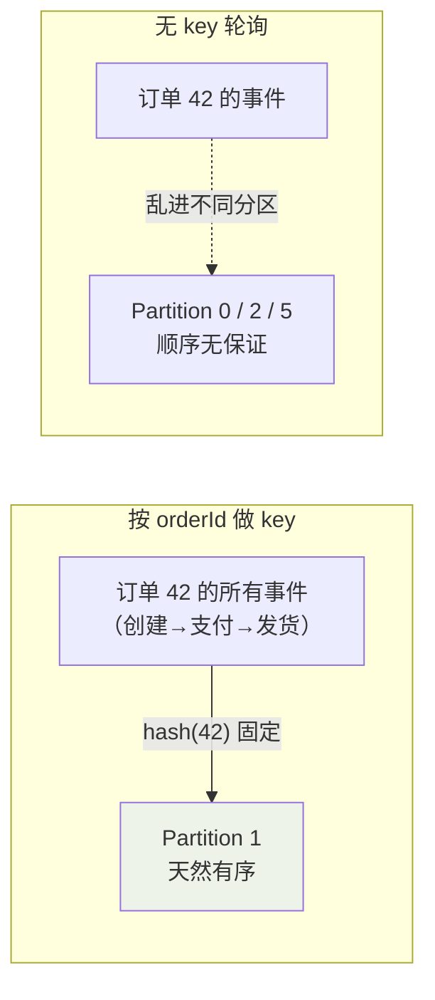
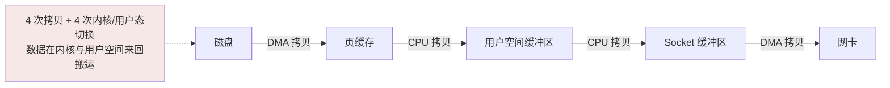
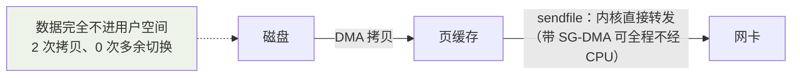
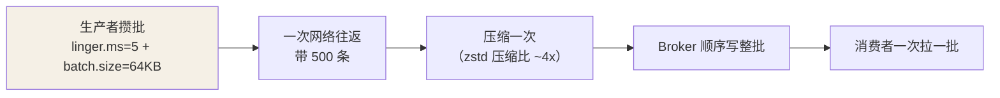

## 顺序性：先问"要多有序"

| 档位 | 实现方式 | 代价 |
|---|---|---|
| 全局有序 | **单分区**（整个 Topic 一条道走到黑） | 无并行，吞吐塌方 |
| 分区有序 | 同 key 进同分区 + 单线程消费 | 大多数场景的甜点 |
| 业务有序 | 按业务字段在**消费端重组**（内存队列/时间窗） | 实现复杂，兜底用 |



### 乱序的真实来源（比生产端更隐蔽）

生产端 hash 只解决"同 key 进同分区"；真正的坑在**消费端**：

1. **多线程消费**：一个分区的消息被扔进线程池并行处理 → 顺序打乱。
2. **重试**：消息 A 处理失败进重试，B 先成功 → 到库里的顺序变了。
3. **Rebalance**：分区换人的瞬间，offset 回退重放。

```java
// 单分区内保序消费的标准写法：按分区串行
for (ConsumerRecord<String, String> r : records) {
    String key = r.key();                          // 同 key 同分区
    CompletableFuture.runAsync(() -> process(r), 
        executorFor(key));                          // ★ 按 key 哈希到固定线程
}
// 同 key 永远同一个线程 → 分区内同 key 严格串行；不同 key 并行不浪费吞吐
```

RocketMQ 的顺序消息显式做了这套（`MessageQueueSelector` 选队列 +
`ConsumeMessageOrderlyService` 串行消费），Kafka 要自己拼——本质相同：
**有序的边界 = 并行的边界**。

## 高性能原理：零拷贝

### 传统读文件发送的路径（4 次拷贝 4 次切换）



### sendfile 零拷贝（Kafka 消费路径）



为什么 Kafka 能用：消费的本质是"**把日志文件原样发出去**"（不修改、
不组装）——恰好是零拷贝的完美场景。Java 侧的 API：
`FileChannel.transferTo()`（Linux 走 sendfile）。

### mmap（生产路径）

写入侧用**内存映射**：`MappedByteBuffer` 把日志文件映射进用户地址
空间，写内存 = 写文件（OS 负责刷盘）——省掉"用户缓冲区 → 内核页缓存"
的一次拷贝。

## 批量：吞吐的复利

零拷贝解决"单次搬运"，**批量**解决"搬运次数"：



```yaml
linger.ms: 5        # 攒 5ms（延迟换吞吐的旋钮）
batch.size: 65536   # 攒满 64KB 就发
compression.type: zstd   # 网络与磁盘同时受益
fetch.min.bytes: 1024   # 消费端也要攒
```

三者（零拷贝 + 顺序写 + 批量压缩）相乘，就是"百万级 QPS"的算术。

## 小结

- 顺序性先问档位：全局有序牺牲并行，分区有序（key 路由 + 按 key 串行
  消费）是默认答案；乱序多发生在消费端线程池与重试，不在生产端。
- 零拷贝的本质：数据不进用户空间——sendfile 管消费、mmap 管生产。
- 吞吐 = 顺序写 × 零拷贝 × 批量压缩的复利；linger.ms 是延迟与吞吐
  的交换旋钮。
