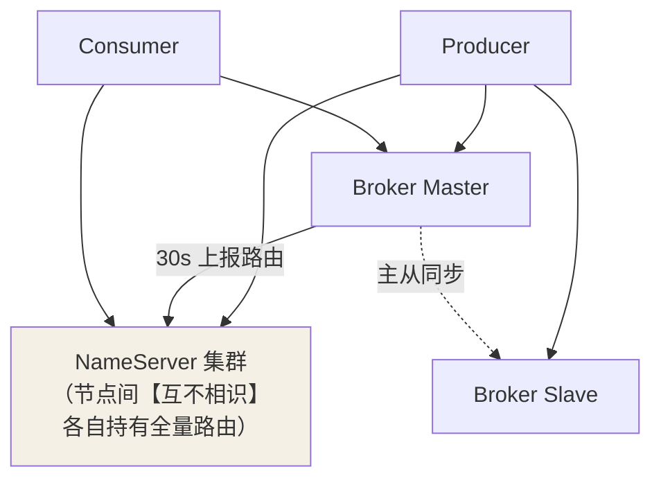
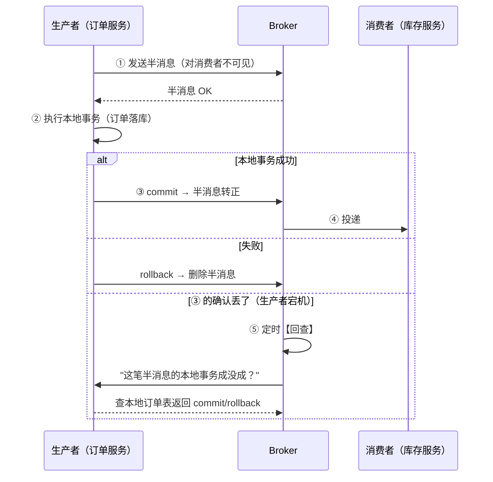
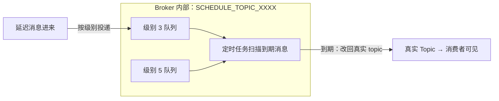

## 架构：无中心元数据



与 Kafka 的关键差异：

| | Kafka | RocketMQ |
|---|---|---|
| 元数据 | KRaft（Raft 强一致） | **NameServer：无状态、AP、节点互不同步** |
| 路由发现 | 元数据日志推送 | 客户端**定时拉取**（30s） |
| 写入 | Leader 分区 | Master Broker |

NameServer 各节点不同步，为什么敢这么设计？——路由数据**30 秒内
全量重建**，且客户端有重试兜底：**元数据丢了大不了等下一轮上报**，
不值得为它上共识（对比 KRaft：Kafka 分区粒度细、元数据量大到必须
强一致；RocketMQ 的路由粒度粗，AP 够用）。这就是"按数据的性质选
一致性"的又一现场（CAP 篇的选型口诀）。

## 事务消息：分布式事务的 MQ 解

对照分布式事务篇的"本地消息表"，RocketMQ 把扫表内建成协议：



```java
// 生产者：实现两个回调
@TransactionalMessageListener
class OrderTxListener implements TransactionListener {
    @Override
    public LocalTransactionState executeLocalTransaction(Message msg, Object arg) {
        orderMapper.insert(arg);                  // 本地事务
        return LocalTransactionState.COMMIT_MESSAGE;
    }
    @Override
    public LocalTransactionState checkLocalTransaction(MessageExt msg) {
        // 回查：订单存在 → COMMIT；不存在 → ROLLBACK
        return orderMapper.exists(msg.getTransactionId())
            ? LocalTransactionState.COMMIT_MESSAGE
            : LocalTransactionState.ROLLBACK_MESSAGE;
    }
}
```

**回查是灵魂**：半消息 + 本地事务 + 回查，等价于一张"由 Broker 托管
的本地消息表"——业务方免建表免扫表，代价是实现回查逻辑。注意与
Seata 的分工：MQ 事务消息是**最终一致 + 异步解耦**（下游慢点没关系）；
Seata 是**同步强一致**（下游失败整体回滚）。

## 延迟消息：订单超时取消的标准解

```java
// 30 分钟未支付自动取消：发消息时设级别，到期才对消费者可见
Message msg = new Message("order-timeout-check", body);
msg.setDelayTimeLevel(3);        // 级别 3 = 10s（1s 2s 5s 10s 30s 1m 2m...2h）
// 4.x：msg.setDeliverTimeMs(System.currentTimeMillis() + 30 * 60 * 1000) 任意时间

producer.send(msg);
```

底层实现——**每个延迟级别一个逻辑队列 + 定时轮询**：



对比其他方案：

| 方案 | 精度 | 持久化 | 适用 |
|---|---|---|---|
| RocketMQ 延迟消息 | 级别/时间戳 | ✅ | **订单超时（首选）** |
| Redis ZSet / 时间轮 | 高 | 内存（丢失风险） | 海量高频短延迟 |
| DB 轮询 | 分钟级 | ✅ | 兜底对账 |
| JDK DelayQueue | 高 | ✗ 内存 | 单机小场景 |

订单超时这种"分钟级、必须可靠"的场景，延迟消息是唯一正解——Redis
 方案宕机即丢，DB 轮询扛不住扫表压力。

## Push 消费：其实是长轮询

```java
// "Push 消费"的真相：客户端线程循环拉取，Broker 没消息就把请求【挂起】
// （Suspend），5s 内有消息立刻返回——伪 Push，真 Poll
while (!stopped) {
    PullRequest req = pullRequestQueue.take();
    PullResult result = pullKernelBrocket(req);   // 递增 offset 拉取
    if (hasMsg(result)) { consumeMessage(result); updateOffset(); }
    // 没消息：请求挂起 hold，pushDelayFlag 让 Broker 立即响应新消息
}
```

选型落点：**流控友好 + 实时性接近真推**——消费者按自己的消化能力
拉取（不会被打爆），又几乎零延迟（长轮询挂起）。

## 小结

- NameServer 无状态互不同步：路由数据"丢了能重建"，不值得上共识。
- 事务消息 = 半消息 + 本地事务 + 回查，Broker 托管的"本地消息表"。
- 延迟消息级别 + 定时轮转投；订单超时场景它是持久化可靠性的唯一
  正解；Push 的本质是长轮询。
