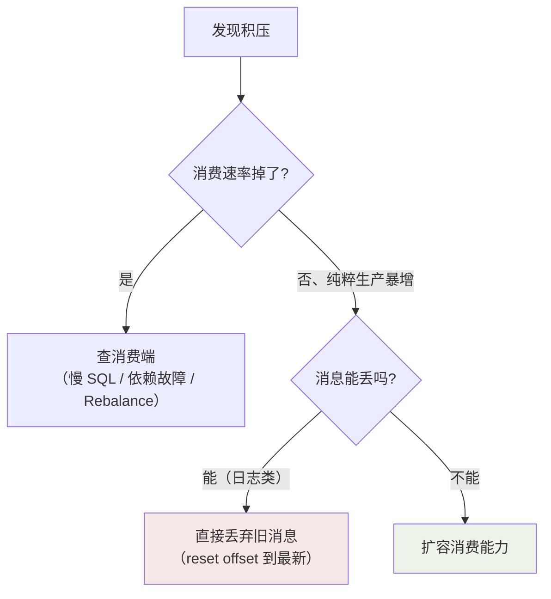
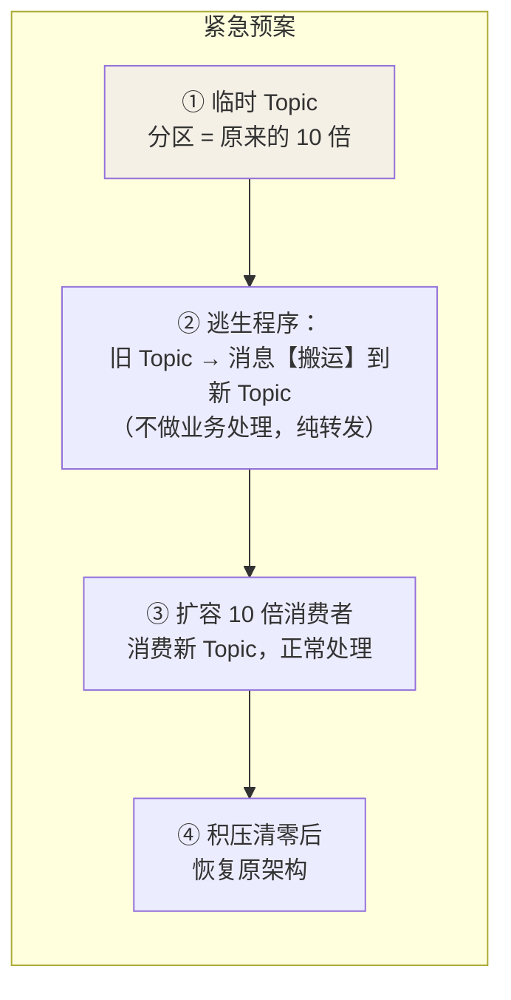

## 先定位，再动手

看到积压别急着扩容——先回答三个问题：

```sql
-- ① 积压了多少、还在涨吗？
kafka-consumer-groups.sh --describe --group inventory-service
-- CURRENT-OFFSET（消费到）/ LOG-END-OFFSET（最新）/ LAG（差值）

-- ② 是生产暴增，还是消费变慢？
-- 对比两条曲线：生产速率 vs 消费速率
-- 生产涨：业务洪峰（合理的削峰场景，等它自己消化）
-- 消费跌：消费者故障 / 下游 DB 慢 / Rebalance 抖动（先修病根）

-- ③ 慢在哪一层？
-- 消费者线程 dump：卡在 DB 慢查询？卡在外部 RPC？卡在锁？
```



## 紧急扩容四步法（Kafka 版）

分区数 = 消费并行度上限。**积压 × 分区不够**时，加消费者没用，标准
操作是"临时通道"：



```java
// ② 逃生程序：一个"只搬不处理"的消费者，把 1 个分区的内容
// 按 hash(key) 摊到 10 倍分区的新 Topic —— 保序不破坏
while (true) {
    for (var r : oldConsumer.poll(...)) {
        emergencyProducer.send(new ProducerRecord<>("topic-x10",
            r.key(), r.value()));      // 同 key 落同分区，顺序不乱
    }
}
```

如果不保序无所谓（如日志清洗），逃生程序甚至可以**丢 key 均摊**。

## 消费端提速清单（扩容之前先做的事）

| 手段 | 效果 | 前提 |
|---|---|---|
| 单条处理 → **攒批处理**（N 条一批落库） | 常常 10 倍 | 业务允许 |
| 消费逻辑里的 DB 单条 insert → **批量 upsert** | 大 | 唯一键幂等 |
| 拉取参数调大（max.poll.records、fetch.min.bytes） | 温和 | 内存够 |
| 消费线程池（按 key 哈希，见顺序篇） | 线性 | 处理无全局共享状态 |
| 下游慢（DB/RPC）→ **加缓存或降级非核心逻辑** | 视情况 | —— |

大部分"积压"其实是**消费逻辑里的同步慢 IO**——扩容是最后手段，先
做单机提速。

## 预防：把积压挡在设计期

1. **容量规划留水位**：日常峰值的 3 倍余量；分区数 = 预估消费者数 × 2。
2. **监控告警前置**：LAG > 阈值（如 10 万条或 5 分钟消费延迟）就告警，
   不要等用户投诉。
3. **消费逻辑瘦身**：消费线程里只做"落库 + 发下一步事件"，重逻辑
   （调外部接口、发短信）再异步拆出去。
4. **压测演练**：上大流量前，用影子 Topic 压一遍消费链路。

## 事故复盘模板（真实案例的骨架）

```text
背景：大促 0 点，订单 Topic 突发 50 倍流量
现象：库存服务 LAG 从 0 涨到 800 万，订单超时大面积告警
根因：消费逻辑里同步调用了风控 RPC（超时 3s），下游一抖动
     消费速率从 5000/s 掉到 50/s
处理：① 风控调用改异步 + 熔断（Sentinel）
     ② 消费改攒批（500 条/批落库）
     ③ 临时扩容 4 个消费者实例
     2 小时清完积压
改进：消费链路禁止同步外部 RPC（架构红线）
     LAG 告警阈值从 50 万降到 5 万
     大促前影子压测纳入发布清单
```

值得记住的顺序：**先看监控定位（消费掉速 vs 生产暴增）→ 单机提速
（批量/瘦身）→ 再扩容（加实例/临时通道）→ 最后复盘（红线写进规范）**。

## 小结

- 积压三问：多少、涨没涨、慢在哪——先诊断消费端，生产暴增才考虑
  扩容。
- 分区数卡住并行度时，"临时 Topic 搬运 ×10 分区"是标准逃生通道，
  记得按 key 摊以保序。
- 预防三件套：容量水位、LAG 前置告警、消费逻辑瘦身（同步外部调用
  是积压第一根因）。
