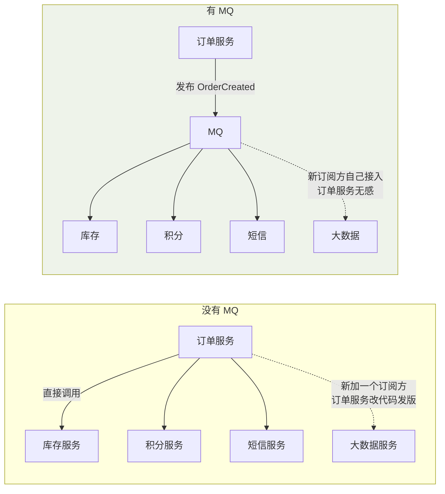
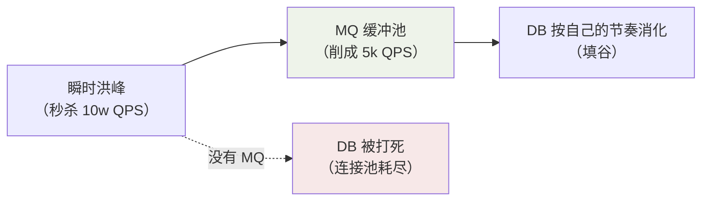

## 三大收益

### 解耦：让"变化"不传染



判断标准：**下游增减时上游要不要动**。订单创建后 N 个下游关心，
每加一个下游就改一次订单服务——把"通知"这件事交给 MQ，上游只管发布
事实（Event），下游自由订阅。

### 异步：缩短主链路响应

```
同步链路：下单 = 订单 50ms + 库存 50ms + 积分 100ms + 短信 200ms = 400ms
异步链路：下单 = 订单 50ms + 发消息 5ms = 55ms（其余异步消费）
```

非核心链路（通知、统计、积分）拖慢核心链路，是典型的"用串行浪费
用户时间"。

### 削峰填谷



数据库能稳定消化 5k QPS，但流量天生有波峰——**MQ 的本质是把"处理速率"
的决策权从"流量到达率"手里夺回来**。

## 四大代价（上车前先想清楚）

| 代价 | 场景 | 对策（后续笔记展开） |
|---|---|---|
| **系统可用性下降** | MQ 挂了全链路瘫 | 集群高可用（ISR/主从） |
| **复杂度飙升** | 一致性从"一个事务"变"最终一致" | 分布式事务方案（见分布式事务篇） |
| **重复消费** | At Least Once 投递 | 幂等设计（唯一键/去重表） |
| **消息丢失** | 三阶段都可能丢 | acks=all + 手动提交（Kafka 篇） |
| **顺序问题** | 多分区并发消费 | 分区有序（顺序性篇） |
| **积压** | 消费速度跟不上生产 | 扩容/治理（积压篇） |

一个常被忽略的原则：**先问"不用 MQ 行不行"**。两个服务、一天几百条
调用、核心链路同步强一致——这种场景上 MQ 是给自己加戏。

## 消息模型：推 vs 拉

| | 推 Push（RocketMQ/Broker 视角） | 拉 Pull（Kafka 视角） |
|---|---|---|
| 主动方 | Broker 推给消费者 | 消费者主动拉取 |
| 实时性 | 高（长轮询近似推） | 由拉取间隔决定 |
| 流控 | Broker 压力大（慢消费者拖垮） | 消费者按自己节奏来 |

实践中的混合形态：RocketMQ 用**长轮询**（客户端请求挂起，有消息立即
返回，兼顾实时与流控）；Kafka 消费者按分区批量拉取，吞吐优先。

## 消费语义三档

| 语义 | 含义 | 代价 |
|---|---|---|
| At Most Once | 至多一次（可能丢） | 快，允许丢失的日志类 |
| **At Least Once（主流默认）** | 至少一次（可能重复） | **必须配幂等** |
| Exactly Once | 恰好一次 | Kafka 事务流（限定场景） |

工业界的务实答案：**At Least Once + 消费端幂等**——把"不重不丢"这个
分布式难题，拆成"不丢"（重试解决）+"不重"（业务幂等解决）两个简单问题。

## 小结

- 收益三件套：解耦（下游变化不传染）、异步（主链路只做核心）、削峰
  （夺回处理速率的决策权）。
- 代价清单先背下来：可用性、复杂性、重复、丢失、顺序、积压——后续每
  篇各治一病。
- 默认组合拳：At Least Once + 幂等消费，别幻想裸奔的 Exactly Once。
