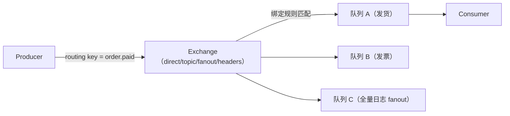
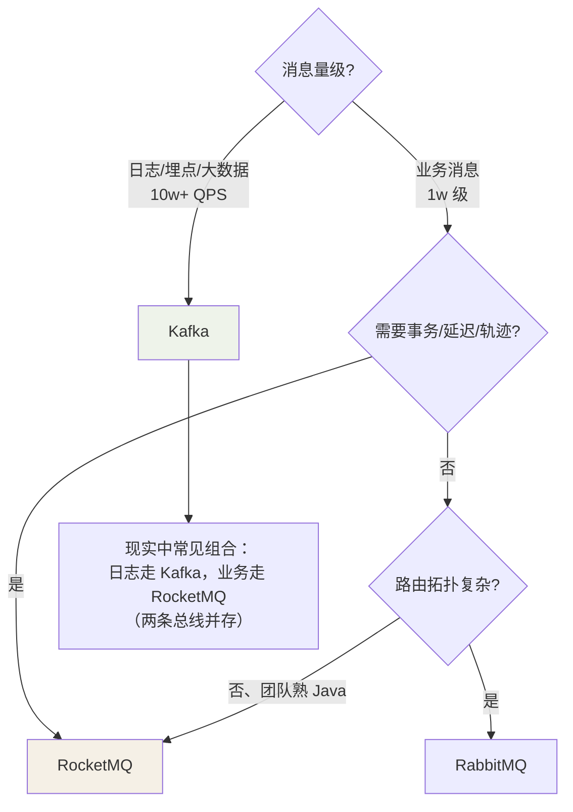

## 一张表定调

| 维度 | Kafka | RocketMQ | RabbitMQ |
|---|---|---|---|
| 出身 | LinkedIn 日志管道 | 阿里交易链路 | AMQP 协议实现 |
| 单机吞吐 | **百万级/s** | 十万级/s | 万级/s |
| 延迟 | ms 级（批量攒批） | ms 级 | **μs~ms 级（最低）** |
| 功能丰富度 | 精简 | **事务消息/延迟消息/轨迹** | 路由灵活（exchange） |
| 顺序消息 | 分区内有序 | **队列有序 + 支持顺序消息** | 队列有序 |
| 管理生态 | KRaft 自治 | 控制台好用 | 管理界面成熟 |
| 语言基因 | Scala/Java | Java（易读源码/二开） | Erlang（改不动） |
| 选型口诀 | **日志、大数据管道** | **电商业务、金融交易** | **中小规模、复杂路由** |

吞吐差距的根源是**架构基因**：Kafka 追求"磁盘顺序写 + 批量"的极限
（详见 Kafka 架构篇）；RabbitMQ 的路由灵活（exchange/binding 模型）换来
每条消息的协议解释开销。

## Kafka：为吞吐而生

**定位**：高吞吐、可水平扩展的**分布式提交日志**（distributed log）。

- 大数据管道标配（日志采集 → Flink/Spark 计算）。
- Kafka Streams 让它兼顾轻量流处理。
- 功能上"做减法"：4.x 前连延迟消息都没有（KIP-401 后仍有限），事务
  面向流处理场景而非业务事务。

**适合**：埋点日志、CDC 同步、大数据入仓、事件溯源底座。
**不适合**：需要延迟消息、消息轨迹、业务级事务消息的场景。

## RocketMQ：为业务而生

**定位**：电商交易链路打磨出来的**业务消息中枢**——JavaGuide 作者的
一线经验：阿里内部叫它"消息中间件扛把子"。

三大招牌功能（后续笔记展开）：

1. **事务消息**：半消息 + 本地事务 + 回查——分布式事务的标配（呼应
   分布式事务篇）。
2. **延迟消息**：18 个固定级别（1s~2h），订单超时未支付自动取消的
   主力方案（4.x 支持任意时间戳）。
3. **消息轨迹**：一条消息从生产到消费全程可查——排查"消息去哪了"
   的刚需。

**适合**：订单/交易/支付链路、需要事务与延迟特性的业务消息。
**不适合**：单条延迟要求不敏感的纯日志类大数据管道（吞吐干不过 Kafka）。

## RabbitMQ：为路由而生

**定位**：AMQP 协议的教科书实现，**路由拓扑是它最大的差异化**：

- Exchange 类型决定分发策略：direct 精确匹配、topic 通配符、fanout 广播、
  headers 按头匹配。
- **低延迟小流量**场景体验好；消息确认（ack）与死信队列（DLX）机制
  完整。

**适合**：业务复杂路由、低延迟告警、跨国团队 AMQP 标准。
**不适合**：大吞吐（单机万级顶不住埋点洪峰）。

## 选型决策树

三个工程提醒：

1. **已有 Hadoop/Flink 生态 → 无脑 Kafka**（ connector 全家桶最全）。
2. **不要用 MQ 的"顺手功能"代替专用组件**：延迟队列重度使用时，认真
   考虑 Redis ZSet 或时间轮，比 18 个固定级别灵活。
3. **团队语言栈**：Java 团队改 RocketMQ 源码的成本远低于改 Erlang 写的
   RabbitMQ——二开能力也是隐性选型因素。

## 小结

- 基因决定能力：Kafka 顺序写为吞吐、RocketMQ 交易链路为业务、RabbitMQ
  exchange 为路由。
- 大数据管道给 Kafka，业务消息要事务/延迟给 RocketMQ，复杂路由低延迟
  给 RabbitMQ。
- 现实架构常是"日志 + 业务"两条总线并存，别硬塞一个 MQ 干所有活。
