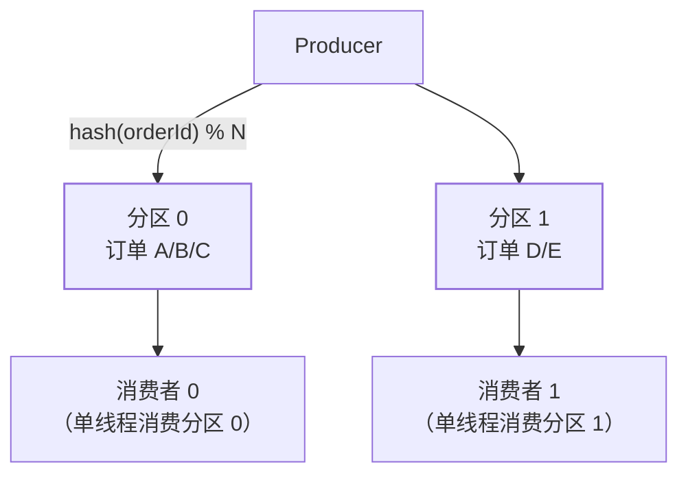

"消息队列能保证消息的顺序吗？"——面试必考，正确答案的第一句是：
**全局有序几乎不可能做到不牺牲吞吐量，实际方案是"分区有序"**。

## 为什么需要顺序

- 订单状态变更：创建 → 支付 → 发货 → 完成——乱序就是"已发货的订单
  被标记为待支付"；
- 数据库变更同步（CDC 篇）：INSERT/UPDATE/DELETE 必须按序执行；
- 这些场景的**同一 key 的操作**必须按序处理。

## 分区有序：核心思想

- **同一 key 的消息路由到同一分区**（生产端 hash 路由）——分区内
  天然有序（追加写）；
- **同一分区只给一个消费者**（消费端组内互斥）——消费端不会乱序；
- **分区之间无序**——不同订单之间不关心顺序。

## 消费端并行的矛盾

分区有序但消费端并行处理会破坏顺序：

- ❌ 多线程消费同一分区：两个线程可能交错处理同一 key 的消息；
- ✅ **内存队列分组**：同一 key 的消息 hash 到同一个内存队列，
  队列内单线程处理——RocketMQ 的 MessageListenerOrderly 就是这个
  思路；
- ✅ **按 key 分区到线程**：分区数 = 线程数（或 hash 映射），同一
  key 始终到同一线程。

## 三大 MQ 的实现差异

| | Kafka | RocketMQ | RabbitMQ |
| --- | --- | --- | --- |
| 分区有序 | ✓（分区天然有序） | ✓（Queue 天然有序） | 单队列天然有序 |
| 顺序路由 | hash(key) % partitions | MessageQueueSelector | 单队列绑定单消费者 |
| 消费并行 | 分区数 = 消费者并行度上限 | MessageListenerOrderly | prefetch + 单队列单消费者 |
| 破坏顺序的操作 | 增加 partition | 扩容 Queue 数 | 消费者重启 |

- **Kafka 扩分区破坏顺序**：hash(key) % N 的 N 变了，同一 key 的
  路由就变了——提前规划分区数（Kafka 架构篇）；
- **RabbitMQ 天然适合顺序**：单队列单消费者就是有序的——但吞吐量
  受限于单队列。

## 高频追问速答

- **为什么不用全局有序？** 全局有序 = 单分区 = 单消费者 = 吞吐量
  瓶颈——分区有序是吞吐与顺序的最优折中。
- **顺序消费怎么处理失败？** 不能跳过（跳了就乱序）——**阻塞重试**
  直到成功，或者将失败消息放入**本地重试队列**等待后续处理（不
  消费后续消息）。
- **消费端重启会不会乱序？** offset 是已消费的位置——重启后从
  offset 继续消费，不会重复也不会乱序（offset 篇的位移语义）。

## 小结

- 全局有序不可行（吞吐瓶颈），**分区有序是标准方案**：同 key 同
  分区 + 分区内单线程消费。
- 三大 MQ 都支持分区有序，但路由方式和消费并行度不同。
- **分区数提前规划**——扩分区破坏 hash 路由的有序性（Kafka 架构篇）。
