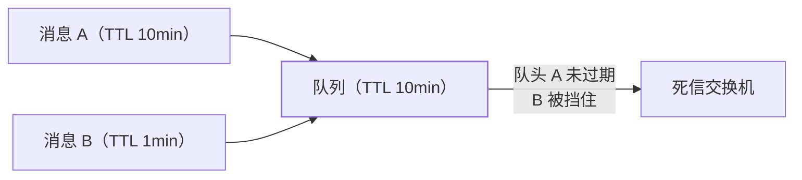

"订单 30 分钟不支付自动取消"——延迟消息是这个场景的标准解，但三大 MQ
的**实现方式和能力差异**很大：RocketMQ 原生支持、RabbitMQ 靠 TTL+死信
模拟、Kafka 没有原生支持。面试考的就是"知不知道这些差异"。

## 三大 MQ 的延迟消息实现

| | RocketMQ | RabbitMQ | Kafka |
| --- | --- | --- | --- |
| 原生支持 | ✓（延迟级别） | ✗（TTL+死信模拟） | ✗ |
| 精度 | 固定 18 级（10s~2h） | 毫秒级（TTL 控制） | 取决于外部方案 |
| 灵活性 | 固定级别不可自定义 | **任意延迟时间** | 需要自己实现 |
| 大量不同延迟 | 18 级够用 | 每个延迟一个队列（爆炸） | 外部组件 |

- **RocketMQ 5.0** 支持任意时间延迟（定时消息）——4.x 只有 18 个
  固定级别；
- **RabbitMQ 的 TTL+死信**：给消息设置 TTL，过期后转发到死信交换机——
  但有**队头阻塞**问题（前面消息 TTL 长会挡住后面短的，需要每级一个队列）；
- **Kafka 没有原生延迟**——需要外部实现（时间轮/延迟 topic 分层/外部
  调度器），或者用 Redis zset 做延迟队列（对照定时任务篇）。

## RabbitMQ TTL+死信的队头阻塞

- RabbitMQ 只检查**队头消息**是否过期——如果队头 TTL 是 10 分钟，
  后面 TTL 1 分钟的消息**即使过期了也不会先投递**（被队头挡住）；
- 解法：**按延迟时间分队列**（1min/5min/10min 各一个队列），或者
  使用 **rabbitmq-delayed-message-exchange 插件**（直接支持任意
  延迟，底层用 Mnesia 存储）。

## 高频追问速答

- **延迟消息和定时任务怎么选？** 延迟消息适合"每个消息独立延迟"
  （订单超时各自计时）；定时任务适合"固定周期批量执行"（每天对账）
  ——按触发模式选。
- **Kafka 怎么实现延迟消息？** ①按延迟时间分 topic（delay-5s/
  delay-30s...），消费者定时轮询；②用时间轮算法自研；③引入
  Kafka 延迟消息插件——三种方案复杂度递增。
- **延迟消息的数量很大怎么办？** RocketMQ 的定时轮（时间轮算法）
  用轮次+槽位管理大量延迟消息——时间轮把 O(n) 的扫描变成 O(1)
  的槽位定位。

## 小结

- RocketMQ 原生延迟级别（4.x 固定 18 级，5.0 任意时间），RabbitMQ
  靠 TTL+死信（有队头阻塞），Kafka 无原生支持（需外部实现）。
- 延迟消息 vs 定时任务：每个消息独立计时用延迟消息，固定周期批量
  用定时任务。
- 队头阻塞是 RabbitMQ TTL 方案的坑——按延迟分级或用插件。
