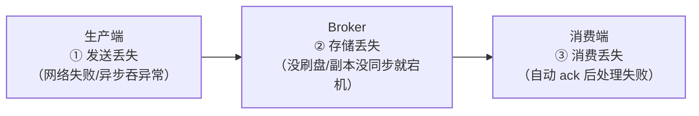

## 可靠性是全链路木桶

消息从生产到消费要跨三段，**每一段都可能丢**，可靠性方案 = 三段
各设一道闸：

面试标准姿势：按"生产 → 存储 → 消费"三段各答 2~3 招，而不是
背某个 MQ 的某个参数。

## 一、不丢：三段各一道闸

### 生产端：发出去才算数

- **确认机制**：RabbitMQ publisher confirm、Kafka `acks=all`（leader
  等 ISR 全部落盘）、RocketMQ 同步发送 + 同步刷盘。
- **失败重试**：发送失败重试若干次；仍未成功落地**本地消息表**
  定时补偿（完整方案见 [分布式事务篇](/distributed/intermediate/transaction/01-distributed-transaction/)）。
- 忌讳：异步发送不关心回执、fire-and-forget。

### Broker：存下来才可靠

- **持久化**：RabbitMQ 交换机/队列/消息三者都要 durable；RocketMQ
  同步刷盘（`FlushDiskType=SYNC_FLUSH`）优于异步。
- **副本**：Kafka `replication.factor>=3` + `min.insync.replicas>=2`；
  RocketMQ 主从同步复制（`SYNC_MASTER`），主挂了从上有全量。
- 刷盘与副本是"性能换可靠"的两个独立旋钮，按业务分级配置。

### 消费端：处理完才确认

- **手动 ack**：RabbitMQ 关 autoAck，Kafka 关自动提交位移，业务
  处理成功后再 ack/commit。
- 处理失败：重试队列 + 死信队列（DLQ）兜底，别无限重试堵住正常
  消费。
- 忌讳：**先 ack 再处理**——ack 后进程崩了，这条消息就永久没了。

## 二、不重：承认重复，用幂等消灭

防丢的手段（重试、副本切换、消费重平衡）**天然导致重复投递**，
MQ 只能保证 **At Least Once**——"恰好一次"在工程上是"至少一次
+ 消费幂等"拼出来的：

- 通用解：**唯一业务号 + 去重表/Redis SETNX**，完整套路见
  [接口幂等性设计](/distributed/intermediate/coordination/02-idempotency/)。
- 框架辅助：Kafka 幂等生产者（PID + 序列号去重，只保单分区会话内）、
  事务/跨分区用事务 ID。
- 消费端入口统一做幂等拦截，别指望上游不重发。

## 三、不乱序：全局有序是奢侈品

- **全局有序** = 单分区/单队列 + 单消费者，吞吐归一，一般不选。
- **局部有序**（生产标准答案）：**按业务 key 路由**——同一订单的
  消息进同一分区，分区内天然 FIFO，多分区并行保吞吐。
  - Kafka：自定义分区器按 `orderId` hash；
  - RocketMQ：`MessageQueueSelector` + 顺序消费模式。
- **隐蔽坑：生产端重试乱序**——msg1 超时重试，msg2 先到了。Kafka
  里 `max.in.flight.requests.per.connection>1` 时必须**同时开启
  幂等生产者**才能保证重试后仍有序。
- 消费端并行处理同 key 消息也会乱序——同 key 要路由到同一线程
  （内存队列/单线程池分片）。

## 三问速答卡

| 问题 | 一句话答案 |
|---|---|
| 不丢 | 生产确认重试 + Broker 持久化副本 + 消费手动 ack，三段缺一不可 |
| 不重 | MQ 只能至少一次，"恰好一次"= 至少一次 + 消费幂等 |
| 不乱序 | 按 key 分区局部有序，单线程消费同分区，开幂等防重试乱序 |

## 小结

- 可靠性三问的共同哲学：**承认分布式失败是常态（丢/重/乱都会
  发生），用机制收敛而不是祈祷**。
- 不丢的木桶短板几乎总在消费端"自动 ack"上，优先检查它。
- 顺序的代价与范围成正比：全局有序不可取，按 key 局部有序是
  吞吐与顺序的黄金平衡点。

## 延伸阅读

- [RocketMQ 积压治理：定位三板斧与扩容四步法（同站）](/rocketmq/advanced/core/)
- [Kafka 顺序性与零拷贝（同站）](/kafka/intermediate/core/)
- [Kafka 官方文档：投递语义](https://kafka.apache.org/documentation/#semantics)
- [RabbitMQ Reliability Guide](https://www.rabbitmq.com/docs/reliability)
