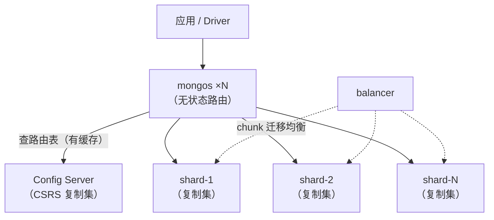

## 垂直与水平扩展的取舍

单机扛不住时有两条路：

- **垂直扩展**：加内存、换 NVMe、上大机型。简单、应用零改造，但有物理
  天花板，且机器越大单价越贵。
- **水平扩展**：注意复制集只解决**可用性**——它仍是"单主写入、全量数据
  每节点一份"，容量与写吞吐都不随节点数增长。真正把数据切开的是**分片**。

判断标准（详见容量规划篇）：**工作集放得进单机内存、写入峰值没到单机
瓶颈 → 复制集就够**。分片换来的扩展性，代价是组件更多、跨分片查询与
事务受限、运维复杂度上一个台阶——不要为分片而分片。

## 三大组件



| 组件 | 职责 | 部署要点 |
|---|---|---|
| **mongos** | 路由：按分片键定位 chunk 转发请求；不带分片键的查询做 scatter-gather（广播所有分片再归并） | 无状态，可随应用横向多开；客户端连接串配多个 mongos |
| **Config Server** | 存集群元数据：分片列表、库/集合分片配置、chunk 分布路由表 | 生产必须是**复制集（CSRS）**；全集群唯一，位置要稳 |
| **Shard** | 存真实数据 | 每个分片**本身是一个复制集**，高可用靠它（先学复制集篇） |

## 分片键：一次拍板，长期生效

分片键决定每条文档去哪个分片，**选错基本只能建新集合重灌数据**
（4.2+ 的 refineCollectionShardKey 只能追加后缀字段，不能整体换键）。
两种切法：

| | 范围分片（默认） | 哈希分片 |
|---|---|---|
| 分布 | 相邻键值进同一 chunk | 按哈希值均匀打散 |
| 范围查询 | 带分片键可只路由目标分片 | 退化为 scatter-gather |
| 等值查询 | 可路由到目标分片 | 可路由到目标分片 |
| 写热点 | 单调递增键必热点 | 天然打散 |

**好分片键的两个指标**：

1. **基数**（cardinality）：不同取值的数量。低基数（如"省份"只有几十个
   取值）最多分裂出几十个 chunk，再也无法细分——数据倾斜无解。
2. **单调性**：单调递增键（时间戳、ObjectId `_id`）在范围分片下永远
   追着"最后一个 chunk"写，单分片扛全部写入；要么换哈希，要么用复合键
   把高基数非单调字段放前面（如 `{userId: 1, createdAt: 1}`）。

另注意：分片键字段必须有索引（或以它开头的复合索引）才能用作分片键。

## chunk 与 balancer

数据按分片键切成 **chunk**（默认 64MB），归属路由表存在 Config Server：


- 迁移占用源/目标分片的 IO 与网络带宽，**业务高峰应限制 balancer**
  （设置 activeWindow 时间窗，或 `sh.stopBalancer()`）；
- mongos 靠定时刷新元数据保持路由一致，迁移完成后的极短窗口内可能出现
  路由重试，driver 会自动处理。

## 部署配置要点

最小生产拓扑：**Config Server 复制集（3 节点）+ 2~3 个分片复制集（每片
3 节点）+ 2 个以上 mongos**。搭建流程（合并来源 2、3 的实操步骤）：

```yaml
# ① Config Server（mongod.conf）：以 CSRS 复制集身份启动
sharding:
  clusterRole: configsvr
replication:
  replSetName: cfg_rs

# ② 分片（每个分片一份）：先按普通复制集 rs.initiate() 建好
sharding:
  clusterRole: shardsvr
replication:
  replSetName: shard1_rs    # 每个分片的 replSetName 必须不同
```

```bash
# ③ 启动 mongos，指向 Config Server 复制集
mongos --configdb cfg_rs/cfg1:28019,cfg2:28019,cfg3:28019 --port 28020

# ④ 在 mongos 上注册分片、启用分片、选定分片键
sh.addShard("shard1_rs/shard1a:28017,shard1b:28017,shard1c:28017")
sh.enableSharding("orders")
# 哈希键 + 预分裂：起步就把写入打散到 128 个 chunk
sh.shardCollection("orders.payments", { userId: "hashed" }, false, 128)
# 范围键新集合也可手动预分裂，避免前期全落一个分片：
# sh.splitAt("orders.payments", { userId: "u_10000" })

sh.status()   # 验证分片列表与 chunk 分布
```

要点：

- 应用只连 mongos，**绝不直连分片或 Config Server**；
- 先建好分片键索引，再执行 `shardCollection`；
- 库级 `enableSharding` 不等于集合已分片——未分片集合集中在该库的
  **primary shard** 上。

## 运维坑清单

- **jumbo chunk**：某个 chunk 超过大小上限又无法分裂（同一个分片键值
  对应海量文档，典型如低基数字段做键）→ balancer 搬不动它，数据倾斜
  卡死。处理：换高基数分片键重建集合；6.0.3+ 的 balancer 支持直接迁移
  jumbo chunk；老版本需手动清除 jumbo 标记。
- **分片内避免 PSA（主+从+仲裁）架构**：Arbiter 不存数据，`w:"majority"`
  被迫等唯一 Secondary，写延迟放大——分片复制集推荐三数据节点。
- **addShard 前确认分片名/replSetName 全局唯一**，重名会导致路由错乱。
- **scatter-gather 拖垮集群**：大量查询不带分片键（按非键字段过滤），
  每次查询打满所有分片——要么把分片键补进查询条件，要么重新审视
  分片键设计。

## 小结

- 复制集解决可用性，分片解决容量/写入的水平扩展；工作集放得下单机
  就别分片。
- 三组件：mongos 无状态路由、Config Server 存路由元数据（CSRS）、
  shard 本身是复制集。
- 分片键看基数与单调性：高基数 + 非单调优先；单调键用哈希分片。
- balancer 搬 chunk 有成本，高峰限流；低基数键迟早撞上 jumbo chunk。

## 延伸阅读

- [MongoDB 分片集群技术（cnblogs · 惨绿少年）](https://www.cnblogs.com/clsn/p/8214345.html)——从复制集到分片集群的系统讲解与多实例实操，本篇组件与部署部分的主要来源。
- [MongoDB 分片架构配置（51cto）](https://blog.51cto.com/zengestudy/2105849)——分片集群搭建的命令级操作记录，可与本篇部署清单对照练习。
