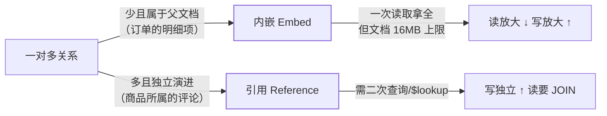

MongoDB 面试的第一关不是复制集也不是分片，而是**"为什么用文档模型、什么时候
该选它"**。用关系库视角建立映射，再抓住建模的第一决策（内嵌还是引用），
本站复制集/分片/容量规划各篇（见中级/高级）就都有了地基。

## 概念映射：从 MySQL 视角入门

| MySQL | MongoDB | 一句话差异 |
| --- | --- | --- |
| Database | Database | 同名同义 |
| Table | Collection | 无 schema 约束（同一集合内文档结构可不同） |
| Row | Document | BSON 文档，可多层嵌套 |
| Column | Field | 动态字段，无需提前 DDL |
| JOIN | `$lookup` / 内嵌 | 聚合管道替代，代价远高于关系 JOIN |

- **BSON**：JSON 的二进制扩展（多出日期、Decimal128、ObjectId 等类型），
  `_id` 默认 ObjectId（含时间戳，近似按插入有序）。
- **"无 schema"的准确理解**：不是没有结构，而是**结构长在文档里**——
  灵活性是应用层的纪律问题，集合层面仍建议保持大体一致（索引才有意义）。

## 建模第一决策：内嵌还是引用

关系库的第三范式直觉在文档库要倒过来想——**先问"数据怎么被一起读"**：

- **内嵌**：一起读的内嵌（订单+明细、文章+作者快照）——少一次查询，
  但更新膨胀、超 16MB 危险。
- **引用**：独立演进的引用（评论、日志类"多到没边"的子实体）——
  需要二次查询或 `$lookup`。
- 实际建模常是混合体：**有限条数的内嵌 + 无上限的引用**（如订单内嵌前 N 条
  明细概要，全量明细另存）。

## 什么时候选 / 不选

**适合**：

- 文档结构多变或按租户/品类差异大（商品 SKU 属性、CMS 内容）；
- 读多写少、一次聚合读整块数据（商品详情、用户画像）；
- 水平扩展诉求明确——分片是内建能力（见分片集群篇）。

**不适合**：

- 强事务、跨文档复杂关联（4.0+ 虽有多文档事务，但性能与模型都不为它而生）；
- 关系复杂、报表型多维 JOIN 分析——这是关系库与数仓的主场。

## 高频追问速答

- **16MB 限制踩到过吗？** 大数组（用户 feed、消息记录）是重灾区——
  建模期就该把"无界增长"的部分拆成引用集合（Bucket 模式）。
- **多文档事务能用吗？** 4.0 复制集 / 4.8 分片集群起支持，语法类似会话级
  事务；但面试正确答法是"能用不等于该用"，MongoDB 的事务是兜底不是常态。
- **ObjectId 为什么不用自增？** 分布式下无协调自增；ObjectId 含时间戳
  （秒级）+机器+进程+计数，天然趋势递增对索引友好。

## 小结

- 概念映射五件套：Collection≈无 schema 的 Table、Document≈可嵌套的 Row、
  `$lookup`≈代价更高的 JOIN。
- 建模第一决策"内嵌还是引用"的判据是**读取方式与增长边界**，不是直觉范式。
- 选型：读聚合、schema 多变、要分片 → MongoDB；强事务、多维 JOIN → 关系库。
