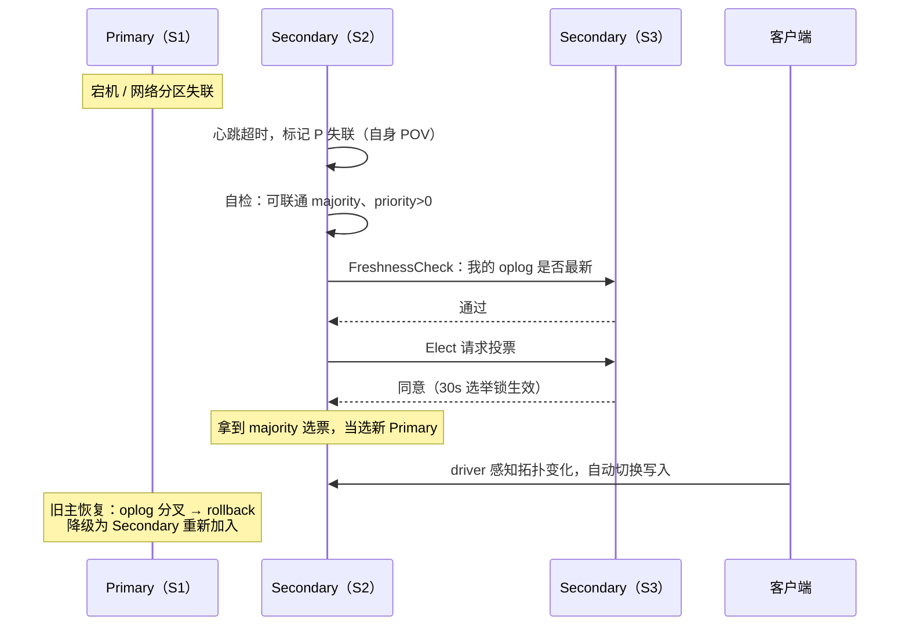

## 为什么需要复制集

单实例 mongod 有两个绕不开的问题：**机器一坏数据全丢**（持久化只能防
进程崩溃，防不了磁盘/整机故障）；**可用性没有兜底**——进程一停服务就停。
复制集（Replica Set）让一组 mongod 维护同一份数据，一次拿到三样东西：

- **数据冗余**：多副本跨机器（跨机房）分布，任一节点损坏数据不丢；
- **自动故障转移**：主挂了秒级选出新主，无需人工介入；
- **读写分离的底子**：Secondary 可以承担读流量（读不读它由 readPreference 决定）。

### 成员角色

| 成员 | 职责与要点 |
|---|---|
| **Primary** | 唯一接受写请求，所有写操作记录为 oplog |
| **Secondary** | 回放同步源的 oplog 保持数据一致 |
| **Arbiter** | 只投票不存数据，用来凑多数派，极轻量 |
| **Priority 0** | 永不参选（如备机房节点），只同步数据 |
| **Hidden** | priority=0 且对客户端不可见，专做备份/报表，不接业务读 |
| **Delayed** | 数据落后固定时长（如 1 小时）+ Hidden，误删误改的"后悔药" |

## oplog：局部滚动窗口

复制集的核心是一张特殊的固定集合 **`local.oplog.rs`**：固定大小、只追加、
满了删最旧——本质是一个**持久化的 ring-buffer**。Primary 上每个写操作
都会同步追加一条幂等格式的 oplog，Secondary 拉取并回放。

同步分两个阶段：

**initial-sync**（新节点首次加入）：

1. 清空本地除 local 外的所有库；
2. 从源节点全量拷贝数据（不含索引）——最耗时的一步；
3. 追放拷贝期间源产生的新 oplog（连续两轮逼近，缩小差距）；
4. 重建全部索引；
5. 再追一次 oplog，差距足够小后转为 Secondary。

**steady-sync**（日常）：后台持续从同步源拉增量 oplog 回放——生产者
单线程保序，消费者按 (namespace, _id) 哈希分组**并行**回放（组内严格
保序，不相干文档之间无需排队）。

### 两个高频坑

- **滚动窗口被套圈**：Secondary 停机或追不上，落后超过 oplog 窗口长度，
  同步位点被覆盖 → 只能重新 initial-sync。所以 **oplogSize 按
  "最长预期停机时间 × 写入速率"配置**，宁大勿小——磁盘便宜，重同步贵。
- **回滚（rollback）**：老 Primary 失联期间仍接了写，重连后 oplog 与
  新主分叉 → 双向游标找 LCA（最近公共祖先），回滚冲突文档并写入
  rollback 目录的 bson 文件等待人工裁决——分叉期的写默认不保证不丢，
  要靠 writeConcern 兜底。

## 心跳与选举

- 任意两节点互发**心跳**（默认 2s 一次），每个节点只维护自己视角（POV）
  的他人状态——同一时刻 A 看 C 是 down、B 看 C 是 Secondary 都可能；
- **多数派（majority）= 投票成员数 / 2 + 1**：存活投票成员不足 majority
  就选不出 Primary，整个复制集**只读**——宁可不可写，不可出现双主。

| 投票成员数 | majority | 容忍失效数 |
|---|---|---|
| 3 | 2 | 1 |
| 4 | 3 | 1 |
| 5 | 3 | 2 |

偶数成员不增加容错只增加成本，**推荐奇数（3 或 5）**；两数据节点 +
Arbiter 省机器但只剩一个数据副本，慎用。

选举流程（两阶段 + 多数派，**Raft 思想**）：

1. **自检**：能联通 majority、priority > 0、非 Arbiter；
2. **同僚仲裁**：向存活节点发 FreshnessCheck——发起者的 oplog 必须是
   存活节点中最新的（旧数据没资格当主）；
3. **Elect 投票**：仲裁节点校验合法后投票，并持有 **30s 选举锁**（期间
   不再给别人投票，类似"任期"）；拿到 majority 选票者当选；
4. 未过半（同优先级节点同时发起时常见）→ 随机退避 [0,1]s 后重试。

**priority 的用法**：心跳发现更高优先级节点可当主时，当前主会主动
step down——想把主锁在 A 机房，就把 B 机房成员 priority 设 0
（且 majority 必须落在 A，否则分区时全员只读）。

## 故障转移时序

## 读写关注

**readPreference**（读去哪儿）：

| 取值 | 行为 | 场景 |
|---|---|---|
| primary | 只读主（默认） | 要求读到的就是已确认的最新数据 |
| primaryPreferred | 主优先，主失联读从 | 一般兜底 |
| secondary | 只读从 | 专门卸载读流量到从库 |
| secondaryPreferred | 从优先 | 读多写少的常规选择 |
| nearest | 最低延迟节点 | 多机房就近读 |

**writeConcern**（写得多稳才算成功）：

| 参数 | 含义 |
|---|---|
| w: 1 | 主写完即回（默认）——主刚确认就宕机，这条写可能丢 |
| w: "majority" | majority 成员确认才回，**不丢的底线**（代价是延迟） |
| j: true | 落 journal 才回（防进程崩溃丢页缓存） |
| wtimeout | 等待上限，防写关注把请求卡死 |

关键认知：**oplog 异步复制 + w:1 存在丢数据窗口**（与 Redis 主从异步复制
同类问题）；要"多数派落盘"就显式声明 `{w: "majority", j: true, wtimeout: 5000}`。

## 与 MySQL 主从复制的差异

| 维度 | MongoDB 复制集 | MySQL 主从 |
|---|---|---|
| 复制载体 | oplog（库内 capped 集合） | binlog（独立文件）+ relay log |
| 回放方式 | 按 (ns, _id) 哈希并行、幂等 | 传统单线程回放（需并行复制方案） |
| 故障转移 | **内置选举**，自动切主 | 需外部组件（MHA/Orchestrator/MGR） |
| 从库读 | readPreference 声明式，driver 感知拓扑 | 应用层手动分发数据源 |
| 分叉处理 | 自动 rollback + 文件留存人工裁决 | binlog 位点/GTID 对齐，处理繁琐 |
| 多数派语义 | 选举与写关注共用 majority | 半同步/无损复制近似实现 |

一句话：MongoDB 把"复制 + 选举 + 切换"做进了数据库本体，MySQL 把它们
拆给了生态组件——前者省心内聚，后者可拆可换。

## 小结

- 复制集 = 冗余 + 自动故障转移 + 读写分离底子；推荐 3/5 个奇数投票成员。
- oplog 是固定大小滚动窗口：停机时间长于窗口就会退化全量重同步，
  oplogSize 按最长停机时间 × 写入速率配。
- 选举两阶段 + majority + 30s 选举锁（Raft 思想）；priority 决定主的位置。
- 默认 w:1 有丢数据窗口，重要写显式 w:"majority"。

## 延伸阅读

- [MongoDB 复制集原理（cnblogs · 孔德雨）](https://www.cnblogs.com/purpleraintear/p/6035111.html)——initial-sync 六步、steady-sync 线程模型与 oplog 并行回放的源码级分析，本篇同步与选举部分的主要来源。
- [MongoDB 中文社区（mongoing）](https://mongoing.com/)——官方文档翻译与社区实践文章的聚合站。
