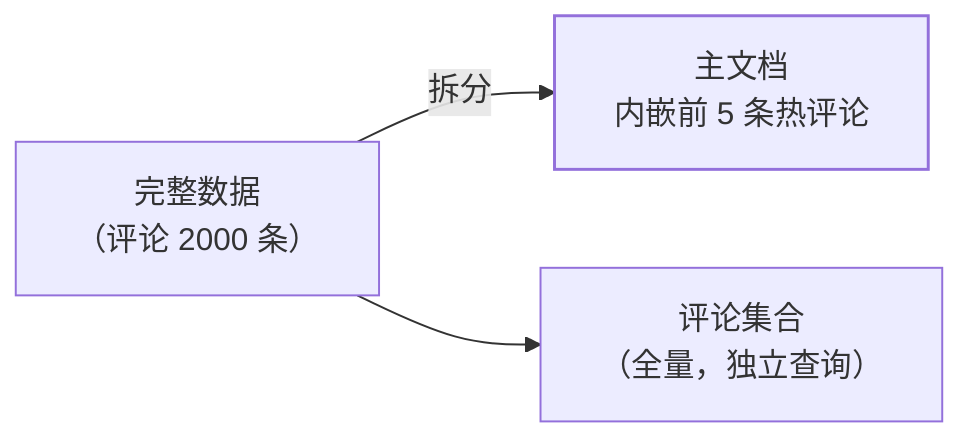

文档模型篇讲了内嵌 vs 引用的基础决策，但**大文档、高频 $lookup、
时序数据**这三类工程难题有成熟的**已知套路**（Schema Design Patterns）
——它们是 MongoDB 社区沉淀的设计模式，面试里能说出名字与适用场景
就是加分项。

## 子集模式：文档太大就切出冷数据

"商品有 2000 条评论，但列表页只显示前 5 条"——全部内嵌文档膨胀
（16MB 上限 + 每次读取都搬大文档）：

- 主文档只内嵌**热子集**（前 N 条），全量放独立集合——一次读取拿
  热数据，展开再看冷数据；
- 代价：热子集与全量的**一致性要维护**（新评论同时更新两处或异步）。

## 扩展引用：少量冗余换掉 $lookup

"订单列表要显示用户名"——每条订单 $lookup users 太贵。**在订单文档
里冗余用户名**（扩展引用）：

- 冗余的是**变化少**的字段（用户名/商品名）——字段变更时批量更新
  引用方（低频可接受）；
- 与关系库第三范式相反：**有意识地违反范式换读取性能**（文档模型篇
  的读取导向）。

## 桶模式：时序数据按时间分桶

IoT 传感器每秒一条记录——一天 86400 个文档，存储与索引爆炸。
**按时间分桶**：一小时一个文档，内嵌该时段的测量数组：

- 文档数从 86400/天 → 24/天（降 3600 倍），单文档内的数组还支持
  按位置查询；
- 代价：文档结构复杂（数组内嵌）、需要预聚合设计——时序场景的
  标准套路（对照 IoT/监控场景）。

## Outlier 模式：极值文档单独处理

99% 的文档符合设计假设，1% 的"异常大文档"（爆款商品的百万评论）拖垮
统一策略——**识别 Outlier 单独建模**（超限部分放独立集合），主流程
不变。

## 高频追问速答

- **子集模式的热/冷怎么同步？** 新评论写入冷集合 + 更新主文档热
  子集（单事务或异步）——热子集是"缓存"，脏了可从冷重建。
- **这些模式有代价吗？** 全有：子集要双写、扩展引用要同步冗余、
  桶增加查询复杂度——**模式的收益必须大于维护成本**才用。
- **还有哪些模式？** Computed（预计算字段）、Polymorphic（多形态
  文档）、Schema Versioning（版本字段平滑迁移）——按痛点检索。

## 小结

- 三模式对三类痛点：**子集**控文档大小、**扩展引用**免 $lookup、
  **桶**扛时序数据；Outlier 兜极值。
- 模式是已知套路不是银弹——每个都有维护代价，用评测数据决定。
- MongoDB 面试的建模题，答出"模式名 + 适用场景 + 代价"三段就是
  高分结构。
