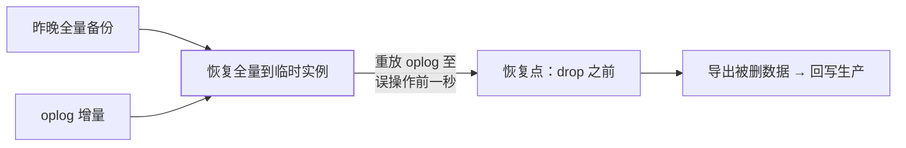

硬件故障有 RAID、误删库有权限——但 **`db.orders.drop()` 敲下去的
那一瞬间，只有备份能救你**。行业统计：数据丢失事故的大头是人为错误
与逻辑故障（误删/坏数据扩散），而非硬件——备份体系是运维的最后底牌。

## 三种备份方式

| 方式 | 原理 | 优点 | 代价 |
| --- | --- | --- | --- |
| mongodump | 逻辑导出 BSON | 灵活（可单库单集合）、跨版本 | 慢、大库导出数小时 |
| 文件系统快照 | 卷级物理快照 | **秒级完成**、一致性好 | 恢复粒度粗（整卷） |
| 云托管快照 | Atlas/云厂商自动 | 全自动、保留策略现成 | 成本、可迁移性锁定 |

- mongodump 运行时**会刷 buffer 且与写入竞争**——副本集从 **secondary**
  备份（读偏好篇）；
- 文件系统快照要配 WiredTiger 的日志保证一致性（快照瞬间 + journal）。

## PITR：恢复到"误操作前一秒"

只有 nightly 全量备份 = 最多丢一天。**PITR（时间点恢复）** 补齐：

- oplog 是环形（Change Streams 篇）——**oplog 窗口必须覆盖备份间隔**，
  否则增量断档（"窗口要覆盖最长恢复需求"的容量规划）；
- MySQL binlog PITR（三大日志篇）与 Mongo oplog PITR 同构——全量+
  增量重放是关系与非关系库通用的恢复模式。

## 备份验证：没有验证过的备份等于没有

- **定期恢复演练**：把备份恢复到隔离环境，校验数据完整性与应用可用
  ——备份文件损坏/版本不兼容/密码丢失，只有演练会发现；
- 指标：**RTO**（多久能恢复服务）与 **RPO**（丢多少时间的数据）——
  备份策略由这两个目标反推（容灾多活篇的 RTO/RPO 同源）；
- 3-2-1 原则：3 份副本、2 种介质、1 份异地。

## 高频追问速答

- **删除大集合后 oplog 也滚没了还能恢复吗？** 不能从 oplog——只剩
  全量备份的内容（丢备份后段）——所以 oplog 窗口规划 + 备份频率
  是 RPO 的决定项。
- **mongodump 备份分片集群？** 要停 balancer + 多分片一致性难保证
  ——分片集群推荐文件快照或 Atlas 连续备份。
- **备份要不要加密？** 备份包含全部数据（比生产库更集中）——必须
  加密 + 密钥分离管理（密码存储篇的密钥纪律同源）。

## 小结

- 三方式：mongodump（灵活慢）、文件快照（快粗）、云快照（自动）——
  按 RTO/RPO 目标组合。
- PITR = 全量 + oplog 重放：oplog 窗口决定 RPO 上限。
- **备份的价值在验证**：恢复演练 + RTO/RPO 度量 + 3-2-1 原则。
